# Flowline — Project Overview

> **What this is:** a single, current, as-built description of the Flowline
> codebase — architecture, data flow, data model, every screen, widget,
> provider and key function, the UI/UX system, the build/CI pipeline, and
> an honest list of known gaps.
>
> **Snapshot:** commit `1d66c1c` on `main`, 2026-09-27. Status lines marked
> **VERIFIED** come from CI run `36192781020`; anything not exercised by CI
> is marked **UNVERIFIED**.
>
> **How it relates to the other docs:** `docs/01-architecture.md`,
> `docs/02-ux-ui-spec.md` and `docs/03-scope-architecture-dfd-v2.md` are
> the original *plans*. `README.md` is the phase-by-phase build log. This
> file describes what the code *actually does today* and records where it
> differs from the plans (see [§17 Documentation drift](#17-documentation-drift)).

---

## Table of contents

1. [Product summary](#1-product-summary)
2. [Current status](#2-current-status)
3. [Scope: built vs. planned](#3-scope-built-vs-planned)
4. [Technology stack](#4-technology-stack)
5. [Architecture](#5-architecture)
6. [Data flow diagrams](#6-data-flow-diagrams)
7. [Data model](#7-data-model)
8. [Domain layer: entities, contracts, pure services](#8-domain-layer)
9. [Data layer: repositories, AI clients, platform services](#9-data-layer)
10. [State management: provider catalog](#10-state-management-provider-catalog)
11. [Navigation](#11-navigation)
12. [Screens and features](#12-screens-and-features)
13. [Widget and component catalog](#13-widget-and-component-catalog)
14. [UI/UX system](#14-uiux-system)
15. [Key algorithms and functions](#15-key-algorithms-and-functions)
16. [Security, privacy, offline behaviour](#16-security-privacy-offline-behaviour)
17. [Documentation drift](#17-documentation-drift)
18. [Build, CI and Android packaging](#18-build-ci-and-android-packaging)
19. [Testing](#19-testing)
20. [Known issues and gaps](#20-known-issues-and-gaps)
21. [Physical-device verification checklist](#21-physical-device-verification-checklist)
22. [Roadmap](#22-roadmap)

---

## 1. Product summary

Flowline is an **Android-first, phone-first, local-first** productivity app
built with Flutter. It combines three things in one calm, focus-first UI:

- **Time-blocked planning** — tasks, subtasks and named schedule blocks on a
  per-day timeline, plus an unscheduled backlog.
- **A Pomodoro focus timer** — focus / short break / long break sessions
  whose remaining time is derived from persisted wall-clock anchors, so it
  stays correct across backgrounding and process death.
- **A bring-your-own-key AI layer** — chat with Anthropic, OpenAI, Google
  Gemini or a local Ollama server, plus AI-assisted resolution of schedule
  conflicts.

There is **no Flowline backend, no account, no telemetry**. All data lives
in an on-device SQLite database; API keys live in the Android Keystore; AI
requests go directly from the device to the vendor the user chose.

---

## 2. Current status

| Check | Result | Evidence |
|---|---|---|
| Dependencies resolve (`flutter pub get`) | **VERIFIED** | CI |
| Code generation (`build_runner`, Drift + Riverpod) | **VERIFIED** | CI |
| Static analysis (`flutter analyze`) | **VERIFIED — no issues** | CI |
| Formatting (`dart format`) | **FAILED** — only files added in the latest commit; CI uploaded the exact fix as the `format-patch` artifact | CI |
| Unit + widget + repository tests | **86 passed, 1 failed** | CI |
| Android release APK (`--split-per-abi`) | **VERIFIED — builds** | CI artifact `flowline-release-apks-<sha>` |
| Emulator / integration tests | **NOT RUN** — no emulator job yet | — |
| Behaviour on a physical phone | **UNVERIFIED** | see [§21](#21-physical-device-verification-checklist) |

The single failing test is
`test/features/focus_timer/focus_screen_test.dart` → *"a running session
shows wall-clock remaining time on first frame"*. It was added in the latest
commit and has not been diagnosed yet.

> History worth knowing: the project was originally written without a
> compiler ("written blind", per `README.md`). The first CI runs showed it
> had never compiled — one nonexistent package version, a whole database
> layer that failed code generation, several API mismatches with the pinned
> packages, and a lint config pointing at a file that doesn't exist. Those
> are fixed; see the git log from `84d0b57` onward.

---

## 3. Scope: built vs. planned

| Module (from `03-scope…` §1) | Status | Notes |
|---|---|---|
| Task & schedule management | **Built, partial** | Tasks, subtasks, blocks, day switcher, unscheduled backlog, swipe complete/delete. **No UI to edit or delete a schedule block** (the repository supports both). No drag-and-drop timeline, no recurrence, no due-date picker. |
| Focus timer | **Built** | 25/5/15 presets, start/pause/resume/end/+5 min, task/subtask linking, sprint credit, local notification. No Skip, no custom duration, no Session Summary sheet. |
| AI assistant | **Built, partial** | Four vendors behind one strategy interface, one thread per provider, error bubbles. No streaming, no markdown, no conversation history screen, no Task Breakdown Engine, no "Add to Today". |
| Schedule intelligence | **Built, partial** | Overlap detection on save, conflict sheet, one-shot AI time suggestion, overlap flagging on Today. No drift analysis, no manual timeline adjuster. |
| Calendar sync (Google, read-only) | **Not built** | Deliberately deferred (needs the owner's OAuth client + release-key SHA-1). `ScheduleBlockSource.externalCalendar` and `isLocked` exist in the model already. |
| Insights | **Built, partial** | Today / streak / week stat cards, 7-day bar chart. No monthly view, no heatmap, no adherence %. |
| Export | **Built** | PDF, CSV, JSON of the last 7 days via the system share sheet. |
| AI Monitoring (voice) | **Not built** | Designed in `03-scope…` §6 only. No microphone code or permission exists. |
| Settings | **Built, partial** | Settings home + AI Providers only. No Notifications, Appearance/Theme, Data & Privacy, or AI Monitoring screens. |
| Onboarding / splash | **Not built** | App opens straight to Today; Android's native launch screen is the only splash. |

---

## 4. Technology stack

Versions are what CI actually resolves (see the `flutter pub get` log), not
just the caret constraints in `pubspec.yaml`.

| Concern | Package | Resolved | Notes |
|---|---|---|---|
| SDK | Flutter / Dart | **3.35.7 / 3.9.2** | Pinned in CI. Newer Flutter (3.38+, Dart 3.10) crashes the pinned `analyzer` 7.x — see [§18](#18-build-ci-and-android-packaging). |
| State management | `flutter_riverpod`, `riverpod_annotation`, `riverpod_generator` | 2.6.1 / 2.6.1 / 2.6.5 | Code-generated providers. |
| Routing | `go_router` | 14.8.1 | `StatefulShellRoute.indexedStack` for the 4 tabs. |
| Database | `drift`, `drift_dev`, `sqlite3_flutter_libs` | 2.28.2 / 2.28.0 / 0.5.42 | SQLite via FFI. |
| Secure storage | `flutter_secure_storage` | 9.2.4 | `encryptedSharedPreferences: true` (Keystore-backed). |
| HTTP | `dio` | 5.11.1 | One shared instance, **no timeouts configured**. |
| Notifications | `flutter_local_notifications`, `timezone`, `flutter_timezone` | 17.2.4 / 0.9.4 / 5.1.0 | Inexact `zonedSchedule`. |
| Charts | `fl_chart` | 0.69.2 | Insights bar chart. |
| Export | `pdf`, `printing`, `share_plus`, `path_provider` | 3.13.1 / 5.15.1 / 10.1.4 / 2.1.6 | |
| Formatting | `intl` | 0.19.0 | Date/time labels. |
| Lints | `flutter_lints` | 4.0.0 | Included via `package:flutter_lints/flutter.yaml`. |
| Codegen runner | `build_runner` | 2.5.4 | |

Android toolchain (from the Flutter 3.35.7 template CI generates):
AGP 8.9.1, Gradle 8.12, Kotlin 2.1.0, `compileSdk` 36, `targetSdk` 36,
`minSdk` 24, JDK 17, application id `com.devbehindyou.flowline`.

---

## 5. Architecture

### 5.1 Layering

Flowline follows the MVVM-flavoured *Presentation → Domain → Data* layering
from `docs/01-architecture.md`, **minus the Use Case layer** (intentionally
dropped — see [§17](#17-documentation-drift)). View models call repository
interfaces directly; the one place that genuinely spans two repositories
(schedule intelligence) orchestrates in its view model.

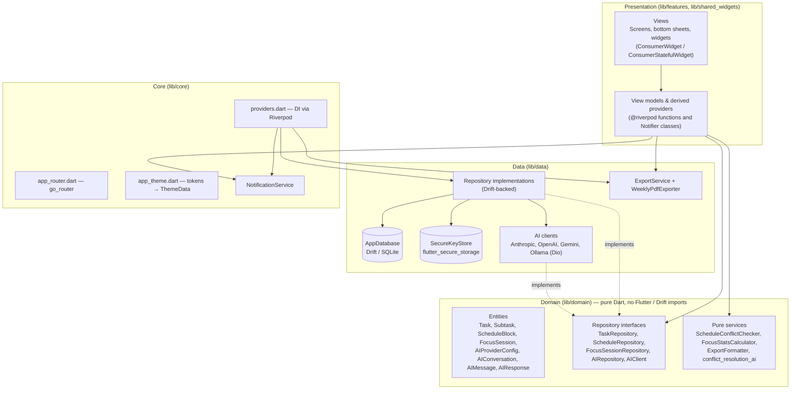

Dependency rule: `domain/` imports nothing from `data/`, `features/` or
Flutter. Verified by grep — no `package:flutter` import exists under
`lib/domain/`.

### 5.2 Folder map (as built)

```text
lib/
├── main.dart                     ProviderScope + runApp (no async init)
├── app.dart                      FlowlineApp: MaterialApp.router, theme,
│                                 focus-session reconciliation on start/resume
├── core/
│   ├── providers.dart            App-wide singletons (DB, repos, Dio, AI, export, notifications)
│   ├── router/app_router.dart    Routes + 4-branch shell
│   ├── theme/app_theme.dart      FlowlineSemanticColors + AppTheme.light()/dark()
│   └── notifications/notification_service.dart
├── domain/
│   ├── entities/                 9 plain Dart classes/enums
│   ├── repositories/             5 abstract interfaces
│   └── services/                 4 pure, unit-tested services
├── data/
│   ├── local/drift/              AppDatabase + 7 table definitions
│   ├── local/secure/             SecureKeyStore
│   ├── remote/ai_clients/        4 vendor clients + ai_error_mapper
│   ├── repositories/             4 Drift-backed implementations
│   └── export/                   ExportService, WeeklyPdfExporter
├── features/                     one folder per feature: view/ viewmodel/ [widgets/]
│   ├── shell/                    AppShell (bottom navigation)
│   ├── schedule/                 Today screen, DayTimeline, TaskCard
│   ├── task_form/                Add/Edit Task sheet
│   ├── task_detail/              Task Detail screen
│   ├── schedule_block_form/      Add/Edit Schedule Block sheet
│   ├── schedule_intelligence/    Conflict sheet + AI suggestion
│   ├── focus_timer/              Focus screen, TimerRing
│   ├── ai_assistant/             Assistant screen, ChatBubble
│   ├── insights/                 Insights screen (stat cards + chart)
│   ├── export/                   Export sheet
│   └── settings/                 Settings home, AI Providers, provider sheet
└── shared_widgets/               EmptyState, PriorityChip, StatusChip

test/                             13 test files (see §19)
tool/ci/                          Android template patches applied in CI
.github/workflows/ci.yml          The only build environment
```

`android/` and `ios/` are **gitignored on purpose**: CI regenerates
`android/` from the pinned Flutter template on every run and patches it
(see [§18.3](#183-android-template-patches)).

### 5.3 Dependency injection graph

All singletons are `keepAlive` Riverpod providers in `core/providers.dart`.
Tests override `appDatabaseProvider` (in-memory SQLite) and, where needed,
`notificationServiceProvider`.

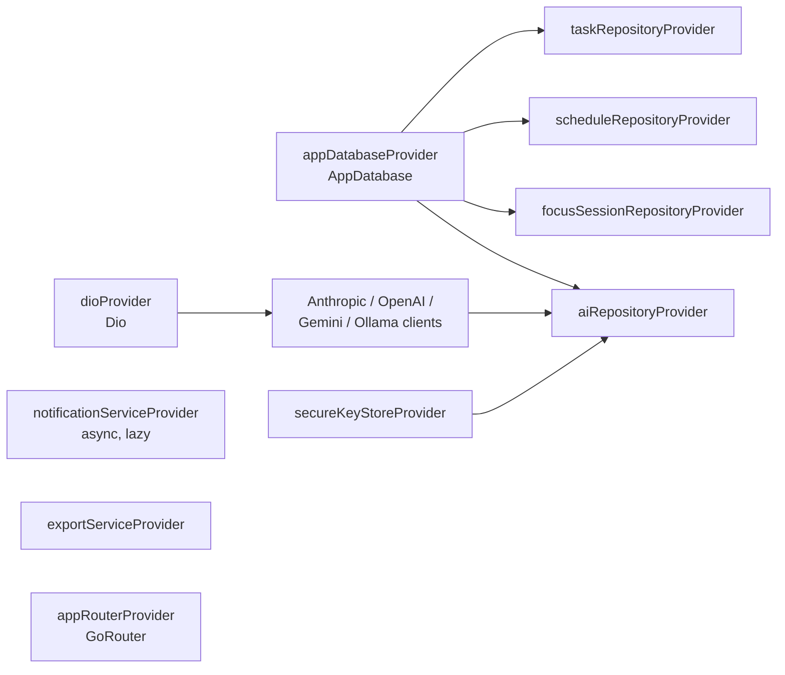

`notificationServiceProvider` is **lazy and async on purpose**: its `init()`
requests the notification permission, and that prompt should appear the
first time a focus session starts, not at app launch.

---

## 6. Data flow diagrams

### 6.1 Level 0 — system context (as built)

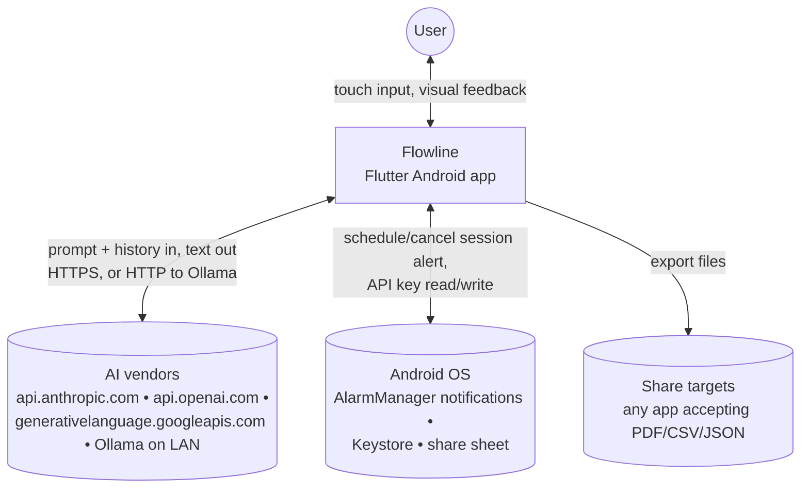

Not present yet (planned in `03-scope…`): Google Calendar, microphone /
foreground service.

### 6.2 Level 1 — processes and stores (as built)

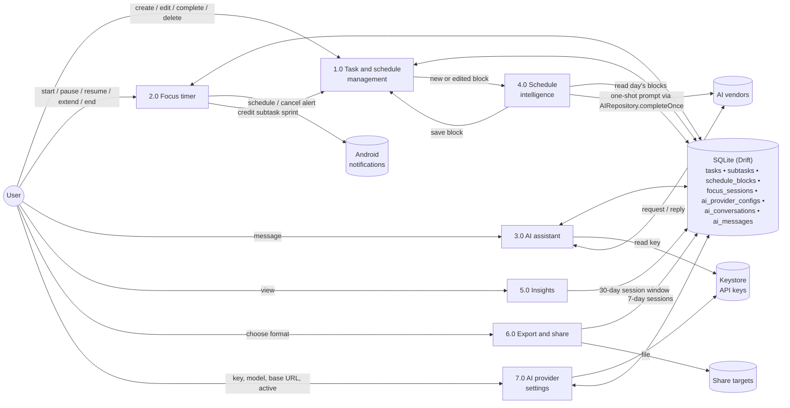

### 6.3 Create a task

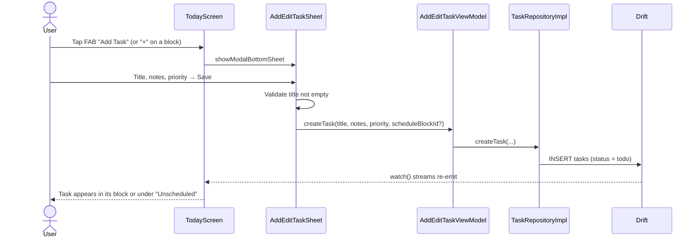

### 6.4 Focus session lifecycle (wall-clock timer)

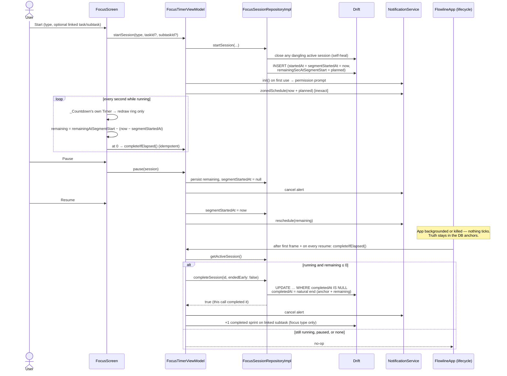

### 6.5 Assistant message

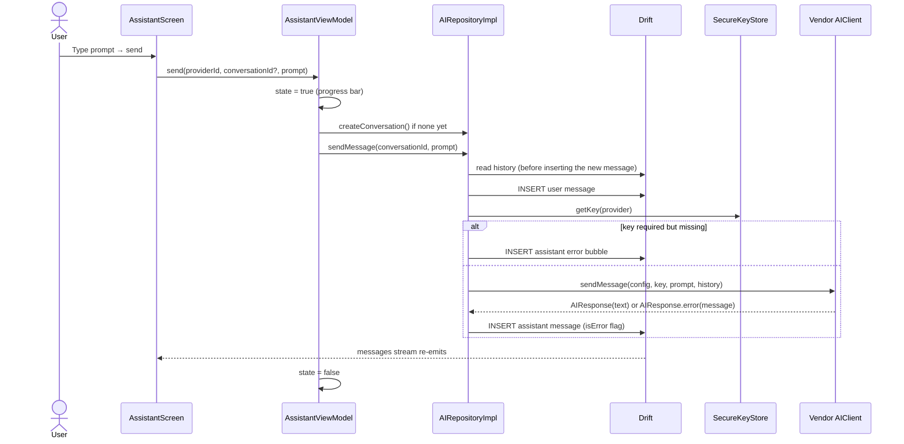

Errors never throw out of a client: every failure becomes an
`AIResponse.error` with a plain-language message (see
[§15.6](#156-ai-error-mapping)).

### 6.6 Schedule block save with conflict resolution

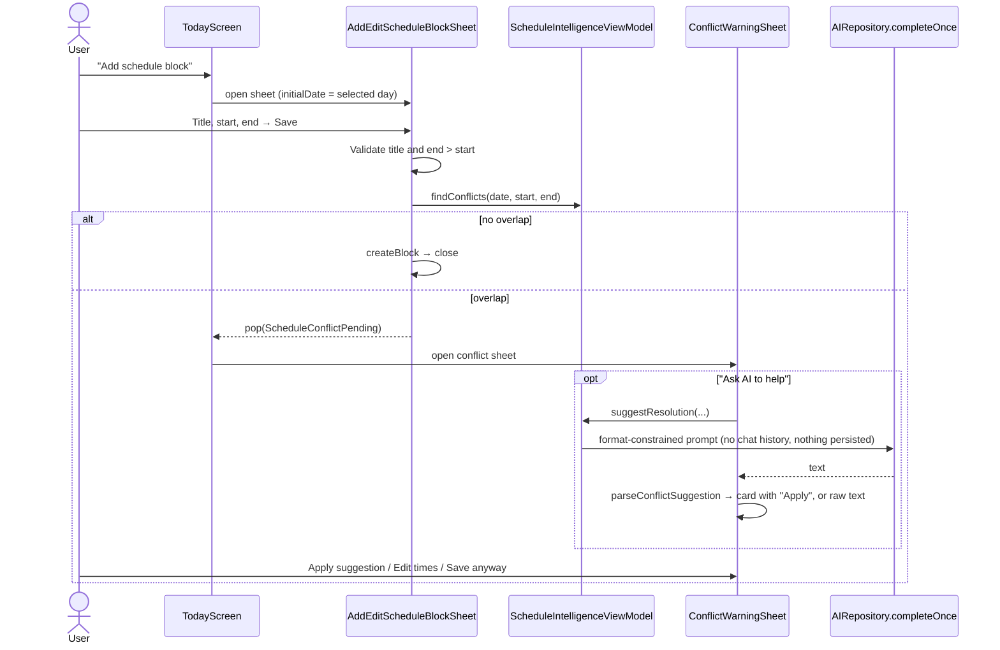

### 6.7 Export

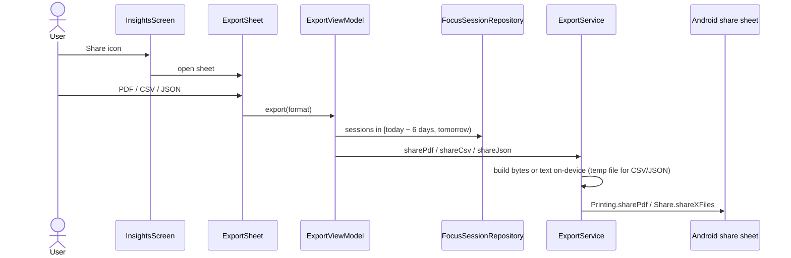

---

## 7. Data model

### 7.1 Entity-relationship diagram (as built, schema version 3)

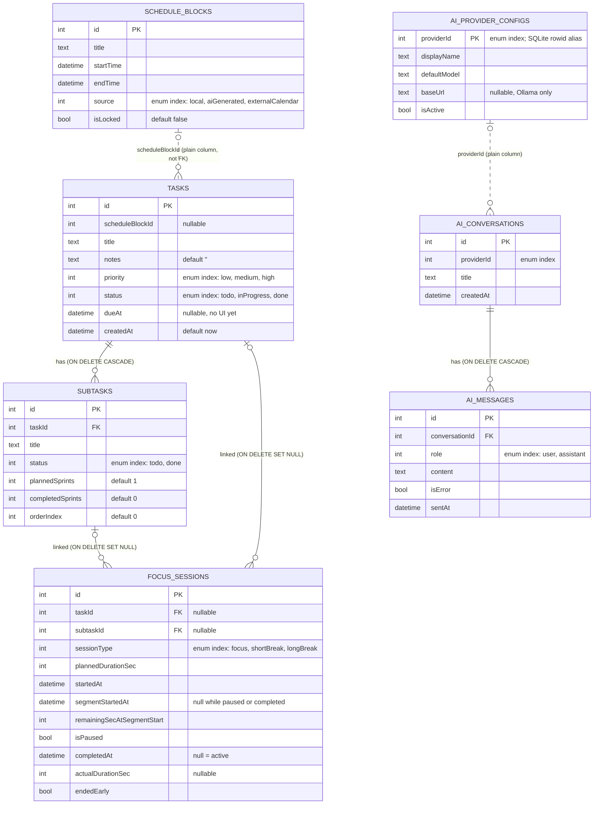

### 7.2 Storage rules and invariants

- **Foreign keys are enforced** — `PRAGMA foreign_keys = ON` runs in
  `beforeOpen` on every connection. (Before commit `1f5d597` it didn't, so
  every `onDelete` rule was silently ignored.)
- **`tasks.scheduleBlockId` is not a foreign key.** `ScheduleRepositoryImpl.deleteBlock`
  therefore un-schedules the block's tasks in the same transaction.
- **At most one active focus session** (`completedAt IS NULL`).
  `startSession` closes any dangling one first.
- **Completion is idempotent** — `completeSession` updates only
  `WHERE completedAt IS NULL` and returns whether it did.
- **API keys are never stored here.** `ai_provider_configs` holds metadata
  only.
- **Enums are stored by index** (`intEnum<T>()`). Reordering or inserting
  in the middle of an enum silently corrupts existing rows — only ever
  append.
- **Date-times** use Drift's default storage (Unix seconds), so sub-second
  precision is dropped.
- **Seeding:** `AIRepositoryImpl` inserts the four provider rows on first
  use (none active).

### 7.3 Migrations

`AppDatabase.schemaVersion = 3`, additive only:

| From → to | Change |
|---|---|
| 1 → 2 | `createTable(focusSessions)` (Phase 2) |
| 2 → 3 | `createTable(aiProviderConfigs, aiConversations, aiMessages)` (Phase 3) |

No schema-verification tests exist yet (Drift's `SchemaVerifier` is not set
up). No build of the app has shipped, so there is no user data to migrate.

---

## 8. Domain layer

Everything under `lib/domain/` is plain Dart: no Flutter, no Drift, no
Riverpod.

### 8.1 Entities

| Entity | Key fields | Behaviour |
|---|---|---|
| `Task` | `id, title, notes, priority, status, scheduleBlockId?, dueAt?, createdAt` | `copyWith` |
| `Subtask` | `id, taskId, title, status, plannedSprints, completedSprints, orderIndex` | `copyWith` |
| `ScheduleBlock` | `id, title, startTime, endTime, source, isLocked` | `duration`, `copyWith` |
| `FocusSession` | see §7.1 | `isRunning`; **`remainingSec`** — derived from the wall clock on every read |
| `AIProviderConfig` | `id, displayName, defaultModel, baseUrl?, isActive` | `requiresApiKey` (false for Ollama) |
| `AIConversation` | `id, providerId, title, createdAt` | — |
| `AIMessage` | `id, conversationId, role, content, isError, sentAt` | — |
| `AIResponse` | `content, isError` | `AIResponse(text)` / `AIResponse.error(text)` — errors are values, not exceptions |
| `ExportFormat` | `pdf, csv, json` | — |

### 8.2 Repository contracts

| Interface | Reads (streams) | Writes |
|---|---|---|
| `TaskRepository` | `watchTasksForBlock`, `watchUnscheduledTasks`, `watchTask`, `watchSubtasks` | `createTask`, `updateTask`, `deleteTask`, `setTaskStatus`, `createSubtask`, `setSubtaskStatus`, `deleteSubtask`, `incrementSubtaskCompletedSprints` |
| `ScheduleRepository` | `watchBlocksForDay` | `createBlock`, `updateBlock`, `deleteBlock` |
| `FocusSessionRepository` | `watchActiveSession`, `getActiveSession`, `watchSessionsForTask`, `watchTodaysSessions`, `watchSessionsInRange` | `startSession`, `pauseSession`, `resumeSession`, `extendSession`, `completeSession → bool` |
| `AIRepository` | `watchProviders`, `watchActiveProvider`, `watchConversations`, `watchMessages`, `hasKey` | `saveProviderKey`, `setActiveProvider`, `removeProviderKey`, `createConversation`, `deleteConversation`, `sendMessage`, `completeOnce` |
| `AIClient` (strategy) | — | `sendMessage(config, apiKey, prompt, history) → AIResponse` |

### 8.3 Pure services

| Service | Functions | Used by |
|---|---|---|
| `ScheduleConflictChecker` | `findConflicts(startTime, endTime, existingBlocks, excludeBlockId?)`, `findConflictingBlockIds(blocks)` | Block save flow; Today's overlap flags |
| `FocusStatsCalculator` | `dailyTotals(sessions, days = 7)`, `currentStreak(sessions)` | Insights, PDF export |
| `ExportFormatter` | `toCsv(sessions)`, `toJson(sessions, rangeStart, rangeEnd)` | Export |
| `conflict_resolution_ai.dart` | `buildConflictResolutionPrompt(...)`, `parseConflictSuggestion(text)` | Conflict sheet |

Details of each algorithm are in [§15](#15-key-algorithms-and-functions).

---

## 9. Data layer

### 9.1 Repository implementations

| Class | Notes |
|---|---|
| `TaskRepositoryImpl` | Straight Drift CRUD. Subtasks ordered by `orderIndex` (always 0 today — no reordering UI). |
| `ScheduleRepositoryImpl` | `watchBlocksForDay` = blocks whose **start** falls in `[day, day+1)`, ordered by start. `deleteBlock` un-schedules tasks first, in one transaction. |
| `FocusSessionRepositoryImpl` | Wall-clock timer persistence, self-heal, natural-end completion, extension grows `plannedDurationSec`. See [§15.1](#151-wall-clock-focus-timer). |
| `AIRepositoryImpl` | Seeds providers, keeps the "exactly one active" rule in a transaction, orchestrates a chat send, and `completeOnce` for no-history one-shot prompts. |

### 9.2 AI vendor clients

All four implement `AIClient`, share the app's single `Dio` instance,
send the full conversation history each time (**unbounded**), and are
**non-streaming**.

| Client | Endpoint | Auth | Request shape | Notes |
|---|---|---|---|---|
| `AnthropicClient` | `POST https://api.anthropic.com/v1/messages` | `x-api-key`, `anthropic-version: 2023-06-01` | `messages[]`, `max_tokens: 1024` | Joins all `text` content blocks |
| `OpenAIClient` | `POST https://api.openai.com/v1/chat/completions` | `Authorization: Bearer` | `messages[]` | `choices[0].message.content` |
| `GeminiClient` | `POST …/v1beta/models/{model}:generateContent` | `x-goog-api-key` header (never a URL query parameter) | `contents[]` with `user` / `model` roles | Joins `candidates[0].content.parts[].text` |
| `OllamaClient` | `POST {baseUrl}/api/chat` (default `http://localhost:11434`) | none | `messages[]`, `stream: false` | Tailored errors: LAN-IP hint on connection failure; "ollama pull" hint on 404 |

Seeded default models (editable per provider in Settings):
`claude-3-5-sonnet-20241022`, `gpt-4o-mini`, `gemini-1.5-flash`, `llama3.2`.
**UNVERIFIED against today's vendor APIs** — the first and third are likely
retired; see [§20](#20-known-issues-and-gaps).

### 9.3 Platform services

| Class | Responsibility |
|---|---|
| `SecureKeyStore` | `getKey / setKey / deleteKey` per `AIProviderId`, key name `flowline_ai_api_key_<id>`, Android `encryptedSharedPreferences`. The only place a raw key is read or written. |
| `NotificationService` | `init()` (load tz data, resolve device timezone, init plugin, request `POST_NOTIFICATIONS`), `scheduleSessionComplete(fireAt, title, body)` using one fixed notification id (1001) and channel `focus_session`, `cancelSessionNotification()`. Inexact scheduling (`inexactAllowWhileIdle`) — no exact-alarm permission needed. |
| `ExportService` | `sharePdf` (via `Printing.sharePdf`), `shareCsv` / `shareJson` (temp file + `Share.shareXFiles`). File names: `flowline-focus-YYYYMMDD-YYYYMMDD.<ext>`. |
| `WeeklyPdfExporter` | One A4 page: stat row, daily breakdown table, focus-session log (`pw.TableHelper.fromTextArray`). |

---

## 10. State management: provider catalog

All providers are code-generated with `@riverpod` / `@Riverpod(keepAlive:
true)`. "Auto" = auto-dispose.

| Provider | Kind | Lifetime | Source | Consumers |
|---|---|---|---|---|
| `appDatabaseProvider` | `AppDatabase` | keepAlive | new DB, closed on dispose | all repositories |
| `taskRepositoryProvider` / `scheduleRepositoryProvider` / `focusSessionRepositoryProvider` / `aiRepositoryProvider` | repository | keepAlive | DB (+ Dio, key store) | view models |
| `notificationServiceProvider` | `Future<NotificationService>` | keepAlive, lazy | `init()` | `FocusTimerViewModel` |
| `dioProvider`, `secureKeyStoreProvider`, `exportServiceProvider` | singleton | keepAlive | — | AI repo, export |
| `appRouterProvider` | `GoRouter` | keepAlive | route table | `FlowlineApp` |
| `selectedDateProvider` | `Notifier<DateTime>` | auto | today, `nextDay / previousDay / goToToday` | Today |
| `scheduleBlocksForSelectedDateProvider` | `Stream<List<ScheduleBlock>>` | auto | watches `selectedDateProvider` | Today |
| `tasksForBlockProvider(blockId)` | `Stream<List<Task>>` family | auto | repo | block cards |
| `unscheduledTasksProvider` | `Stream<List<Task>>` | auto | repo | Today |
| `todayActionsProvider` | action notifier | auto | `toggleTaskDone`, `deleteTask` | TaskCard |
| `taskByIdProvider(id)`, `subtasksForTaskProvider(id)` | stream families | auto | repo | Task Detail, Focus linked chip |
| `taskDetailActionsProvider` | action notifier | auto | add/toggle/delete subtask, delete task | Task Detail |
| `addEditTaskViewModelProvider` | action notifier | auto | create/update task | task sheet |
| `addEditScheduleBlockViewModelProvider` | action notifier | auto | create/update block | block sheet, conflict sheet |
| `scheduleIntelligenceViewModelProvider` | action notifier | auto | `findConflicts`, `suggestResolution` | block sheet, conflict sheet |
| `activeFocusSessionProvider` | `Stream<FocusSession?>` | auto | repo | Focus |
| `todaysFocusSummaryProvider` | `Stream<(totalSeconds, sessionCount)>` | auto | sessions started today | Focus footer, Insights "Today" |
| `selectedSessionTypeProvider` | `Notifier<FocusSessionType>` | auto | — | Focus idle view |
| `pendingFocusLinkProvider` | `Notifier<(taskId, subtaskId?, label)?>` | auto | set from Today / Task Detail | Focus idle view |
| `focusTimerViewModelProvider` | action notifier | auto | start/pause/resume/extend/complete/`completeIfElapsed` | Focus, `FlowlineApp` |
| `recentFocusSessionsProvider` | `Stream<List<FocusSession>>` | auto | last 30 days by `startedAt` | Insights stats |
| `weeklyFocusTotalsProvider` | `AsyncValue<List<DailyFocusTotal>>` | auto | derived synchronously | Insights |
| `currentStreakProvider` | `AsyncValue<int>` | auto | derived synchronously | Insights |
| `exportViewModelProvider` | `Notifier<bool>` (busy) | auto | builds + shares file | Export sheet |
| `aiProvidersProvider`, `activeAiProviderProvider` | streams | auto | AI repo | Assistant, AI Providers |
| `providerHasKeyProvider(id)` | `Future<bool>` family | auto | reads Keystore | provider cards |
| `latestConversationForProviderProvider(id)` | `Stream<AIConversation?>` family | auto | newest conversation for provider | Assistant |
| `conversationMessagesProvider(id)` | `Stream<List<AIMessage>>` family | auto | AI repo | message list |
| `assistantViewModelProvider` | `Notifier<bool>` (sending) | auto | `send(...)` | Assistant |
| `aiProvidersViewModelProvider` | action notifier | auto | `setActive`, `saveKey`, `removeKey` | AI Providers |

Rebuild notes:
- The one-second tick lives in `_Countdown`, a small stateful widget that
  owns a plain `Timer` (cancelled in `dispose`) and redraws only the
  `TimerRing` inside a `RepaintBoundary`. It replaced a Riverpod
  `Stream.periodic` provider: Riverpod 2.6 defers cancelling a stream
  provider disposed before its first event, so pausing or ending within a
  second of (re)starting leaked a permanent 1 Hz timer.
- The Assistant's "sending" flag is watched by the whole chat body.

---

## 11. Navigation

`go_router` with a `StatefulShellRoute.indexedStack`: each tab keeps its own
navigator and state; the four tab subtrees stay mounted.

| Path | Screen | Navigator | How it's reached |
|---|---|---|---|
| `/today` *(initial)* | `TodayScreen` | shell branch 0 | bottom nav |
| `/today/task/:taskId` | `TaskDetailScreen` | **root** (full screen over the shell) | tap a task card |
| `/focus` | `FocusScreen` | shell branch 1 | bottom nav; ▶ on a task or subtask (`context.go`) |
| `/assistant` | `AssistantScreen` | shell branch 2 | bottom nav |
| `/insights` | `InsightsScreen` | shell branch 3 | bottom nav |
| `/settings` | `SettingsHomeScreen` | root | gear icon on Today's app bar |
| `/settings/ai-providers` | `AiProvidersScreen` | root | Settings list; icon/CTA on Assistant |

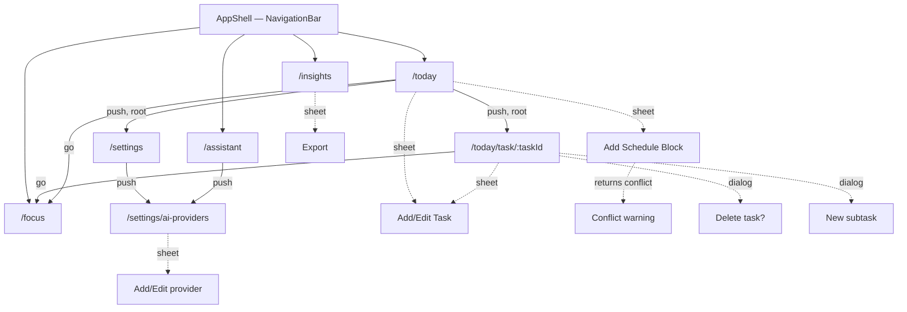

Bottom-nav tap on the already-selected tab resets that branch to its root
(`goBranch(index, initialLocation: index == currentIndex)`).

---

## 12. Screens and features

For each screen: purpose, what it shows, actions, and its state model.

### 12.1 App shell — `AppShell`
- `Scaffold` with the shell body and an M3 `NavigationBar`: **Today**
  (calendar icon), **Focus** (hourglass), **Assistant** (sparkle), **Insights**
  (bar chart). Outlined icon when inactive, filled when selected.

### 12.2 Today — `TodayScreen`
- **App bar:** title "Flowline", settings icon (tooltip "Settings").
- **Date header (`_DateHeader`):** previous/next day chevrons, date as
  "EEEE, MMM d", and a "Jump to today" button only when another day is shown.
- **Body:** `DayTimeline` — one card per schedule block (time range,
  title, lock icon if locked, warning icon + red outline + "Overlaps another
  block" if it overlaps another block that day, "+" to add a task into
  it, nested task cards), an "Add schedule block" button, then an
  "Unscheduled" section.
- **FAB:** extended "Add Task".
- **Task card actions:** tap → Task Detail; leading circle → toggle done;
  swipe right → toggle done; swipe left → "Delete task?" dialog; ▶ → go to
  Focus with the task pre-linked.
- **States:** loading (spinner), error (raw text), empty ("No tasks yet" +
  "Add Task" CTA), populated.

### 12.3 Add/Edit Task — `AddEditTaskSheet` (bottom sheet)
- Drag handle, title (required, inline error), notes (2–4 lines), priority
  `SegmentedButton` (Low / Medium / High, default Medium), Save button with
  an in-button spinner. Edit mode pre-fills from `existingTask`.
- Not present vs. spec: status field, due date, block picker, delete.

### 12.4 Add Schedule Block — `AddEditScheduleBlockSheet` (bottom sheet)
- Title (required), Start / End time pickers (defaults 09:00–10:30),
  validation "End time must be after start time". On save it checks the
  day's blocks for overlaps: none → save; any → closes and hands a
  `ScheduleConflictPending` back to Today, which opens the conflict sheet.
- The sheet supports editing an existing block, but **no screen opens it in
  edit mode**.

### 12.5 Schedule conflict — `ConflictWarningSheet` (bottom sheet)
- Lists the overlapping blocks, then offers:
  1. **Ask AI to help** → one-shot prompt; a parsed suggestion shows as a
     card with **Apply suggested time**; an unparseable reply shows as raw
     text; a failure shows an error card.
  2. **Edit times** → just closes the sheet (known rough edge).
  3. **Save anyway (overlap allowed)** → saves; Today then flags it.

### 12.6 Task Detail — `TaskDetailScreen` (full screen)
- App bar: edit (opens task sheet), delete (confirmation dialog, then pops).
- Priority + status chips, title, notes, **Start Focus Session**.
- Subtasks: checkbox list (strike-through when done), "N of M pomodoros
  logged", ▶ per subtask (links the focus session to the subtask), ✕ to
  delete (no confirmation), "Add subtask" dialog.
- States: loading, error, "This task no longer exists."
- Not present vs. spec: the task's focus-session history.

### 12.7 Focus — `FocusScreen`
- **Idle (`_IdleView`):** optional linked-task chip (dismissible),
  session-type `SegmentedButton` — "Focus (25m)", "Short (5m)",
  "Long (15m)" — an hourglass icon, **Start**, and the "Today's Focus"
  footer ("0m • 0 sessions").
- **Running / paused (`_RunningView`):** linked-task chip, `TimerRing`
  (MM:SS, colour by session type), label FOCUS / SHORT BREAK / LONG BREAK
  or PAUSED, three round controls — **End** (early), **Pause/Resume**,
  **+5 min** — and the footer.
- Completion at zero is triggered from the screen and, independently, from
  `FlowlineApp` after the first frame and on every resume.
- Not present vs. spec: Skip, custom duration, Session Summary sheet,
  last-10-seconds emphasis, haptics.

### 12.8 Assistant — `AssistantScreen`
- App bar: "AI Providers" icon.
- **No active provider:** empty state "Connect an AI provider" with a
  "Go to AI Providers" button.
- **Active provider (`_ChatBody`):** chip "<Provider> • <model>", message
  list (`ListView.builder`, reversed, newest at the bottom), a 2 px
  progress bar while sending, input field (1–4 lines, send on enter) and a
  filled send button (disabled while sending). Empty thread: "Ask me
  anything".
- Chat bubbles: user right-aligned on `primary`; assistant left-aligned on
  `surfaceContainerHigh`; errors on `errorContainer`.
- Not present vs. spec: streaming, markdown, retry, in-chat provider
  switcher, conversation history, new-conversation action.

### 12.9 Insights — `InsightsScreen`
- App bar: share icon ("Export this week").
- **Empty:** "Complete a session to see stats".
- **Populated:** three `_StatCard`s — **Today** (focus time), **Day
  streak** (fire icon), **This week** — then "Last 7 days" bar chart (one
  bar per day, single-letter weekday labels, no grid or axes) and
  "N focus session(s) this week".

### 12.10 Export — `ExportSheet` (bottom sheet)
- "Export this week", privacy line ("generated on-device…"), three rows:
  PDF summary, CSV (spreadsheet), JSON (raw data). Spinner while exporting;
  closes when done.

### 12.11 Settings — `SettingsHomeScreen`
- One row: **AI Providers** ("Connect Anthropic, OpenAI, Gemini, or a local
  Ollama server").

### 12.12 AI Providers — `AiProvidersScreen`
- One `_ProviderCard` per vendor inside a `RadioGroup`: radio (enabled only
  when the provider has a key, or is Ollama), name, subtitle
  ("Connected • model" / "Not connected" / Ollama URL • model), edit icon.
  Selecting a radio makes that provider the single active one.

### 12.13 Add/Edit AI Provider — `AddEditAiProviderSheet` (bottom sheet)
- Hosted vendors: masked **API key** field with show/hide toggle, **Model**
  field, **Save**, **Remove key**. Ollama: **Server URL** (with the
  "localhost means the phone itself" hint) and **Model**.
- An empty key field on Save keeps the existing key (only model/URL change).

---

## 13. Widget and component catalog

### 13.1 Inventory

| Widget | File | Type | Role |
|---|---|---|---|
| `FlowlineApp` | `app.dart` | ConsumerStatefulWidget | Root `MaterialApp.router`, themes, lifecycle reconciliation |
| `AppShell` | `features/shell/app_shell.dart` | StatelessWidget | Bottom navigation shell |
| `TodayScreen`, `_DateHeader` | `features/schedule/view/today_screen.dart` | Consumer | Today tab, date switcher |
| `DayTimeline`, `_ScheduleBlockSection` | `features/schedule/widgets/day_timeline.dart` | Stateless / Consumer | Timeline of blocks + unscheduled |
| `TaskCard` | `features/schedule/widgets/task_card.dart` | Consumer | Dismissible task row |
| `AddEditTaskSheet` | `features/task_form/view/` | ConsumerStateful | Task form |
| `AddEditScheduleBlockSheet`, `ScheduleConflictPending` | `features/schedule_block_form/view/` | ConsumerStateful / value | Block form + conflict hand-off |
| `ConflictWarningSheet`, `_SuggestionCard`, `_RawAiTextCard`, `_ErrorCard` | `features/schedule_intelligence/view/` | ConsumerStateful / Stateless | Conflict resolution |
| `TaskDetailScreen`, `_SubtaskList` | `features/task_detail/view/` | Consumer | Task detail + subtasks |
| `FocusScreen`, `_IdleView`, `_RunningView`, `_LinkedTaskChip`, `_ControlButton`, `_TodaysFocusFooter` | `features/focus_timer/view/focus_screen.dart` | Consumer / Stateless | Focus tab |
| `TimerRing` | `features/focus_timer/widgets/timer_ring.dart` | StatelessWidget | 240×240 countdown ring |
| `AssistantScreen`, `_ChatBody`, `_MessageList` | `features/ai_assistant/view/` | Consumer / ConsumerStateful | Chat |
| `ChatBubble` | `features/ai_assistant/widgets/chat_bubble.dart` | StatelessWidget | One message |
| `InsightsScreen`, `_StatCard`, `_WeeklyBarChart` | `features/insights/view/` | Consumer / Stateless | Insights |
| `ExportSheet`, `_ExportOption` | `features/export/view/` | Consumer / Stateless | Export picker |
| `SettingsHomeScreen` | `features/settings/view/` | StatelessWidget | Settings list |
| `AiProvidersScreen`, `_ProviderCard` | `features/settings/view/` | Consumer | Provider list |
| `AddEditAiProviderSheet` | `features/settings/view/` | ConsumerStateful | Key / model / URL form |
| `EmptyState` | `shared_widgets/empty_state.dart` | StatelessWidget | Icon + title + message + optional button |
| `PriorityChip` | `shared_widgets/priority_chip.dart` | StatelessWidget | Low / Medium / High pill (text label + colour) |
| `StatusChip` | `shared_widgets/status_chip.dart` | StatelessWidget | Todo / In Progress / Done pill |

### 13.2 Against the UX spec's component library (`02-ux-ui-spec.md` §4)

| Spec component | Implementation | Gaps |
|---|---|---|
| Primary / Secondary Button | `ElevatedButton` (themed, 48 dp full-width), `OutlinedButton`, `TextButton` | — |
| Icon Button | `IconButton` | Several lack tooltips (see §20) |
| FAB | `FloatingActionButton.extended` on Today | — |
| Top App Bar | `AppBar` per screen | Settings icon only on Today, not every tab |
| Bottom Navigation Bar | `NavigationBar` in `AppShell` | No badges |
| Task Card/Row | `TaskCard` | No overdue state, no long-press menu |
| Schedule Block Card | `_ScheduleBlockSection` | No current/past/future styling |
| Day Timeline | `DayTimeline` | Eager `ListView(children:)`, not lazily built |
| Timer Ring | `TimerRing` | No last-10 s emphasis, no semantics label, fixed 240 px |
| Session Type Selector | `SegmentedButton` | Hidden while running rather than disabled |
| Session Controls | `_ControlButton` ×3 | No Skip |
| Chat Bubble | `ChatBubble` | No streaming, retry or markdown |
| Chat Input Bar | `TextField` + `IconButton.filled` | Send button has no tooltip |
| Active Provider Indicator | `Chip` in chat header | Not tappable (no in-chat switcher) |
| Provider Card | `_ProviderCard` | No validating / invalid-key state |
| API Key Field | masked `TextField` + visibility toggle | Toggle has no tooltip; no "Test connection" |
| Stat Card | `_StatCard` | No trend arrow, no skeleton |
| Chart Widget | `_WeeklyBarChart` (`fl_chart`) | Weekly bars only |
| Streak Badge | Streak stat card | Not a standalone badge |
| Priority / Status Chip | `PriorityChip`, `StatusChip` | — (text + colour, not colour alone) |
| Empty State | `EmptyState` | — |
| Skeleton Loader | — | Spinners used instead |
| Inline Error + Retry | plain `Text("Something went wrong: $error")` | No retry, shows raw error |
| Snackbar with Undo | — | Not implemented |
| Confirmation Dialog | `AlertDialog` for task delete | Not used for Remove key or subtask delete |
| Bottom Sheet Container | `showModalBottomSheet` + themed sheet | — |
| Switch / Dropdown / Search / Onboarding Step | — | Not implemented (no screens need them yet) |
| Date & Time Picker | `showTimePicker` | No date picker |

---

## 14. UI/UX system

### 14.1 Principles (from `02-ux-ui-spec.md` §1, applied)

- **Minimal, focus-first, dark-first**, Material 3 at its quiet end: one
  accent, flat surfaces, no decorative motion or gradients.
- **Four persistent tabs**; Settings off the top bar; bottom sheets for
  short single-purpose forms; dialogs only for destructive confirmation.
- **8 pt spacing grid** — screens use 8/12/16/20/24 px paddings.
- **Local-first** — no pull-to-refresh anywhere; Drift streams update the UI
  reactively.

### 14.2 Theme implementation (`core/theme/app_theme.dart`)

Both themes are `ColorScheme.fromSeed(primary)` with a handful of token
overrides, fed into one shared `_buildTheme`:

| Token role | Light | Dark | Source token |
|---|---|---|---|
| `primary` (seed) | `#3525CD` | `#6366F1` | light `primary`; dark uses `semantic-session-focus`, **not** the dark file's `primary` `#C0C1FF` |
| `onPrimary` | white | white | — |
| `surface` / scaffold | `#FAF8FF` | `#0F1117` | light `surface`; dark `surface-canvas` |
| `onSurface` | `#131B2E` | `#F1F5F9` | light `on-surface`; dark `text-primary` |
| `outlineVariant`, card border, divider | `#C7C4D8` | `#282E3E` | dark `surface-border`; light value ≠ light `surface-border` `#E2E8F0` |
| `surfaceContainerHigh` (cards, inputs, sheets) | seed-derived | seed-derived | tokens define `#E2E8F0` / `#1F2430`, not applied |

Component theming:

| Component | Setting |
|---|---|
| Card | `surfaceContainerHigh`, elevation 0, radius **16**, 1 px border |
| Input | filled `surfaceContainerHigh`, radius **8**, focused border `primary` 1.5 px |
| ElevatedButton | `primary` / `onPrimary`, min height **48**, full width, radius **12** |
| Bottom sheet | `surfaceContainerHigh`, top radius **24** |
| NavigationBar | `surface` background, indicator `primary` at 16% opacity |
| AppBar | `surface`, elevation 0, no surface tint |

Radii map onto the token scale: 8 = `DEFAULT`, 12 = `md`, 16 = `lg`,
24 = `xl`, 999 = `full` (chips).

### 14.3 Semantic colours (identical in both themes)

| Meaning | Colour |
|---|---|
| Priority low / medium / high | `#64748B` / `#F59E0B` / `#EF4444` |
| Status todo / in progress / done | `#94A3B8` / `#6366F1` / `#10B981` |
| Session focus / short break / long break | `#6366F1` / `#06B6D4` / `#8B5CF6` |
| Feedback error / valid / overdue | `#F87171` / `#34D399` / `#FB7185` (defined, unused) |

### 14.4 Typography

The design tokens specify **Space Grotesk** (display/headline) and
**Inter** (body/label). Neither font is bundled yet, so the app uses the
Material default (Roboto) with the M3 type scale. Large numerals use
`displaySmall` bold (timer) and `headlineSmall` bold (stat cards).

### 14.5 Theme mode

`ThemeMode.system` is hard-coded. There is no in-app theme switch and no
dynamic colour (the spec's Appearance screen isn't built).

### 14.6 States matrix (as built)

| Screen | Empty | Loading | Error | Success |
|---|---|---|---|---|
| Today | "No tasks yet" + Add Task | spinner | raw error text | timeline |
| Task Detail | "No subtasks yet." | spinner | raw error text | detail |
| Focus | idle view (always ready) | spinner | raw error text | idle / running / paused |
| Assistant | "Connect an AI provider" / "Ask me anything" | spinner; progress bar while sending | error **bubble** in the thread | thread |
| Insights | "Complete a session to see stats" | spinner | raw error text | stat cards + chart |
| AI Providers | (all four always listed) | spinner | raw error text | cards |

### 14.7 Accessibility status

| Requirement | Status |
|---|---|
| Priority / status not by colour alone | **Met** — chips carry text labels |
| Session type not by colour alone | **Met** — text label under the ring |
| 48 dp primary buttons | **Met** via theme |
| Icon-only buttons labelled | **Partly** — missing on Task Detail edit/delete, subtask delete, API key visibility toggle, date chevrons, chat send |
| Timer ring semantics | **Missing** — progress indicators have no semantic label |
| 200% font scale, reduced motion, small screens | **UNVERIFIED** — no tests yet |

---

## 15. Key algorithms and functions

### 15.1 Wall-clock focus timer

State stored per session: `segmentStartedAt` (null while paused) and
`remainingSecAtSegmentStart`. Everything else is derived:

```text
remaining = isPaused ? remainingSecAtSegmentStart
                     : max(0, remainingSecAtSegmentStart − (now − segmentStartedAt))
pause     : remainingSecAtSegmentStart ← remaining; segmentStartedAt ← null
resume    : segmentStartedAt ← now
extend(n) : plannedDurationSec += n; remainingSecAtSegmentStart += n
complete  : only if completedAt IS NULL
            completedAt = endedEarly ? now : min(now, segmentStartedAt + remainingSecAtSegmentStart)
            actualDurationSec = clamp(planned − remaining, 0, planned)
```

- The `_Countdown` widget's one-second `Timer` only **redraws**; it never
  counts time. Time is read through `package:clock`, so tests drive it
  with FakeAsync.
- A session that ran out while the app was closed is recorded at its
  **natural end**, so it lands on the right day in Insights and the streak.
- `completeSession` returns `true` only for the call that completed it; the
  view model credits the subtask's sprint (focus type, not ended early,
  subtask linked) and cancels the notification only then. Racing calls
  therefore credit once — this is covered by a test.
- `FlowlineApp` calls `completeIfElapsed()` after the first frame and on
  every resume.

### 15.2 Overlap detection

Half-open intervals: two ranges conflict when
`start < other.end && end > other.start`. Touching boundaries (one block
ends exactly when the next starts) are **not** conflicts.
`excludeBlockId` stops an edited block conflicting with its own old
version. `findConflictingBlockIds` flags every block that overlaps any
other in the list, including locked external ones.

### 15.3 Daily totals and streak

- `dailyTotals(sessions, days)` returns one entry per day, oldest first,
  ending today; zero-filled; counts only **completed focus** sessions,
  bucketed by the local date of `completedAt`, summing `actualDurationSec`
  (null counts as 0). Ended-early sessions count.
- `currentStreak(sessions)` counts consecutive days with at least one
  completed focus session, walking back from today. If today has none
  *yet*, the walk starts from yesterday, so the streak doesn't reset
  mid-day.
- Insights feeds both from a 30-day window, so a streak **caps at 30**.

### 15.4 AI conflict-resolution prompt

`buildConflictResolutionPrompt` asks for exactly three lines —
`SUGGESTED_START=<ISO8601>`, `SUGGESTED_END=<ISO8601>`, `REASON=<text>` —
keeping the same duration later the same day. `parseConflictSuggestion`
returns `null` (never throws) when either time is missing or unparsable,
or the end isn't after the start; the sheet then shows the raw text instead
of an Apply button.

### 15.5 CSV / JSON export

- CSV header: `Date,Start Time,Type,Planned Minutes,Actual Minutes,Completed,Ended Early`.
  Hand-rolled on purpose: every field is a date, time, enum label, number or
  boolean, so nothing needs quoting. Adding any free-text column (task
  title, notes) would need a real CSV encoder.
- JSON: `exportedAt`, `rangeStart`, `rangeEnd`, and `sessions[]` with ids,
  type, timestamps, durations, `endedEarly`, `taskId`, `subtaskId`;
  pretty-printed with 2-space indentation.

### 15.6 AI error mapping

`describeDioError(error, vendor)`:

| Condition | Message |
|---|---|
| HTTP 401 / 403 | "That API key was rejected by {vendor}." |
| HTTP 429 | "{vendor} rate-limited this request — try again shortly." |
| Other HTTP status | "{vendor} returned an error (HTTP {code})." |
| Connection / receive timeout, connection error | "Couldn't reach {vendor} — check your connection." |
| Anything else | "Couldn't reach {vendor}." |

Ollama has its own mapper (LAN-IP hint, "model isn't pulled" on 404).
Non-Dio exceptions become "Unexpected error talking to {vendor}: $e" —
this still exposes the raw exception text.

### 15.7 Android template patches (`tool/ci/android_patches.dart`)

`patchManifest` and `patchAppGradleKts` are pure, idempotent string
transforms that throw `AndroidPatchException` when an anchor is missing,
so a template change fails CI loudly. See [§18.3](#183-android-template-patches).

---

## 16. Security, privacy, offline behaviour

| Area | As built |
|---|---|
| API keys | Only in `flutter_secure_storage` (`encryptedSharedPreferences`, Keystore-backed). Never in SQLite, never logged, never in URLs (Gemini uses a header). |
| Logging | No `print`, `debugPrint`, `log` or Dio `LogInterceptor` anywhere in `lib/`. |
| Network | HTTPS to the three hosted vendors; plain HTTP allowed app-wide (`usesCleartextTraffic`) for Ollama on the LAN. **No timeouts or cancellation** on requests. |
| Telemetry / backend | None. |
| Data at rest | `flowline.sqlite` in app documents (not encrypted). |
| Permissions (release manifest, after CI patch) | `INTERNET`, `POST_NOTIFICATIONS`, `RECEIVE_BOOT_COMPLETED`; `VIBRATE` merged from the notification plugin. No microphone, location or exact-alarm permission. |
| Offline | Tasks, subtasks, blocks, focus timer, Insights and export work fully offline. Only the Assistant and "Ask AI to help" need the network; they fail with an in-app error message. |

---

## 17. Documentation drift

Differences between the planning docs, the README and the code, with an
assessment of each.

| # | Documented | Implemented | Assessment | Action |
|---|---|---|---|---|
| D1 | Use Case layer between view models and repositories (`01`, `03`) | View models call repositories directly | Intentional (README) | Keep |
| D2 | Google Calendar sync, locked external events (`03` §1, §5) | Not built; model fields exist | Intentional deferral | Keep deferred |
| D3 | AI Monitoring / voice (`03` §6) | Not built | Planned future | Keep deferred |
| D4 | README "Full CRUD … schedule blocks" | Create only in the UI; repository edit/delete unreachable | Incomplete | Build edit/delete UI or fix README |
| D5 | Spec: Settings icon on every tab | Only on Today (Assistant has AI Providers) | Incomplete | Add to app bars |
| D6 | Spec: onboarding, splash, Session Summary, Conversation History, Notifications, Appearance, Data & Privacy screens | None built | Incomplete | Roadmap |
| D7 | Spec: theme mode System / Light / Dark setting | Hard-coded `ThemeMode.system` | Incomplete | Build Appearance |
| D8 | Tokens: dark `primary` `#C0C1FF`, `surface-container-high` `#1F2430`, light `surface-border` `#E2E8F0`; Space Grotesk + Inter | Dark primary `#6366F1`; container colours seed-derived; light border `#C7C4D8`; Roboto | Unclear / partly intentional | Decide the canonical dark primary, apply container tokens, bundle fonts |
| D9 | `03` §7 model matrix: Claude 3.5 Sonnet, GPT-4o mini, Gemini 1.5 | Same seeded defaults | Likely stale today | Verify live, then update openly |
| D10 | `03` §8 packages: `drift_flutter`, `freezed`, `json_serializable`, `csv`, `workmanager`, `mocktail` | None used | Intentional — not needed yet | Keep |
| D11 | README: notification plugin "merges its own manifest requirements" | False since plugin v16; app must declare receivers | Bug (fixed) | README updated in `1f5d597` |
| D12 | README: release build needs only `POST_NOTIFICATIONS` + cleartext | Also `INTERNET`, receivers, desugaring | Bug (fixed) | README + CI patch updated |
| D13 | README "wall-clock-safe … even if killed" | True for display; completion stamping was wrong until `1d66c1c` | Bug (fixed) | — |
| D14 | Spec: swipe-left reveals delete *with* confirmation | Swipe-left triggers the dialog directly | Minor, consistent with intent | Keep |
| D15 | Spec: chat streaming, markdown, retry | Non-streaming plain text | Incomplete | Roadmap |
| D16 | `03` §9: timeline and chat virtualised, `RepaintBoundary` on the timer | Chat is lazy; timeline eager; Focus countdown isolated in `_Countdown` + `RepaintBoundary` | Partly done | Virtualise timeline |

---

## 18. Build, CI and Android packaging

### 18.1 Development model

There is **no local Flutter SDK or Android Studio**. GitHub Actions is the
only place the project resolves dependencies, generates code, analyses,
tests and builds. APKs are downloaded from CI artifacts and sideloaded onto
a physical phone.

### 18.2 Pipeline (`.github/workflows/ci.yml`)

Triggers: push to `main`, pull requests, manual dispatch. One run per ref at
a time (`cancel-in-progress`). Runner `ubuntu-24.04`. Read-only token
permissions. Flutter pinned to **3.35.7**.

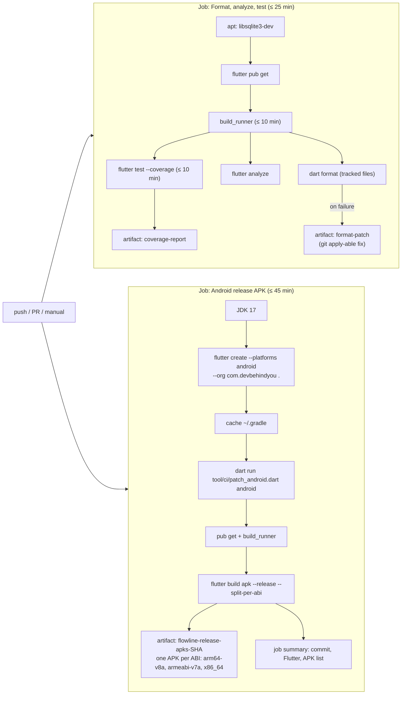

Design decisions:
- **Why Flutter 3.35.7, not the latest:** the pinned code generators
  (`riverpod_generator` 2.6 → `analyzer` 7.x) support Dart ≤ 3.9. Flutter
  3.38+ ships Dart 3.10, whose SDK source uses dot shorthands; the analyzer
  crashed on them and `build_runner` then hung for 5.5 hours. Bump Flutter
  only together with the codegen stack.
- Analyze and test still run after a format failure, so one run reports
  everything; the job still fails.
- The format check covers git-tracked files only, so generated code can't
  fail it.
- The two jobs run in parallel for faster feedback.

### 18.3 Android template patches

`android/` is regenerated each run, then patched:

| Patch | Why |
|---|---|
| `INTERNET` permission | `flutter create` adds it only to the debug/profile manifests; without it every AI request fails in a release build. |
| `POST_NOTIFICATIONS` | Session-end alert on Android 13+. |
| `RECEIVE_BOOT_COMPLETED` + `ScheduledNotificationReceiver` + `ScheduledNotificationBootReceiver` | Required by `flutter_local_notifications` ≥ 16 for `zonedSchedule`; without the receiver the scheduled alert never shows. |
| `android:usesCleartextTraffic="true"` | Ollama over plain HTTP on the LAN. |
| `isCoreLibraryDesugaringEnabled = true` + `desugar_jdk_libs:2.1.4` | The notification plugin is built with desugaring; the release build fails without it. |

Signing: the release build uses the template's **debug key** — fine for
sideloading, **not** for the Play Store. No keystore or secrets are
configured in CI.

---

## 19. Testing

### 19.1 Inventory

| File | Level | Covers |
|---|---|---|
| `test/domain/services/focus_stats_calculator_test.dart` | unit | daily totals, streak rules |
| `test/domain/services/schedule_conflict_checker_test.dart` | unit | exact, touching, nested, partial, multiple, self-exclusion, locked blocks |
| `test/domain/services/export_formatter_test.dart` | unit | CSV header/rows/nulls, JSON round-trip |
| `test/data/remote/ai_clients/ai_error_mapper_test.dart` | unit | every status/timeout mapping, no raw exception leakage |
| `test/data/repositories/data_integrity_test.dart` | repository | FK pragma on, cascade subtasks, unlink sessions, block delete un-schedules tasks, single active session |
| `test/data/repositories/focus_session_repository_impl_test.dart` | repository | natural-end stamping, ended-early, idempotence, extension, self-heal, pause freezes time |
| `test/data/repositories/ai_repository_impl_test.dart` | repository | seeding once, exactly one active provider, conversation defaults, message cascade |
| `test/features/focus_timer/focus_timer_view_model_test.dart` | view model | `completeIfElapsed` cases, racing completions credit once |
| `test/features/schedule/today_screen_test.dart` | widget | empty state (light/dark), unscheduled task, day switching |
| `test/features/focus_timer/focus_screen_test.dart` | widget | idle (light/dark), no idle ticker, plural label, first-frame remaining time, per-second ticking, pause within first second leaves no timer, natural completion at zero |
| `test/features/ai_assistant/assistant_screen_test.dart` | widget | no-provider state (light/dark), no Keystore access |
| `test/features/insights/insights_screen_test.dart` | widget | empty (light/dark), populated, ended-early counted |
| `test/tool/android_patches_test.dart` | unit | manifest + Gradle patches against the 3.35.7 templates, idempotence, loud failure |

**87 tests: 86 passing, 1 failing** (CI run `36192781020`).

### 19.2 Harness

- `test/support/test_database.dart` — `AppDatabase.forTesting(DatabaseConnection(NativeDatabase.memory(), closeStreamsSynchronously: true))`.
  The synchronous stream close stops Drift's close timer from failing
  widget tests.
- `test/support/pump_app.dart` — `pumpScreen` (themed `MaterialApp` +
  `ProviderScope` with the DB override, then `pumpAndSettle`),
  `pumpScreenNoSettle` for screens that tick on purpose, and
  `disposeScreen` to cancel their timers.
- No platform-channel mocks are needed: tests avoid the Keystore, and the
  notification service is replaced by a fake where required.

### 19.3 Not yet covered

Emulator/integration tests, Task Detail / settings / sheet widget tests,
AI client request/response shapes against mocked Dio, Drift migration
tests, accessibility (text scale, semantics), golden/screenshot tests,
performance/stress fixtures.

---

## 20. Known issues and gaps

Severity: **P0** critical · **P1** major · **P2** moderate · **P3** minor.
"Suspected" means found by reading the code, not yet reproduced by a test.

| ID | Sev | Area | Issue | Status |
|---|---|---|---|---|
| K1 | P2 | Focus | Ticker leak: pausing/ending within 1 s of (re)start leaked a 1 Hz timer (Riverpod stream provider disposed while loading) | Fixed — widget-owned timer; regression test |
| K2 | P2 | CI | `dart format` fails on the newest files | Fix available as the CI `format-patch` artifact |
| K3 | P2 | Schedule intelligence | "Apply suggested time" saves the AI's time without re-checking it for conflicts or the same day | Suspected |
| K4 | P2 | AI settings | `providerHasKeyProvider` isn't refreshed after saving or removing a key, so the card and radio stay stale until you leave the screen | Suspected |
| K5 | P2 | AI network | Shared `Dio()` has no connect/receive timeouts and requests can't be cancelled | Confirmed by reading |
| K6 | P2 | AI config | Seeded default models `claude-3-5-sonnet-20241022` and `gemini-1.5-flash` are probably retired, so first use fails until the model is edited | Unverified against live APIs |
| K7 | P2 | Time | "Today" windows (Focus footer, Insights 30-day range, Today's initial date) are computed when the provider is created, and tabs stay mounted, so they go stale across midnight while the app stays open | Suspected |
| K8 | P2 | Performance | Whole Focus `Scaffold` rebuilt every second while running | Fixed — `_Countdown` + `RepaintBoundary` |
| K9 | P2 | Error states | Screens show "Something went wrong: $error" with no retry; AI "unexpected error" messages include the raw exception | Confirmed by reading |
| K10 | P2 | AI | Full conversation history is sent on every message (unbounded payload) | Confirmed by reading |
| K11 | P3 | Insights | Streak caps at 30 days (query window) | Confirmed by reading |
| K12 | P3 | Insights | Focus footer buckets by `startedAt`, Insights by `completedAt`, so sessions that cross midnight are counted on different days | Confirmed by reading |
| K13 | P3 | Accessibility | Unlabelled icon buttons (see §14.7); no timer semantics; 200% font untested | Open |
| K14 | P3 | UX | Remove key and subtask delete have no confirmation | Open |
| K15 | P3 | UX | "Edit times" on the conflict sheet just closes it | Known (README) |
| K16 | P3 | Memory | `TextEditingController` in the "New subtask" dialog is never disposed | Confirmed by reading |
| K17 | P3 | Data | Enum index storage: reordering an enum corrupts stored rows | Design risk |
| K18 | P3 | Android | Drift's recommended `sqlite3.tempDirectory` workaround isn't set; large sorts could fail on Android | Unverified |
| K19 | — | Release | APK signed with the debug key | By design for sideloading |
| K20 | — | Design | Space Grotesk / Inter not bundled | Known (README) |

Fixed during the current QA pass (all verified by CI): never-compiled DB
layer and API mismatches; nonexistent `flutter_timezone` version; missing
lint include; FK enforcement off (orphaned subtasks); tasks vanishing on
block delete; missing release `INTERNET` permission; missing notification
receivers; missing desugaring; wrong completion timestamps; double sprint
credit; lost extension minutes; "1 sessions"; 5.5-hour CI hang.

---

## 21. Physical-device verification checklist

CI cannot prove these. Install `flowline-arm64-v8a-release-<sha7>.apk`
from the latest successful run on a phone and check:

1. Fresh install → cold start opens Today without delay.
2. Create, edit and delete a task; add, complete and delete subtasks;
   delete a task that has subtasks.
3. Add a schedule block; add an overlapping one → conflict sheet →
   "Save anyway" → red outline on Today.
4. Start a focus session → the **notification permission prompt** appears.
5. Pause, resume, +5 min, lock the screen, background the app, reopen:
   remaining time is correct.
6. Let a session finish with the app backgrounded: the **notification
   appears**; tap it; Insights shows the session on the right day.
7. Force-stop the app mid-session, wait past the end, reopen: the session
   is recorded as completed at its natural end.
8. Reboot mid-session: the alert still fires (boot receiver).
9. Deny notification permission: the timer still works.
10. AI Providers: add a real key and send a message; try a bad key
    (expect "rejected" message); airplane mode (expect "couldn't reach").
11. Ollama on the LAN via the computer's IP (cleartext HTTP).
12. Export PDF, CSV and JSON through the share sheet.
13. System dark/light switch while on each tab and with a sheet open.
14. Largest system font / display size: Focus ring, stat cards, sheets.
15. TalkBack pass over every screen.

---

## 22. Roadmap

Near term (QA stop conditions from the continuation brief):
1. Diagnose K1, apply the format patch (K2), get CI fully green.
2. Fix K3–K10 with regression tests; accessibility labels (K13).
3. Add an emulator job for launch, task, schedule and focus flows.

Then, per `03-scope…` §10 and the UX spec:
- Schedule block edit/delete UI; due dates; block picker in the task form.
- Session Summary sheet, Skip, custom durations, haptics.
- Assistant streaming, markdown, conversation history, provider switcher,
  Task Breakdown Engine.
- Settings: Appearance (theme mode), Notifications, Data & Privacy.
- Onboarding.
- Google Calendar read-only sync (needs the owner's OAuth client), then
  drift analysis.
- AI Monitoring (voice), per `03-scope…` §6.
- Upgrade the codegen stack (Riverpod 3 / newer Drift) so Flutter can move
  past 3.35.
