# Atomic Assist (AA) — Project Overview

> **What this is:** a single, current, as-built description of the Atomic Assist
> codebase — architecture, data flow, data model, every screen, widget,
> provider and key function, the UI/UX system, the build/CI pipeline, and
> an honest list of known gaps.
>
> **Snapshot:** originally written at commit `1d66c1c` (2026-09-27).
> Status sections (§2, §18–§20, §22) refreshed on 2026-10-01 for branch
> `claude/eloquent-pasteur-3lciys` after Phase 0 and the first part of
> Phase 1 of `docs/04-build-and-optimization-plan.md`. Status lines marked
> **VERIFIED** come from CI run `36849191025` (#10) or the local Flutter
> 3.35.7 run noted beside them; anything not exercised by either is marked
> **UNVERIFIED**.
>
> **How it relates to the other docs:** `docs/01-architecture.md`,
> `docs/02-ux-ui-spec.md` and `docs/03-scope-architecture-dfd-v2.md` are
> the original *plans*. `docs/history.md` is the phase-by-phase build log
(it used to be `README.md`). `docs/05-atomic-assist-plan.md` is the
> forward plan (the personal assistant and the Atomic UI rebuild);
> `docs/04-build-and-optimization-plan.md` keeps the rules R1–R21, the
> defect register (B1–B31) and the finished phases. This
> file describes what the code *actually does today* and records where it
> differs from the plans (see [§17 Documentation drift](#17-documentation-drift)).

---

## Table of contents

1. [Product summary](#1-product-summary)
2. [Current status](#2-current-status)
3. [Scope: built vs. planned](#3-scope-built-vs-planned)
4. [Technology stack](#4-technology-stack)
5. [Architecture](#5-architecture)
6. [Data flow diagrams](#6-data-flow-diagrams)
7. [Data model](#7-data-model)
8. [Domain layer: entities, contracts, pure services](#8-domain-layer)
9. [Data layer: repositories, AI clients, platform services](#9-data-layer)
10. [State management: provider catalog](#10-state-management-provider-catalog)
11. [Navigation](#11-navigation)
12. [Screens and features](#12-screens-and-features)
13. [Widget and component catalog](#13-widget-and-component-catalog)
14. [UI/UX system](#14-uiux-system)
15. [Key algorithms and functions](#15-key-algorithms-and-functions)
16. [Security, privacy, offline behaviour](#16-security-privacy-offline-behaviour)
17. [Documentation drift](#17-documentation-drift)
18. [Build, CI and Android packaging](#18-build-ci-and-android-packaging)
19. [Testing](#19-testing)
20. [Known issues and gaps](#20-known-issues-and-gaps)
21. [Physical-device verification checklist](#21-physical-device-verification-checklist)
22. [Roadmap](#22-roadmap)

---

## 1. Product summary

Atomic Assist (AA; called Flowline until 2026-10-04) is an **Android-first, phone-first, local-first** productivity app
built with Flutter. It combines three things in one calm, focus-first UI:

- **Time-blocked planning** — tasks, subtasks and named schedule blocks on a
  per-day timeline, plus an unscheduled backlog.
- **A Pomodoro focus timer** — focus / short break / long break sessions
  whose remaining time is derived from persisted wall-clock anchors, so it
  stays correct across backgrounding and process death.
- **A bring-your-own-key AI layer** — chat with Anthropic, OpenAI, Google
  Gemini or a local Ollama server, plus AI-assisted resolution of schedule
  conflicts.

There is **no Atomic Assist backend, no account, no telemetry**. All data lives
in an on-device SQLite database; API keys live in the Android Keystore; AI
requests go directly from the device to the vendor the user chose.

---

## 2. Current status

| Check | Result | Evidence |
|---|---|---|
| Dependencies resolve (`flutter pub get`) | **VERIFIED** | CI |
| Code generation (`build_runner`, Drift + Riverpod) | **VERIFIED** | CI |
| Static analysis (`flutter analyze`) | **VERIFIED — no issues** | CI |
| Formatting (`dart format`) | **VERIFIED — clean** | CI #10 |
| Unit + widget + repository tests | **VERIFIED — all pass** (125 in CI #10; 176 locally with the uncommitted-at-the-time Phase 1 work) | CI + local |
| Android release APK (`--split-per-abi`) | **VERIFIED — builds, signed through the release signing path**, versionCode from the run number | CI artifact `flowline-release-apks-<sha>` |
| Release signing with the stable key | **UNVERIFIED** — needs the `ANDROID_*` repository secrets; until then CI signs with a throwaway key and warns | README › Release signing |
| Emulator / integration tests | **NOT RUN** — no emulator job yet | — |
| Behaviour on a physical phone | **UNVERIFIED** | see [§21](#21-physical-device-verification-checklist) |

The previously failing first-frame Focus test was fixed in `3fc2115` (a
leaked Riverpod ticker). A separate timing flake in the per-second
countdown tests (sub-second clock offset vs. Drift's second precision) was
fixed by aligning the fake clock in the test.

> History worth knowing: the project was originally written without a
> compiler ("written blind", per `README.md`). The first CI runs showed it
> had never compiled — one nonexistent package version, a whole database
> layer that failed code generation, several API mismatches with the pinned
> packages, and a lint config pointing at a file that doesn't exist. Those
> are fixed; see the git log from `84d0b57` onward.

---

## 3. Scope: built vs. planned

| Module (from `03-scope…` §1) | Status | Notes |
|---|---|---|
| Task & schedule management | **Built, partial** | Tasks, subtasks, blocks (create, edit, delete), day switcher, unscheduled backlog, swipe complete/delete with Undo, long-press action sheet, due dates with overdue state, block picker in the task form. Repeating blocks (every day, weekdays, chosen weekdays) with edit/delete of one day or the whole series. No drag-and-drop timeline. |
| Focus timer | **Built** | Configurable focus/break lengths, start/pause/resume/end/+5 min, Skip for breaks, task/subtask linking, sprint credit, local notification (tap opens Focus). Session Summary sheet suggests the next session (long break every N focus sessions); completion haptic. No last-10-seconds emphasis yet. |
| AI assistant | **Built, partial** | Four vendors behind one strategy interface, one thread per provider, error bubbles. No streaming, no markdown, no conversation history screen, no Task Breakdown Engine, no "Add to Today". |
| Schedule intelligence | **Built, partial** | Overlap detection on save, conflict sheet, one-shot AI time suggestion, overlap flagging on Today. No drift analysis, no manual timeline adjuster. |
| Calendar sync (Google, read-only) | **Not built** | Deliberately deferred (needs the owner's OAuth client + release-key SHA-1). `ScheduleBlockSource.externalCalendar` and `isLocked` exist in the model already. |
| Insights | **Built, partial** | Today / streak / week stat cards, 7-day bar chart. No monthly view, no heatmap, no adherence %. |
| Export | **Built** | PDF, CSV, JSON of the last 7 days via the system share sheet. |
| AI Monitoring (voice) | **Not built** | Designed in `03-scope…` §6 only. No microphone code or permission exists. |
| Settings | **Built** | Settings home (reachable from every tab), AI Providers, Focus timer lengths, Notifications (session alerts on/off), Appearance (System/Light/Dark), Data & Privacy (clear all data). Stored in the `app_settings` table (schema v5). No AI Monitoring screen (voice isn't built). |
| Onboarding / splash | **Built** | First launch opens a 3-step skippable onboarding (value, notification permission with rationale, optional AI provider); `onboarding_done` setting. The native launch screen uses the app's surface colour, light and dark (CI writes the resources, see `tool/ci/android_patches.dart`). |

---

## 4. Technology stack

Versions are what CI actually resolves (see the `flutter pub get` log), not
just the caret constraints in `pubspec.yaml`.

| Concern | Package | Resolved | Notes |
|---|---|---|---|
| SDK | Flutter / Dart | **3.47.5 / 3.13.4** | Pinned in CI; move it only together with the codegen stack (rule R19). The project's language version is still 3.4, so the formatter output didn't change. |
| State management | `flutter_riverpod`, `riverpod_annotation`, `riverpod_generator` | 3.4.3 / 4.0.7 / 4.0.9 | Code-generated providers. Automatic retry off (`noAutomaticRetry`); action notifiers are keepAlive. |
| Routing | `go_router` | 18.0.2 | `StatefulShellRoute.indexedStack` for the 4 tabs. |
| Database | `drift`, `drift_dev`, `sqlite3` | 2.35.1 / 2.35.1 / 3.7.0 | SQLite bundled through Dart build hooks (no `sqlite3_flutter_libs`). Schema v4. |
| Secure storage | `flutter_secure_storage` | 10.3.4 (held) | Migrates 9.x Jetpack Security data to its own cipher on first read, with backup. Stay on 10.x until every install has run it. |
| HTTP | `dio` | 5.11.1 | One shared instance; connect 15 s / send 30 s / receive 120 s timeouts. |
| Notifications | `flutter_local_notifications`, `timezone`, `flutter_timezone` | 22.3.1 / 0.11.1 / 5.1.0 | Inexact `zonedSchedule`; UTC fallback for unknown zones. |
| Charts | `fl_chart` | 1.2.0 | Insights bar chart. |
| Export | `pdf`, `printing`, `share_plus`, `path_provider` | 3.13.1 / 5.15.1 / 13.3.0 / 2.1.6 | PDF embeds the bundled Hanken Grotesk, so dashes and Latin/Greek/Cyrillic text render (B25). |
| Formatting | `intl` | 0.20.3 | Date/time labels, through locale-aware skeletons in `lib/l10n/formats.dart`. |
| Localization | `flutter_localizations` + gen-l10n | SDK | All UI text in `lib/l10n/app_en.arb` (English only so far); `context.l10n`. Generated Dart is committed. |
| Lints | `flutter_lints` + strict analyzer settings | 6.0.0 | See `analysis_options.yaml` (rule R15). |
| Codegen runner | `build_runner` | 2.16.1 | |

Android toolchain (from the Flutter 3.47.5 template CI generates):
AGP 9.1.0, Gradle 9.3.1, Kotlin 2.4.0 (`kotlin { compilerOptions }`),
`compileSdk` 36, `targetSdk` 36, `minSdk` 24, Java 17, application id
`com.devbehindyou.flowline`.

---

## 5. Architecture

### 5.1 Layering

Atomic Assist follows the MVVM-flavoured *Presentation → Domain → Data* layering
from `docs/01-architecture.md`, **minus the Use Case layer** (intentionally
dropped — see [§17](#17-documentation-drift)). View models call repository
interfaces directly; the one place that genuinely spans two repositories
(schedule intelligence) orchestrates in its view model.

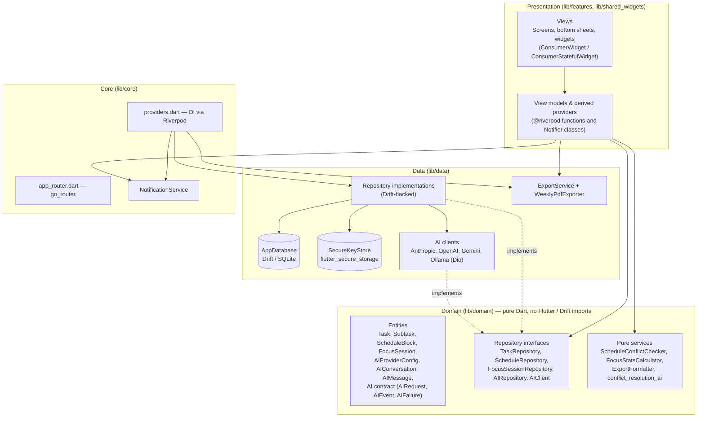
```mermaid
flowchart TB
    subgraph Presentation["Presentation (lib/features, lib/shared_widgets)"]
        V["Views<br/>Screens, bottom sheets, widgets<br/>(ConsumerWidget / ConsumerStatefulWidget)"]
        VM["View models & derived providers<br/>(@riverpod functions and Notifier classes)"]
    end

    subgraph Domain["Domain (lib/domain) — pure Dart, no Flutter / Drift imports"]
        E["Entities<br/>Task, Subtask, ScheduleBlock, FocusSession,<br/>AIProviderConfig, AIConversation, AIMessage,<br/>AI contract (AIRequest, AIEvent, AIFailure)"]
        RI["Repository interfaces<br/>TaskRepository, ScheduleRepository,<br/>FocusSessionRepository, AIRepository, AIClient"]
        S["Pure services<br/>ScheduleConflictChecker, FocusStatsCalculator,<br/>ExportFormatter, conflict_resolution_ai"]
    end

    subgraph Data["Data (lib/data)"]
        R["Repository implementations<br/>(Drift-backed)"]
        DB[("AppDatabase<br/>Drift / SQLite")]
        SK[("SecureKeyStore<br/>flutter_secure_storage")]
        AI["AI clients<br/>Anthropic, OpenAI, Gemini, Ollama (Dio)"]
        EX["ExportService + WeeklyPdfExporter"]
    end

    subgraph Core["Core (lib/core)"]
        P["providers.dart — DI via Riverpod"]
        RT["app_router.dart — go_router"]
        NS["NotificationService"]
    end

    V --> VM
    VM --> RI
    VM --> S
    R -.implements.-> RI
    AI -.implements.-> RI
    R --> DB
    R --> SK
    R --> AI
    P --> R
    P --> NS
    P --> EX
    VM --> NS
    VM --> EX
```

Dependency rule: `domain/` imports nothing from `data/`, `features/` or
Flutter. Verified by grep — no `package:flutter` import exists under
`lib/domain/`.

### 5.2 Folder map (as built)

```text
lib/
├── main.dart                     ProviderScope + runApp (no async init)
├── app.dart                      AtomicAssistApp: MaterialApp.router, theme,
│                                 focus-session reconciliation on start/resume
├── design/                     Atomic design system (docs/05 Part VI)
│   ├── tokens/                   colours, palette roles, spacing/radius/stroke/shadow, type, motion
│   ├── theme/atomic_theme.dart   AtomicTheme.light()/dark() + AtomicThemeData (context.atomic)
│   ├── foundation/               AtomicText, AtomicIcons
│   └── components/               AtomicTag (more in Phase B)
├── core/
│   ├── providers.dart            App-wide singletons (DB, repos, Dio, AI, export, notifications)
│   ├── router/app_router.dart    Routes + 4-branch shell
│   └── notifications/notification_service.dart
├── domain/
│   ├── entities/                 9 plain Dart classes/enums
│   ├── repositories/             5 abstract interfaces
│   └── services/                 4 pure, unit-tested services
├── data/
│   ├── local/drift/              AppDatabase + 7 table definitions
│   ├── local/secure/             SecureKeyStore
│   ├── remote/ai_clients/        4 vendor clients + ai_error_mapper
│   ├── repositories/             4 Drift-backed implementations
│   └── export/                   ExportService, WeeklyPdfExporter
├── features/                     one folder per feature: view/ viewmodel/ [widgets/]
│   ├── shell/                    AppShell (bottom bar or rail by window size)
│   ├── schedule/                 Today screen, DayTimeline, TaskCard
│   ├── task_form/                Add/Edit Task sheet
│   ├── task_detail/              Task Detail screen
│   ├── schedule_block_form/      Add/Edit Schedule Block sheet
│   ├── schedule_intelligence/    Conflict sheet + AI suggestion
│   ├── focus_timer/              Focus screen, TimerRing
│   ├── ai_assistant/             Assistant screen, ChatBubble
│   ├── insights/                 Insights screen (stat cards + chart)
│   ├── export/                   Export sheet
│   └── settings/                 Settings home, AI Providers, provider sheet
└── shared_widgets/               EmptyState, PriorityChip, StatusChip

test/                             13 test files (see §19)
tool/ci/                          Android template patches applied in CI
.github/workflows/ci.yml          The only build environment
```

`android/` and `ios/` are **gitignored on purpose**: CI regenerates
`android/` from the pinned Flutter template on every run and patches it
(see [§18.3](#183-android-template-patches)).

### 5.3 Dependency injection graph

All singletons are `keepAlive` Riverpod providers in `core/providers.dart`.
Tests override `appDatabaseProvider` (in-memory SQLite) and, where needed,
`notificationServiceProvider`.

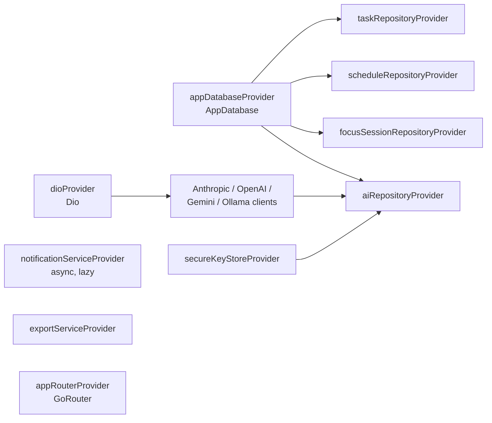
```mermaid
flowchart LR
    appDatabase[appDatabaseProvider<br/>AppDatabase] --> taskRepo[taskRepositoryProvider]
    appDatabase --> scheduleRepo[scheduleRepositoryProvider]
    appDatabase --> focusRepo[focusSessionRepositoryProvider]
    appDatabase --> aiRepo[aiRepositoryProvider]
    dio[dioProvider<br/>Dio] --> clients["Anthropic / OpenAI /<br/>Gemini / Ollama clients"]
    clients --> aiRepo
    secure[secureKeyStoreProvider] --> aiRepo
    notif[notificationServiceProvider<br/>async, lazy]
    export[exportServiceProvider]
    router[appRouterProvider<br/>GoRouter]
```

`notificationServiceProvider` is **lazy and async on purpose**: its `init()`
requests the notification permission, and that prompt should appear the
first time a focus session starts, not at app launch.

---

## 6. Data flow diagrams

### 6.1 Level 0 — system context (as built)

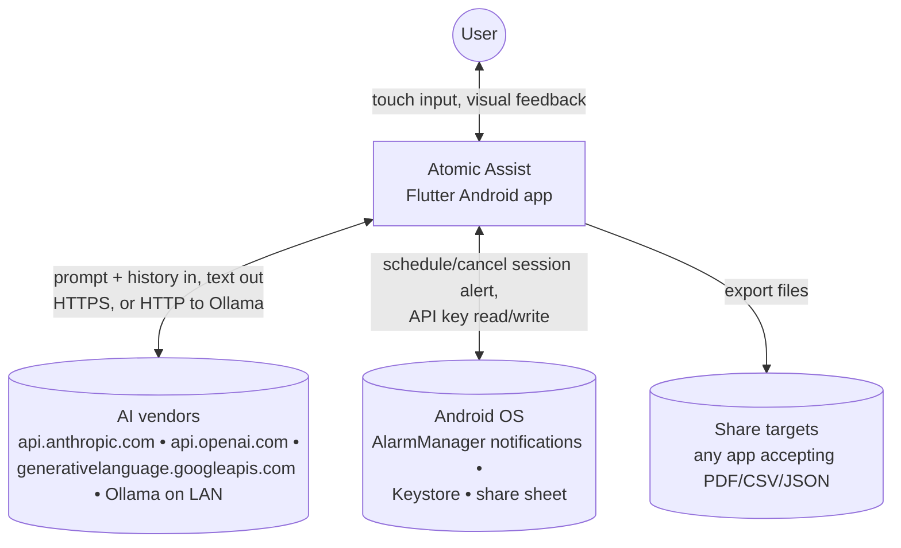
```mermaid
flowchart TB
    User((User))
    App["Atomic Assist<br/>Flutter Android app"]
    AI[("AI vendors<br/>api.anthropic.com • api.openai.com •<br/>generativelanguage.googleapis.com • Ollama on LAN")]
    OS[("Android OS<br/>AlarmManager notifications •<br/>Keystore • share sheet")]
    Share[("Share targets<br/>any app accepting PDF/CSV/JSON")]

    User <-->|touch input, visual feedback| App
    App <-->|prompt + history in, text out<br/>HTTPS, or HTTP to Ollama| AI
    App <-->|schedule/cancel session alert,<br/>API key read/write| OS
    App -->|export files| Share
```

Not present yet (planned in `03-scope…`): Google Calendar, microphone /
foreground service.

### 6.2 Level 1 — processes and stores (as built)

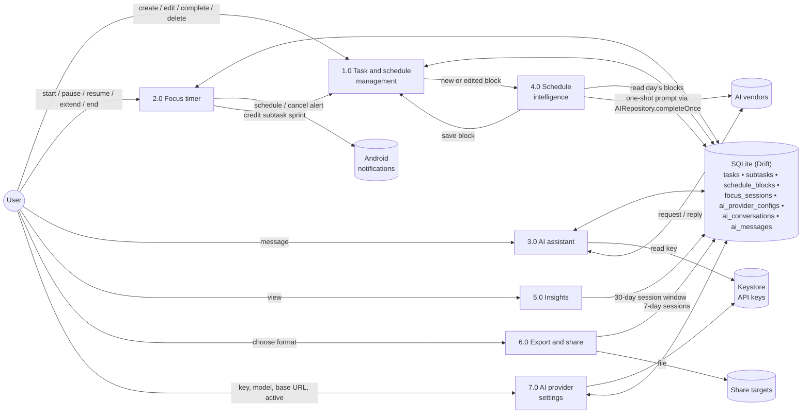
```mermaid
flowchart LR
    U((User))

    P1["1.0 Task and schedule<br/>management"]
    P2["2.0 Focus timer"]
    P3["3.0 AI assistant"]
    P4["4.0 Schedule<br/>intelligence"]
    P5["5.0 Insights"]
    P6["6.0 Export and share"]
    P7["7.0 AI provider<br/>settings"]

    DB[("SQLite (Drift)<br/>tasks • subtasks • schedule_blocks •<br/>focus_sessions • ai_provider_configs •<br/>ai_conversations • ai_messages")]
    SEC[("Keystore<br/>API keys")]
    AI[("AI vendors")]
    OS[("Android<br/>notifications")]
    SH[("Share targets")]

    U -->|create / edit / complete / delete| P1
    P1 <--> DB

    U -->|start / pause / resume / extend / end| P2
    P2 <--> DB
    P2 -->|schedule / cancel alert| OS
    P2 -->|credit subtask sprint| P1

    U -->|message| P3
    P3 <--> DB
    P3 -->|read key| SEC
    P3 <-->|request / reply| AI

    P1 -->|new or edited block| P4
    P4 -->|read day's blocks| DB
    P4 -->|one-shot prompt via AIRepository.completeOnce| AI
    P4 -->|save block| P1

    P5 -->|30-day session window| DB
    U -->|view| P5

    U -->|choose format| P6
    P6 -->|7-day sessions| DB
    P6 -->|file| SH

    U -->|key, model, base URL, active| P7
    P7 --> SEC
    P7 <--> DB
```

### 6.3 Create a task

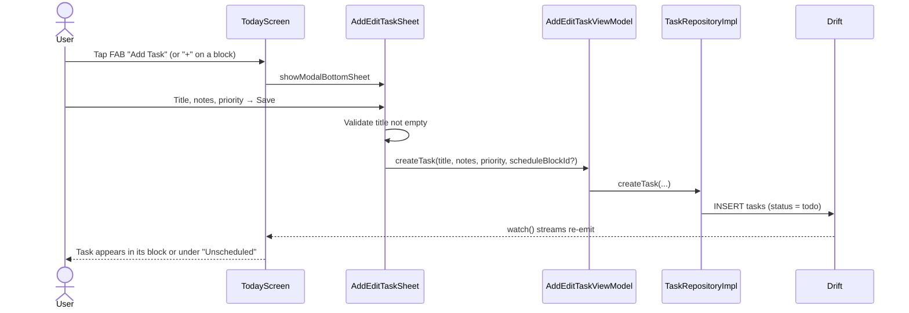
```mermaid
sequenceDiagram
    actor U as User
    participant T as TodayScreen
    participant S as AddEditTaskSheet
    participant VM as AddEditTaskViewModel
    participant R as TaskRepositoryImpl
    participant DB as Drift

    U->>T: Tap FAB "Add Task" (or "+" on a block)
    T->>S: showModalBottomSheet
    U->>S: Title, notes, priority → Save
    S->>S: Validate title not empty
    S->>VM: createTask(title, notes, priority, scheduleBlockId?)
    VM->>R: createTask(...)
    R->>DB: INSERT tasks (status = todo)
    DB-->>T: watch() streams re-emit
    T-->>U: Task appears in its block or under "Unscheduled"
```

### 6.4 Focus session lifecycle (wall-clock timer)

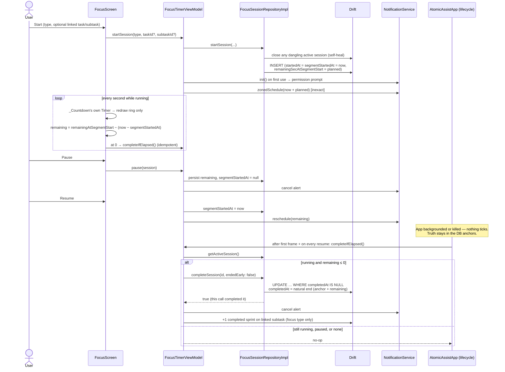
```mermaid
sequenceDiagram
    actor U as User
    participant F as FocusScreen
    participant VM as FocusTimerViewModel
    participant R as FocusSessionRepositoryImpl
    participant DB as Drift
    participant N as NotificationService
    participant App as AtomicAssistApp (lifecycle)

    U->>F: Start (type, optional linked task/subtask)
    F->>VM: startSession(type, taskId?, subtaskId?)
    VM->>R: startSession(...)
    R->>DB: close any dangling active session (self-heal)
    R->>DB: INSERT (startedAt = segmentStartedAt = now,<br/>remainingSecAtSegmentStart = planned)
    VM->>N: init() on first use → permission prompt
    VM->>N: zonedSchedule(now + planned) [inexact]

    loop every second while running
        F->>F: _Countdown's own Timer → redraw ring only
        F->>F: remaining = remainingAtSegmentStart − (now − segmentStartedAt)
        F->>VM: at 0 → completeIfElapsed() (idempotent)
    end

    U->>F: Pause
    F->>VM: pause(session)
    VM->>R: persist remaining, segmentStartedAt = null
    VM->>N: cancel alert

    U->>F: Resume
    VM->>R: segmentStartedAt = now
    VM->>N: reschedule(remaining)

    Note over App: App backgrounded or killed — nothing ticks.<br/>Truth stays in the DB anchors.

    App->>VM: after first frame + on every resume: completeIfElapsed()
    VM->>R: getActiveSession()
    alt running and remaining ≤ 0
        VM->>R: completeSession(id, endedEarly: false)
        R->>DB: UPDATE … WHERE completedAt IS NULL<br/>completedAt = natural end (anchor + remaining)
        R-->>VM: true (this call completed it)
        VM->>N: cancel alert
        VM->>DB: +1 completed sprint on linked subtask (focus type only)
    else still running, paused, or none
        VM-->>App: no-op
    end
```

### 6.5 Assistant message

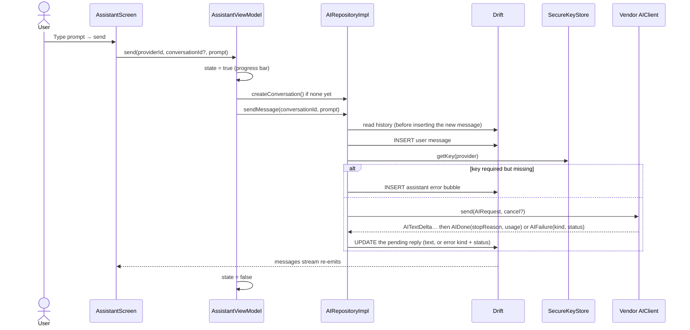
```mermaid
sequenceDiagram
    actor U as User
    participant A as AssistantScreen
    participant VM as AssistantViewModel
    participant R as AIRepositoryImpl
    participant DB as Drift
    participant K as SecureKeyStore
    participant C as Vendor AIClient

    U->>A: Type prompt → send
    A->>VM: send(providerId, conversationId?, prompt)
    VM->>VM: state = true (progress bar)
    VM->>R: createConversation() if none yet
    VM->>R: sendMessage(conversationId, prompt)
    R->>DB: read history (before inserting the new message)
    R->>DB: INSERT user message
    R->>K: getKey(provider)
    alt key required but missing
        R->>DB: INSERT assistant error bubble
    else
        R->>C: send(AIRequest, cancel?)
        C-->>R: AITextDelta… then AIDone(stopReason, usage) or AIFailure(kind, status)
        R->>DB: UPDATE the pending reply (text, or error kind + status)
    end
    DB-->>A: messages stream re-emits
    VM->>VM: state = false
```

Errors never throw out of a client: every failure is an `AIFailure`
event with a kind (invalid key, rate limited, server error + status,
unreachable, empty response, model not pulled, missing key, cancelled,
interrupted, unknown). The reply row stores the kind and status (schema
v7), and the chat words it in the user's language
(`lib/l10n/ai_failure_text.dart`). Error rows from before v7 keep their
English text.

### 6.6 Schedule block save with conflict resolution

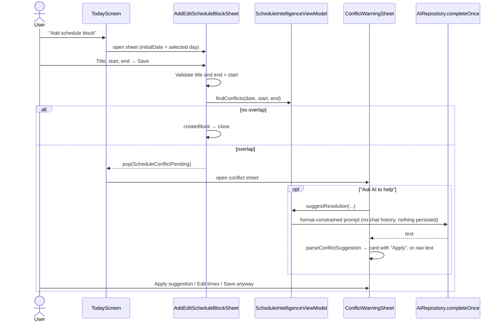
```mermaid
sequenceDiagram
    actor U as User
    participant T as TodayScreen
    participant S as AddEditScheduleBlockSheet
    participant SI as ScheduleIntelligenceViewModel
    participant CW as ConflictWarningSheet
    participant AI as AIRepository.completeOnce

    U->>T: "Add schedule block"
    T->>S: open sheet (initialDate = selected day)
    U->>S: Title, start, end → Save
    S->>S: Validate title and end > start
    S->>SI: findConflicts(date, start, end)
    alt no overlap
        S->>S: createBlock → close
    else overlap
        S-->>T: pop(ScheduleConflictPending)
        T->>CW: open conflict sheet
        opt "Ask AI to help"
            CW->>SI: suggestResolution(...)
            SI->>AI: format-constrained prompt (no chat history, nothing persisted)
            AI-->>CW: text
            CW->>CW: parseConflictSuggestion → card with "Apply", or raw text
        end
        U->>CW: Apply suggestion / Edit times / Save anyway
    end
```

### 6.7 Export

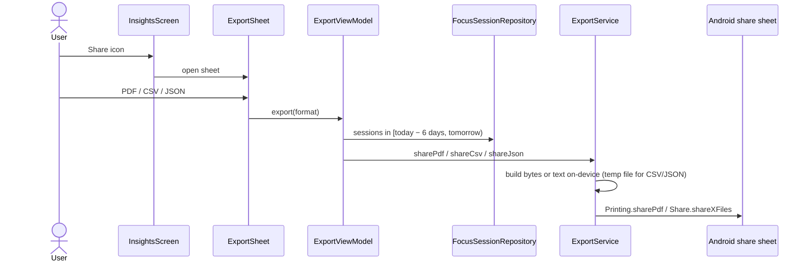
```mermaid
sequenceDiagram
    actor U as User
    participant I as InsightsScreen
    participant ES as ExportSheet
    participant VM as ExportViewModel
    participant R as FocusSessionRepository
    participant X as ExportService
    participant OS as Android share sheet

    U->>I: Share icon
    I->>ES: open sheet
    U->>ES: PDF / CSV / JSON
    ES->>VM: export(format)
    VM->>R: sessions in [today − 6 days, tomorrow)
    VM->>X: sharePdf / shareCsv / shareJson
    X->>X: build bytes or text on-device (temp file for CSV/JSON)
    X->>OS: Printing.sharePdf / Share.shareXFiles
```

---

## 7. Data model

### 7.1 Entity-relationship diagram (as built, schema version 3)

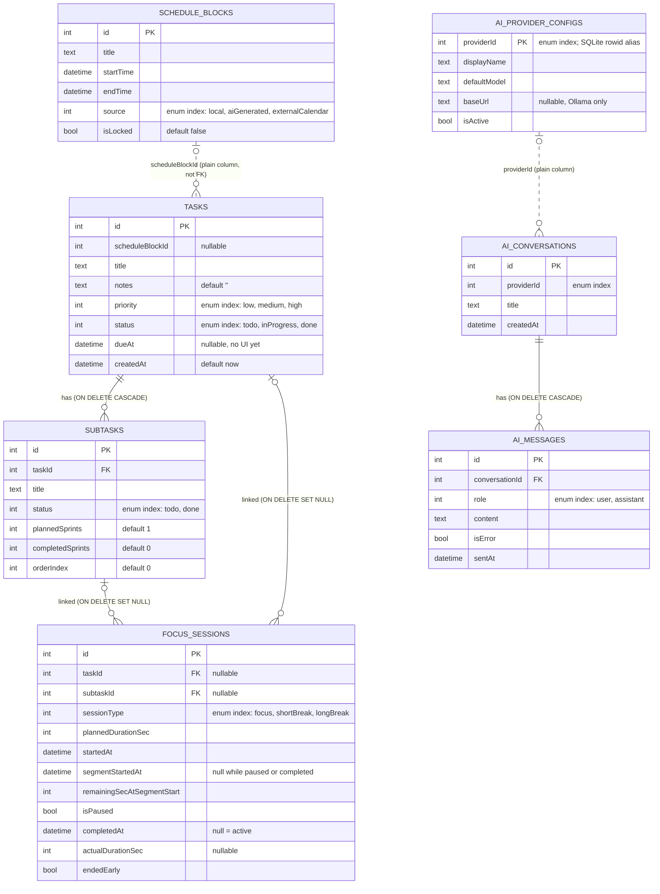
```mermaid
erDiagram
    TASKS ||--o{ SUBTASKS : "has (ON DELETE CASCADE)"
    TASKS |o--o{ FOCUS_SESSIONS : "linked (ON DELETE SET NULL)"
    SUBTASKS |o--o{ FOCUS_SESSIONS : "linked (ON DELETE SET NULL)"
    SCHEDULE_BLOCKS |o..o{ TASKS : "scheduleBlockId (plain column, not FK)"
    AI_CONVERSATIONS ||--o{ AI_MESSAGES : "has (ON DELETE CASCADE)"
    AI_PROVIDER_CONFIGS |o..o{ AI_CONVERSATIONS : "providerId (plain column)"

    TASKS {
        int id PK
        int scheduleBlockId "nullable"
        text title
        text notes "default ''"
        int priority "enum index: low, medium, high"
        int status "enum index: todo, inProgress, done"
        datetime dueAt "nullable, no UI yet"
        datetime createdAt "default now"
    }
    SUBTASKS {
        int id PK
        int taskId FK
        text title
        int status "enum index: todo, done"
        int plannedSprints "default 1"
        int completedSprints "default 0"
        int orderIndex "default 0"
    }
    SCHEDULE_BLOCKS {
        int id PK
        text title
        datetime startTime
        datetime endTime
        int source "enum index: local, aiGenerated, externalCalendar"
        bool isLocked "default false"
    }
    FOCUS_SESSIONS {
        int id PK
        int taskId FK "nullable"
        int subtaskId FK "nullable"
        int sessionType "enum index: focus, shortBreak, longBreak"
        int plannedDurationSec
        datetime startedAt
        datetime segmentStartedAt "null while paused or completed"
        int remainingSecAtSegmentStart
        bool isPaused
        datetime completedAt "null = active"
        int actualDurationSec "nullable"
        bool endedEarly
    }
    AI_PROVIDER_CONFIGS {
        int providerId PK "enum index; SQLite rowid alias"
        text displayName
        text defaultModel
        text baseUrl "nullable, Ollama only"
        bool isActive
    }
    AI_CONVERSATIONS {
        int id PK
        int providerId "enum index"
        text title
        datetime createdAt
    }
    AI_MESSAGES {
        int id PK
        int conversationId FK
        int role "enum index: user, assistant"
        text content
        bool isError
        datetime sentAt
    }
```

### 7.2 Storage rules and invariants

- **Foreign keys are enforced** — `PRAGMA foreign_keys = ON` runs in
  `beforeOpen` on every connection. (Before commit `1f5d597` it didn't, so
  every `onDelete` rule was silently ignored.)
- **`tasks.scheduleBlockId` is a foreign key `ON DELETE SET NULL`** (since
  v4); `ScheduleRepositoryImpl.deleteBlock` also un-schedules the block's
  tasks explicitly in the same transaction.
- **Recurring blocks (v6).** A `schedule_blocks` row is a plain block, a
  *series* (`recurrence` set: an RRULE subset, `FREQ=DAILY` or
  `FREQ=WEEKLY;BYDAY=…`; a template that is never shown itself), or a
  *stored occurrence* (`series_id` + `occurrence_date`; at most one per
  series and day, unique index). Days are expanded in
  `domain/recurrence/occurrences.dart` at read time, at wall-clock times
  (DST-safe). A computed occurrence has a negative stand-in id that
  encodes its series and day; it is stored as a real row when it's edited
  alone or gets a task. "Delete this day" adds a row to
  `schedule_block_exceptions`; "this day and all after" sets
  `recurrence_until`. CHECKs keep `series_id` and `occurrence_date` set
  together, and a stored occurrence is never itself a series.
- **At most one active focus session** (`completedAt IS NULL`).
  `startSession` closes any dangling one first.
- **Completion is idempotent** — `completeSession` updates only
  `WHERE completedAt IS NULL` and returns whether it did.
- **API keys are never stored here.** `ai_provider_configs` holds metadata
  only.
- **Enums are stored by index** (`intEnum<T>()`). Reordering or inserting
  in the middle of an enum silently corrupts existing rows — only ever
  append.
- **Date-times** use Drift's default storage (Unix seconds), so sub-second
  precision is dropped.
- **Seeding:** `AIRepositoryImpl` inserts the four provider rows on first
  use (none active).

### 7.3 Migrations

`AppDatabase.schemaVersion = 10`. Snapshots of v3 (what every APK
before Phase 3 shipped) to v10 live in `drift_schemas/`; `test/drift/`
verifies the upgrade schema and data. Upgrades run **step by step**
through the generated `app_database.steps.dart`, so each step sees its
own version's tables. Run `dart run drift_dev make-migrations` after each
bump, then add the new `fromNToM` step.

| From → to | Change |
|---|---|
| 1 → 2 | `createTable(focusSessions)` (Phase 2) |
| 2 → 3 | `createTable(aiProviderConfigs, aiConversations, aiMessages)` (Phase 3) |
| 3 → 4 | Repair data, then: unique partial index (one active session), `CHECK(end_time > start_time)`, `tasks.schedule_block_id` FK `ON DELETE SET NULL`, five performance indexes, `ai_messages.is_pending` |
| 4 → 5 | `createTable(app_settings)` (Phase 3) |
| 5 → 6 | `schedule_blocks` rebuilt with `recurrence`, `recurrence_until`, `series_id` (FK, cascade), `occurrence_date` and two CHECKs; `createTable(schedule_block_exceptions)`; unique index on `(series_id, occurrence_date)` (Phase 3) |
| 6 → 7 | `ai_messages.error_kind`, `ai_messages.error_status` (typed AI errors, Phase 4) |
| 7 → 8 | `createTable(utterances, assistant_actions, proposals)` and their indexes, including the partial unique `proposals_open_key` (one open proposal per dedupe key). New tables only (docs/05 Phase E.2) |
| 8 → 9 | `ai_messages.stop_reason` (why a reply ended; B18: a reply that hit the length limit shows "Cut off") |
| 9 → 10 | `assistant_actions.preview_json` (what an action did, worded later even if its target is gone) and `ai_messages.turn_group_id` (the assistant turn a chat reply belongs to) |

**Assistant tables (v8).** Written by the assistant core (§9.4–§9.5),
which no screen calls yet (E.5):

| Table | Holds | Invariants in SQL |
|---|---|---|
| `utterances` | What the user said or typed: `body`, `source` (`UtteranceSource`), `language`, `confidence` | `body` non-empty; `confidence` in 0..1 |
| `assistant_actions` | The ledger: `group_id` (one UNDO per turn), `tool_name`, `args_json`, `origin`, `decision`, `status` (`LedgerStatus`), `undo_json` (`encodeUndoRecipe`), `utterance_id` | `tool_name`, `group_id` non-empty; `utterance_id` FK `ON DELETE SET NULL` |
| `proposals` | Suggestions for the Inbox: tool + args, `origin`, `reason` (`ProposalReason`), `reason_json`, `source_text`, `dedupe_key`, `status`, `expires_at` | One open row per `dedupe_key`; `expires_at > created_at`; `dedupe_key` non-empty |

The enum columns have no range CHECK on purpose: the enums are
append-only (R1), and a CHECK would force a table rebuild each time one
grows. Undo recipes (`lib/domain/assistant/ledger.dart`) are JSON with
table *names*, and `decodeUndoRecipe` returns null for anything it can't
read, so an unreadable recipe makes one entry un-undoable instead of
breaking the Activity list.

Schema verification uses Drift's `SchemaVerifier` (generated tests plus a
data-integrity tests: a v3 database full of edge cases, v5 → v6
keeping blocks and their tasks, and v7 → v8 keeping tasks and chat
history). `test/data/local/assistant_tables_test.dart` pins the v8 SQL
invariants.

---

## 8. Domain layer

Everything under `lib/domain/` is plain Dart: no Flutter, no Drift, no
Riverpod.

### 8.1 Entities

| Entity | Key fields | Behaviour |
|---|---|---|
| `Task` | `id, title, notes, priority, status, scheduleBlockId?, dueAt?, createdAt` | `copyWith` |
| `Subtask` | `id, taskId, title, status, plannedSprints, completedSprints, orderIndex` | `copyWith` |
| `ScheduleBlock` | `id, title, startTime, endTime, source, isLocked` | `duration`, `copyWith` |
| `FocusSession` | see §7.1 | `isRunning`; **`remainingSec`** — derived from the wall clock on every read |
| `AIProviderConfig` | `id, displayName, defaultModel, baseUrl?, isActive` | `requiresApiKey` (false for Ollama) |
| `AIConversation` | `id, providerId, title, createdAt` | — |
| `AIMessage` | `id, conversationId, role, content, isError, sentAt` | — |
| AI contract (`domain/ai/ai_contract.dart`) | `AIRequest` (config, key, system, history, prompt, maxOutputTokens, format), `AIEvent` = `AITextDelta` / `AIDone(stopReason, usage)` / `AIFailure(kind, status)`, `AICancelToken`, `AIModelInfo`, `AICompletion` = `AIText` / `AIError` | Errors are values, never exceptions; `collect()` turns a stream into one `AICompletion` |
| `ExportFormat` | `pdf, csv, json` | — |

### 8.2 Repository contracts

| Interface | Reads (streams) | Writes |
|---|---|---|
| `TaskRepository` | `watchTasksForBlock`, `watchUnscheduledTasks({done, limit})`, `watchUnscheduledDoneCount`, `watchTask`, `watchSubtasks` | `createTask`, `updateTask`, `deleteTask`, `setTaskStatus`, `createSubtask`, `setSubtaskStatus`, `deleteSubtask`, `incrementSubtaskCompletedSprints` |
| `ScheduleRepository` | `watchBlocksForDay`, `getBlocksForDay`, `watchDayPlan` (blocks joined with their tasks, one query) | `createBlock`, `updateBlock`, `deleteBlock` |
| `FocusSessionRepository` | `watchActiveSession`, `getActiveSession`, `watchSessionsForTask`, `watchTodaysSessions`, `watchSessionsInRange` | `startSession`, `pauseSession`, `resumeSession`, `extendSession`, `completeSession → bool` |
| `AIRepository` | `watchProviders`, `watchActiveProvider`, `watchConversations`, `watchMessages`, `hasKey` | `saveProviderKey`, `setActiveProvider`, `removeProviderKey`, `createConversation`, `deleteConversation`, `sendMessage`, `completeOnce` |
| `AIClient` (strategy, v2) | `listModels(config, apiKey)` | `send(AIRequest, {cancel}) → Stream<AIEvent>` |

### 8.3 Pure services

| Service | Functions | Used by |
|---|---|---|
| `ScheduleConflictChecker` | `findConflicts(startTime, endTime, existingBlocks, excludeBlockId?)`, `findConflictingBlockIds(blocks)` | Block save flow; Today's overlap flags |
| `FocusStatsCalculator` | `dailyTotals(sessions, days = 7)`, `currentStreak(sessions)` | Insights, PDF export |
| `ExportFormatter` | `toCsv(sessions)`, `toJson(sessions, rangeStart, rangeEnd)` | Export |
| `conflict_resolution_ai.dart` | `buildConflictResolutionPrompt(...)`, `parseConflictSuggestion(text)` | Conflict sheet |

Details of each algorithm are in [§15](#15-key-algorithms-and-functions).

---

## 9. Data layer

### 9.1 Repository implementations

| Class | Notes |
|---|---|
| `TaskRepositoryImpl` | Straight Drift CRUD. Subtasks ordered by `orderIndex` (always 0 today — no reordering UI). |
| `ScheduleRepositoryImpl` | `watchBlocksForDay` = blocks whose **start** falls in `[day, day+1)`, ordered by start. `deleteBlock` un-schedules tasks first, in one transaction. |
| `FocusSessionRepositoryImpl` | Wall-clock timer persistence, self-heal, natural-end completion, extension grows `plannedDurationSec`. See [§15.1](#151-wall-clock-focus-timer). |
| `AIRepositoryImpl` | Seeds providers, keeps the "exactly one active" rule in a transaction, orchestrates a chat send, `completeOnce` for no-history one-shot prompts, and `completeWithTools` (one round with tools; falls back to a JSON plan when the model refuses tools). |

### 9.2 AI vendor clients

All four extend `HttpAIClient` (`data/remote/ai_clients/http_ai_client.dart`),
which owns the HTTP call, cancellation, failure mapping and the contract's
event order; a vendor only builds its call and reads its reply and model
list. They share the app's single `Dio` instance, send a **windowed**
history (the last ten completed exchanges or ~24,000 characters,
`windowHistory`, K10), and **stream**
(Phase 4.3): server-sent events for the hosted vendors, NDJSON for
Ollama. The reply row fills in as text arrives (written at most every
120 ms); the chat's send button becomes **Stop**, and a stopped or
dropped reply keeps the text that arrived. They
send the system prompt the vendor's way, ask for JSON when requested
(OpenAI `response_format`, Gemini `responseMimeType`, Ollama `format`,
an instruction for Anthropic), and read stop reason (cut-off = B18) and
token usage.

**Tool calling (AI contract v3, docs/05 Phase D).** A request may carry
`tools` (`AIToolSpec`: name, description, a JSON Schema in the portable
subset checked by `unsupportedSchemaKeywords`), a `toolChoice` and the
`continuation` of earlier rounds (the model's calls and the app's
results). Each vendor maps them to its own format: Anthropic `tools` +
`tool_use`/`tool_result` blocks, OpenAI `tools` + `tool_calls`/`tool`
messages, Gemini `functionDeclarations` + `functionCall`/
`functionResponse` parts, Ollama the OpenAI shape with object arguments.
`HttpAIClient` assembles streamed argument fragments and emits each call
once, complete, after the text (`AIToolCall`, with the arguments as raw
JSON for the caller to validate, R16); a call cut off by a dropped stream
is never emitted. A 400 whose body talks about tools becomes
`toolsUnsupported`, and `completeWithTools` then asks the same model for a
JSON plan (`json_plan.dart`) whose actions become the same calls.
Pinned by `tool_calls_contract_test.dart` (one call, two calls, text then
a call, raw arguments, a drop mid-call, a 400 about tools vs. other 400s,
request encoding) for all four vendors. Not yet used by any screen: the
orchestrator that does is Phase E.

| Client | Endpoint | Auth | Request shape | Notes |
|---|---|---|---|---|
| `AnthropicClient` | `POST https://api.anthropic.com/v1/messages`; models `GET /v1/models` | `x-api-key`, `anthropic-version: 2023-06-01` | `system`, `messages[]`, `max_tokens` | Joins all `text` content blocks |
| `OpenAIClient` | `POST https://api.openai.com/v1/chat/completions`; models `GET /v1/models` | `Authorization: Bearer` | `system` message, `messages[]`, `max_completion_tokens` | `choices[0].message.content` |
| `GeminiClient` | `POST …/v1beta/models/{model}:generateContent`; models `GET …/v1beta/models` (chat-capable only) | `x-goog-api-key` header (never a URL query parameter) | `systemInstruction`, `contents[]` with `user` / `model` roles, `generationConfig` | Joins `candidates[0].content.parts[].text` |
| `OllamaClient` | `POST {baseUrl}/api/chat` (default `http://localhost:11434`); models `GET /api/tags` | none | `system` message, `messages[]`, `stream: false`, `options.num_predict` | 404 = model not pulled; the chat adds the LAN-IP hint when unreachable |

Seeded default models (editable per provider in Settings):
`claude-3-5-sonnet-20241022`, `gpt-4o-mini`, `gemini-1.5-flash`, `llama3.2`.
**UNVERIFIED against today's vendor APIs** — the first and third are likely
retired; see [§20](#20-known-issues-and-gaps).

### 9.3 Platform services

| Class | Responsibility |
|---|---|
| `SecureKeyStore` | `getKey / setKey / deleteKey` per `AIProviderId`, key name `flowline_ai_api_key_<id>`, Android `encryptedSharedPreferences`. The only place a raw key is read or written. |
| `NotificationService` | `init()` (load tz data, resolve device timezone, init plugin, request `POST_NOTIFICATIONS`), `scheduleSessionComplete(fireAt, title, body)` using one fixed notification id (1001) and channel `focus_session`, `cancelSessionNotification()`. Inexact scheduling (`inexactAllowWhileIdle`) — no exact-alarm permission needed. |
| `ExportService` | `sharePdf` (via `Printing.sharePdf`), `shareCsv` / `shareJson` (temp file + `Share.shareXFiles`). File names: `flowline-focus-YYYYMMDD-YYYYMMDD.<ext>`. |
| `WeeklyPdfExporter` | One A4 page: stat row, daily breakdown table, focus-session log (`pw.TableHelper.fromTextArray`). |

### 9.4 Assistant tools, executor and undo (docs/05 Phase E.3)

**Not wired to any screen or provider yet** — the orchestrator that calls
them is E.4. Everything below is exercised by tests only.

A tool (`lib/domain/assistant/tool.dart`) has a name, a model-facing
description, a JSON Schema in the portable subset, a risk class, and four
steps: `parse` (shape; throws `ToolArgumentError`), `validate` (against
the current state, read fresh; returns `Valid` or `Invalid(reason,
detail)`), `preview` (a typed `ActionPreview` the UI words with l10n) and
`run` (returns the result JSON for the model, an `UndoRecipe`, and
after-commit effects). `ToolRegistry.prepare` turns a name plus raw JSON
into a `PreparedCall` and never throws: an unknown name is `UnknownTool`,
so "pay" or "send" simply don't exist.

The 14 tools (`lib/assistant/tools/`):

| Tool | Risk | Undo |
|---|---|---|
| `get_agenda`, `find_free_time`, `search_tasks`, `get_task` | read | — (no ledger row) |
| `create_task` | reversible | delete the row |
| `update_task`, `complete_task` | reversible | restore the changed columns, only if unchanged since |
| `schedule_task` | reversible | restore the task's block, delete the new block |
| `break_down_task` | reversible | delete the new subtasks |
| `create_block` | reversible | delete the row |
| `move_block` | reversible | restore the times; for a computed occurrence of a series, delete the stored copy so the computed one returns |
| `start_focus` | reversible | under a minute: delete the session; longer: end it early; already ended: refuse |
| `delete_task` | destructive | restore the task, its subtasks and the focus-session links |
| `delete_block` | destructive | restore the block and its tasks' links (one-off blocks only) |

Tasks can be named by `task_id` or by `task` (title), because the local
grammar only has titles: an exact case-insensitive match wins, then a
unique partial match; otherwise `notFound` or `ambiguous` with the
candidates, for the model to resolve. Block tools refuse locked blocks
and series templates; every new time range is checked for order, the
past (one minute's grace), length (≤ 24 h) and overlap, locked blocks
included.

`ToolExecutor` (`lib/data/assistant/`) validates again and runs the tool
inside one transaction together with its `assistant_actions` row, then
runs after-commit effects (a started session's alert), whose failures are
swallowed. A tool that throws rolls back and leaves a `failed` row.
`UndoService.undoGroup` reverses a whole turn in one transaction, newest
first; if any step finds the user changed the data since, nothing is
undone (`changedSince`). `StoredRows` does the raw row access and only
ever builds SQL from schema-known table and column names.

### 9.5 Orchestrator and proposals (docs/05 Phase E.4)

**Wired as keepAlive providers (`lib/assistant/assistant_providers.dart`).**
The Assist chat calls it (E.5a, below); Inbox and Activity are next.

**The acting chat (E.5a).** Every message in Assist is one orchestrator
turn (`AssistChat`): the prompt and a pending reply are written first
(the reply carries the turn's ledger group), recent completed exchanges
go along as history, and the reply is filled with the model's text, an
empty text (the turn's actions say it all), or a typed failure. Under the
reply, `TurnActions` shows a card per action (the stored preview, worded
by `lib/l10n/action_text.dart`: "CREATED TASK · buy milk") and one UNDO
for the whole turn, live from the ledger. A held call (a delete, or
anything under "careful") opens the confirm sheet, which states exactly
what goes. In the chat, a read the grammar recognises goes to the model,
which answers in words. Trade-off: replies in the chat are no longer
streamed token by token (tool rounds are collected); Stop still cancels
and keeps what arrived.

`AssistantOrchestrator.handle(utterance)` records the utterance, then:

1. **Local grammar first.** If `quickParse` produces a call to a
   registered tool, it is validated, decided and run with no model call.
   If the grammar's call is rejected (an ambiguous title), the model gets
   a go; if no model is reachable, the rejection is the answer.
2. **Model rounds** via `AIRepository.completeWithTools` with every tool
   spec and a bounded system prompt (`AssistantContextBuilder`: rules,
   now with weekday and UTC offset, today's and tomorrow's blocks and up
   to 20 open tasks, all with ids, titles redacted for phone numbers,
   emails and card numbers). At most 4 rounds, 8 calls per turn (a reply
   with more runs none of them) and 30 s per round (the request is
   cancelled). Unknown tools, bad arguments and invalid targets go back
   to the model as error results; results are capped at 4,000 chars.
3. **Policy per call** (`decide`, origin `said`, the user's autonomy
   preset from Settings, default `balanced`): reads and hand-offs run;
   reversible actions run with undo, or ask first under `careful`;
   destructive ones always stop the turn with a `PendingConfirmation`
   (typed preview) and nothing after them runs. `confirm()` re-checks the
   state and runs it as `confirm` in the same group, so one UNDO still
   reverses the turn.

The result is `TurnAnswered` (model text, or empty for the grammar),
`TurnNeedsConfirmation`, `TurnFailed(AIFailureKind)` or
`TurnStopped(rounds|calls|timeout)`, each with the `ActedCall`s.

`ProposalService.accept` re-validates a proposal against the state now
and runs it as `said` (a tap is consent); a gone target or an expired
proposal becomes `noLongerPossible` and is closed as expired; a second tap
does nothing. `AssistantRepository.createProposal` refuses a second open
proposal with the same dedupe key. Nothing creates proposals yet: the
scanners and commitment detector are Phase H.

A session started by `start_focus` gets the normal end-of-session alert
(`FocusTimerViewModel.alertForStartedSession`), and undoing it cancels
the alert.

---

## 10. State management: provider catalog

All providers are code-generated with `@riverpod` / `@Riverpod(keepAlive:
true)`. "Auto" = auto-dispose.

| Provider | Kind | Lifetime | Source | Consumers |
|---|---|---|---|---|
| `appDatabaseProvider` | `AppDatabase` | keepAlive | new DB, closed on dispose | all repositories |
| `taskRepositoryProvider` / `scheduleRepositoryProvider` / `focusSessionRepositoryProvider` / `aiRepositoryProvider` | repository | keepAlive | DB (+ Dio, key store) | view models |
| `notificationServiceProvider` | `Future<NotificationService>` | keepAlive, lazy | `init()` | `FocusTimerViewModel` |
| `dioProvider`, `secureKeyStoreProvider`, `exportServiceProvider` | singleton | keepAlive | — | AI repo, export |
| `appRouterProvider` | `GoRouter` | keepAlive | route table | `AtomicAssistApp` |
| `selectedDateProvider` | `Notifier<DateTime>` | auto | today, `nextDay / previousDay / goToToday` | Today |
| `scheduleBlocksForSelectedDateProvider` | `Stream<List<ScheduleBlock>>` | auto | watches `selectedDateProvider` | Today |
| `tasksForBlockProvider(blockId)` | `Stream<List<Task>>` family | auto | repo | block cards |
| `unscheduledTasksProvider` | `Stream<List<Task>>` | auto | repo | Today |
| `todayActionsProvider` | action notifier | auto | `toggleTaskDone`, `deleteTask` | TaskCard |
| `taskByIdProvider(id)`, `subtasksForTaskProvider(id)` | stream families | auto | repo | Task Detail, Focus linked chip |
| `taskDetailActionsProvider` | action notifier | auto | add/toggle/delete subtask, delete task | Task Detail |
| `addEditTaskViewModelProvider` | action notifier | auto | create/update task | task sheet |
| `addEditScheduleBlockViewModelProvider` | action notifier | auto | create/update block | block sheet, conflict sheet |
| `scheduleIntelligenceViewModelProvider` | action notifier | auto | `findConflicts`, `suggestResolution` | block sheet, conflict sheet |
| `activeFocusSessionProvider` | `Stream<FocusSession?>` | auto | repo | Focus |
| `todaysFocusSummaryProvider` | `Stream<(totalSeconds, sessionCount)>` | auto | sessions started today | Focus footer, Insights "Today" |
| `selectedSessionTypeProvider` | `Notifier<FocusSessionType>` | auto | — | Focus idle view |
| `pendingFocusLinkProvider` | `Notifier<(taskId, subtaskId?, label)?>` | auto | set from Today / Task Detail | Focus idle view |
| `focusTimerViewModelProvider` | action notifier | auto | start/pause/resume/extend/complete/`completeIfElapsed` | Focus, `AtomicAssistApp` |
| `recentFocusSessionsProvider` | `Stream<List<FocusSession>>` | auto | last 30 days by `startedAt` | Insights stats |
| `weeklyFocusTotalsProvider` | `AsyncValue<List<DailyFocusTotal>>` | auto | derived synchronously | Insights |
| `currentStreakProvider` | `AsyncValue<int>` | auto | derived synchronously | Insights |
| `exportViewModelProvider` | `Notifier<bool>` (busy) | auto | builds + shares file | Export sheet |
| `aiProvidersProvider`, `activeAiProviderProvider` | streams | auto | AI repo | Assistant, AI Providers |
| `providerHasKeyProvider(id)` | `Future<bool>` family | auto | reads Keystore | provider cards |
| `latestConversationForProviderProvider(id)` | `Stream<AIConversation?>` family | auto | newest conversation for provider | Assistant |
| `conversationMessagesProvider(id)` | `Stream<List<AIMessage>>` family | auto | AI repo | message list |
| `assistantViewModelProvider` | `Notifier<bool>` (sending) | auto | `send(...)` | Assistant |
| `aiProvidersViewModelProvider` | action notifier | auto | `setActive`, `saveKey`, `removeKey` | AI Providers |

Rebuild notes:
- The one-second tick lives in `_Countdown`, a small stateful widget that
  owns a plain `Timer` (cancelled in `dispose`) and redraws only the
  `TimerRing` inside a `RepaintBoundary`. It replaced a Riverpod
  `Stream.periodic` provider: Riverpod 2.6 defers cancelling a stream
  provider disposed before its first event, so pausing or ending within a
  second of (re)starting leaked a permanent 1 Hz timer.
- The Assistant's "sending" flag is watched by the whole chat body.

---

## 11. Navigation

`go_router` with a `StatefulShellRoute.indexedStack`: each tab keeps its own
navigator and state; the four tab subtrees stay mounted.

| Path | Screen | Navigator | How it's reached |
|---|---|---|---|
| `/today` *(initial)* | `TodayScreen` | shell branch 0 | bottom nav |
| `/today/task/:taskId` | `TaskDetailScreen` | **root** (full screen over the shell) | tap a task card |
| `/focus` | `FocusScreen` | shell branch 1 | bottom nav; ▶ on a task or subtask (`context.go`) |
| `/assistant` | `AssistantScreen` | shell branch 2 | bottom nav |
| `/insights` | `InsightsScreen` | shell branch 3 | bottom nav |
| `/settings` | `SettingsHomeScreen` | root | gear icon on Today's app bar |
| `/settings/ai-providers` | `AiProvidersScreen` | root | Settings list; icon/CTA on Assistant |

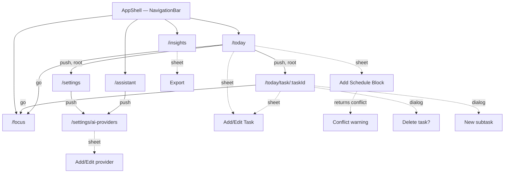
```mermaid
flowchart TD
    Shell["AppShell — NavigationBar"]
    Shell --> Today["/today"]
    Shell --> Focus["/focus"]
    Shell --> Assistant["/assistant"]
    Shell --> Insights["/insights"]
    Today -->|push, root| Detail["/today/task/:taskId"]
    Today -->|push, root| Settings["/settings"]
    Settings -->|push| Providers["/settings/ai-providers"]
    Assistant -->|push| Providers
    Detail -->|go| Focus
    Today -->|go| Focus

    Today -.sheet.-> TaskSheet["Add/Edit Task"]
    Today -.sheet.-> BlockSheet["Add Schedule Block"]
    BlockSheet -.returns conflict.-> ConflictSheet["Conflict warning"]
    Detail -.sheet.-> TaskSheet
    Detail -.dialog.-> DelTask["Delete task?"]
    Detail -.dialog.-> AddSub["New subtask"]
    Insights -.sheet.-> Export["Export"]
    Providers -.sheet.-> ProviderSheet["Add/Edit provider"]
```

Bottom-nav tap on the already-selected tab resets that branch to its root
(`goBranch(index, initialLocation: index == currentIndex)`).

---

## 12. Screens and features

For each screen: purpose, what it shows, actions, and its state model.

### 12.1 App shell — `AppShell`
- Four destinations: **Today** (calendar icon), **Focus** (hourglass),
  **Assistant** (sparkle), **Insights** (bar chart). Outlined icon when
  inactive, filled when selected.
- Adapts by Material window size class (`core/layout/window_size.dart`):
  compact (< 600dp) uses a bottom `NavigationBar`; medium uses a labelled
  `NavigationRail`; expanded (≥ 840dp) uses an extended rail.

### 12.2 Today — `TodayScreen`
- **App bar:** title "Atomic Assist", settings icon (tooltip "Settings").
- **Date header (`_DateHeader`):** previous/next day chevrons, date as
  the locale's long day format ("Tuesday, March 10"), and a "Jump to today" button only when another day is shown.
- **Body:** `DayTimeline` — one card per schedule block (time range,
  title, lock icon if locked, warning icon + red outline + "Overlaps another
  block" if it overlaps another block that day, "+" to add a task into
  it, nested task cards), an "Add schedule block" button, then an
  "Unscheduled" section. Built lazily (`ListView.builder`) from one joined
  query for the day (`dayPlanProvider`). The backlog lists open tasks, 50
  at a time with "Show more"; completed ones sit behind "Show completed
  (N)".
- **FAB:** extended "Add Task".
- **Task card actions:** tap → Task Detail; leading circle → toggle done;
  swipe right → toggle done; swipe left → "Delete task?" dialog; ▶ → go to
  Focus with the task pre-linked.
- **States:** loading (spinner), error (raw text), empty ("No tasks yet" +
  "Add Task" CTA), populated.

### 12.3 Add/Edit Task — `AddEditTaskSheet` (bottom sheet)
- Drag handle, title (required, inline error), notes (2–4 lines), priority
  `SegmentedButton` (Low / Medium / High, default Medium), Save button with
  an in-button spinner. Edit mode pre-fills from `existingTask`.
- Not present vs. spec: status field, due date, block picker, delete.

### 12.4 Add Schedule Block — `AddEditScheduleBlockSheet` (bottom sheet)
- Title (required), Start / End time pickers (defaults 09:00–10:30),
  validation "End time must be after start time". On save it checks the
  day's blocks for overlaps: none → save; any → closes and hands a
  `ScheduleConflictPending` back to Today, which opens the conflict sheet.
- The sheet supports editing an existing block, but **no screen opens it in
  edit mode**.

### 12.5 Schedule conflict — `ConflictWarningSheet` (bottom sheet)
- Lists the overlapping blocks, then offers:
  1. **Ask AI to help** → one-shot prompt; a parsed suggestion shows as a
     card with **Apply suggested time**; an unparseable reply shows as raw
     text; a failure shows an error card.
  2. **Edit times** → just closes the sheet (known rough edge).
  3. **Save anyway (overlap allowed)** → saves; Today then flags it.

### 12.6 Task Detail — `TaskDetailScreen` (full screen)
- App bar: edit (opens task sheet), delete (confirmation dialog, then pops).
- Priority + status chips, title, notes, **Start Focus Session**.
- Due date (overdue in the overdue colour).
- Subtasks: checkbox list (strike-through when done), "N of M pomodoros
  logged", ▶ per subtask (links the focus session to the subtask), ✕ to
  delete (with confirmation), a drag handle to reorder (screen readers
  get ReorderableListView's move actions), "Add subtask" dialog. New
  subtasks go last; order is stored in `subtasks.order_index`.
- Focus history: "N sessions · M min total", then each focus session
  (date, time, minutes, "ended early").
- States: loading, error, "This task no longer exists."

### 12.7 Focus — `FocusScreen`
- **Idle (`_IdleView`):** optional linked-task chip (dismissible),
  session-type `SegmentedButton` — "Focus (25m)", "Short (5m)",
  "Long (15m)" — an hourglass icon, **Start**, and the "Today's Focus"
  footer ("0m • 0 sessions").
- **Running / paused (`_RunningView`):** linked-task chip, `TimerRing`
  (MM:SS, colour by session type), label FOCUS / SHORT BREAK / LONG BREAK
  or PAUSED, three round controls — **End** (early), **Pause/Resume**,
  **+5 min** — and the footer.
- Completion at zero is triggered from the screen and, independently, from
  `AtomicAssistApp` after the first frame and on every resume.
- Ending or finishing a session opens the Session Summary sheet
  (`session_summary_sheet.dart`): minutes logged, today's focus count,
  and a button for the suggested next session. Breaks show **Skip**
  instead of End. A heavy haptic fires on completion (not on End).
- Not present vs. spec: last-10-seconds emphasis.

### 12.8 Assistant — `AssistantScreen`
- App bar: "AI Providers" icon.
- **No active provider:** empty state "Connect an AI provider" with a
  "Go to AI Providers" button.
- **Active provider (`_ChatBody`):** chip "<Provider> • <model>", message
  list (`ListView.builder`, reversed, newest at the bottom), a 2 px
  progress bar while sending, input field (1–4 lines, send on enter) and a
  filled send button (disabled while sending). Empty thread: "Ask me
  anything".
- Chat bubbles: user right-aligned on `primary`; assistant left-aligned on
  `surfaceContainerHigh`; errors on `errorContainer`.
- Not present vs. spec: streaming, markdown, retry, in-chat provider
  switcher, conversation history, new-conversation action.

### 12.9 Insights — `InsightsScreen`
- App bar: share icon ("Export this week").
- **Empty:** "Complete a session to see stats".
- **Populated:** three `_StatCard`s — **Today** (focus time), **Day
  streak** (fire icon), **This week** — then "Last 7 days" bar chart (one
  bar per day, single-letter weekday labels, no grid or axes) and
  "N focus session(s) this week".

### 12.10 Export — `ExportSheet` (bottom sheet)
- "Export this week", privacy line ("generated on-device…"), three rows:
  PDF summary, CSV (spreadsheet), JSON (raw data). Spinner while exporting;
  closes when done.

### 12.11 Settings — `SettingsHomeScreen`
- One row: **AI Providers** ("Connect Anthropic, OpenAI, Gemini, or a local
  Ollama server").

### 12.12 AI Providers — `AiProvidersScreen`
- One `_ProviderCard` per vendor inside a `RadioGroup`: radio (enabled only
  when the provider has a key, or is Ollama), name, subtitle
  ("Connected • model" / "Not connected" / Ollama URL • model), edit icon.
  Selecting a radio makes that provider the single active one.

### 12.13 Add/Edit AI Provider — `AddEditAiProviderSheet` (bottom sheet)
- Hosted vendors: masked **API key** field with show/hide toggle, **Model**
  field, **Save**, **Remove key**. Ollama: **Server URL** (with the
  "localhost means the phone itself" hint) and **Model**.
- An empty key field on Save keeps the existing key (only model/URL change).

---

## 13. Widget and component catalog

### 13.1 Inventory

| Widget | File | Type | Role |
|---|---|---|---|
| `AtomicAssistApp` | `app.dart` | ConsumerStatefulWidget | Root `MaterialApp.router`, themes, lifecycle reconciliation |
| `AppShell` | `features/shell/app_shell.dart` | StatelessWidget | Bottom navigation shell |
| `TodayScreen`, `_DateHeader` | `features/schedule/view/today_screen.dart` | Consumer | Today tab, date switcher |
| `DayTimeline`, `_ScheduleBlockSection` | `features/schedule/widgets/day_timeline.dart` | Stateless / Consumer | Timeline of blocks + unscheduled |
| `TaskCard` | `features/schedule/widgets/task_card.dart` | Consumer | Dismissible task row |
| `AddEditTaskSheet` | `features/task_form/view/` | ConsumerStateful | Task form |
| `AddEditScheduleBlockSheet`, `ScheduleConflictPending` | `features/schedule_block_form/view/` | ConsumerStateful / value | Block form + conflict hand-off |
| `ConflictWarningSheet`, `_SuggestionCard`, `_RawAiTextCard`, `_ErrorCard` | `features/schedule_intelligence/view/` | ConsumerStateful / Stateless | Conflict resolution |
| `TaskDetailScreen`, `_SubtaskList` | `features/task_detail/view/` | Consumer | Task detail + subtasks |
| `FocusScreen`, `_IdleView`, `_RunningView`, `_LinkedTaskChip`, `_ControlButton`, `_TodaysFocusFooter` | `features/focus_timer/view/focus_screen.dart` | Consumer / Stateless | Focus tab |
| `TimerRing` | `features/focus_timer/widgets/timer_ring.dart` | StatelessWidget | Countdown ring sized from the window (160–360dp), tabular digits |
| `AssistantScreen`, `_ChatBody`, `_MessageList` | `features/ai_assistant/view/` | Consumer / ConsumerStateful | Chat |
| `ChatBubble` | `features/ai_assistant/widgets/chat_bubble.dart` | StatelessWidget | One message |
| `InsightsScreen`, `_StatCard`, `_WeeklyBarChart` | `features/insights/view/` | Consumer / Stateless | Insights |
| `ExportSheet`, `_ExportOption` | `features/export/view/` | Consumer / Stateless | Export picker |
| `SettingsHomeScreen` | `features/settings/view/` | StatelessWidget | Settings list |
| `AiProvidersScreen`, `_ProviderCard` | `features/settings/view/` | Consumer | Provider list |
| `AddEditAiProviderSheet` | `features/settings/view/` | ConsumerStateful | Key / model / URL form |
| `EmptyState` | `shared_widgets/empty_state.dart` | StatelessWidget | Icon + title + message + optional button |
| `PriorityChip` | `shared_widgets/priority_chip.dart` | StatelessWidget | Low / Medium / High pill (text label + colour) |
| `StatusChip` | `shared_widgets/status_chip.dart` | StatelessWidget | Todo / In Progress / Done pill |

### 13.2 Against the UX spec's component library (`02-ux-ui-spec.md` §4)

| Spec component | Implementation | Gaps |
|---|---|---|
| Primary / Secondary Button | `ElevatedButton` (themed, 48 dp full-width), `OutlinedButton`, `TextButton` | — |
| Icon Button | `IconButton` | Several lack tooltips (see §20) |
| FAB | `FloatingActionButton.extended` on Today | — |
| Top App Bar | `AppBar` per screen | Settings icon only on Today, not every tab |
| Bottom Navigation Bar | `NavigationBar` in `AppShell` | No badges |
| Task Card/Row | `TaskCard` | No overdue state, no long-press menu |
| Schedule Block Card | `_ScheduleBlockSection` | No current/past/future styling |
| Day Timeline | `DayTimeline` | Eager `ListView(children:)`, not lazily built |
| Timer Ring | `TimerRing` | No last-10 s emphasis yet; one semantics label; scales with the window |
| Session Type Selector | `SegmentedButton` | Hidden while running rather than disabled |
| Session Controls | `_ControlButton` ×3 | No Skip |
| Chat Bubble | `ChatBubble` | No streaming, retry or markdown |
| Chat Input Bar | `TextField` + `IconButton.filled` | Send button has no tooltip |
| Active Provider Indicator | `Chip` in chat header | Not tappable (no in-chat switcher) |
| Provider Card | `_ProviderCard` | No validating / invalid-key state |
| API Key Field | masked `TextField` + visibility toggle | Toggle has no tooltip; no "Test connection" |
| Stat Card | `_StatCard` | No trend arrow, no skeleton |
| Chart Widget | `_WeeklyBarChart` (`fl_chart`) | Weekly bars only |
| Streak Badge | Streak stat card | Not a standalone badge |
| Priority / Status Chip | `PriorityChip`, `StatusChip` | — (text + colour, not colour alone) |
| Empty State | `EmptyState` | — |
| Skeleton Loader | — | Spinners used instead |
| Inline Error + Retry | plain `Text("Something went wrong: $error")` | No retry, shows raw error |
| Snackbar with Undo | — | Not implemented |
| Confirmation Dialog | `AlertDialog` for task delete | Not used for Remove key or subtask delete |
| Bottom Sheet Container | `showModalBottomSheet` + themed sheet | — |
| Switch / Dropdown / Search / Onboarding Step | — | Not implemented (no screens need them yet) |
| Date & Time Picker | `showTimePicker` | No date picker |

---

## 14. UI/UX system

### 14.1 Principles (from `02-ux-ui-spec.md` §1, applied)

- **Minimal, focus-first, dark-first**, Material 3 at its quiet end: one
  accent, flat surfaces, no decorative motion or gradients.
- **Four persistent tabs**; Settings off the top bar; bottom sheets for
  short single-purpose forms; dialogs only for destructive confirmation.
- **8 pt spacing grid** — screens use 8/12/16/20/24 px paddings.
- **Local-first** — no pull-to-refresh anywhere; Drift streams update the UI
  reactively.

### 14.2 Theme implementation (`lib/design/`, Phase A)

The app is themed by the **Atomic Design System**
(`docs/design-system/atomic-design-system.md`); the Flowline token files
in `docs/history/design-tokens/` no longer apply. Everything visual comes from
`lib/design/tokens/`:

| Token file | Contents |
|---|---|
| `atomic_colors.dart` | Raw palette: ink `#15171B`, paper `#F4F5F1`, white, surface `#EDEEE8`, Signal `#3A2FF0` and its family, slate, line, error, energy colours, dark-theme cards `#1E2026` |
| `atomic_palette.dart` | Semantic roles per theme (background, card, panel, text, textMuted, rule, hairline, accent, accentText, danger, shadow, inverse, track). Widgets read roles via `context.atomic.palette` |
| `atomic_metrics.dart` | Spacing (4/8/12/16/22/24/32/44/56/74), radius (3/4/6/8/28/pill), strokes (1/1.5/2/4), hard offset shadows (0 blur), fixed sizes (48 dp targets) |
| `atomic_type.dart` | Bebas Neue (display), Hanken Grotesk (body), JetBrains Mono (labels, ≥ 12 sp) |
| `atomic_motion.dart` | 120/150/200/350/500 ms, ease; `AtomicMotion.of(context)` drops transforms under reduced motion |

`AtomicTheme.light()/dark()` map these onto Material 3 (every component
theme set; elevation 0; radius 4; 1 dp ink rule under app bars; 2 dp ink
input and control borders; 28 dp sheet tops with a drag handle). Dark
follows system §13.9: ink background, `#1E2026` cards, paper text,
signal-light accent. Because Material uses `primary` both as text and as
a fill, the dark `primary` is signal-light with ink on it (docs/05 DS-16).

Contrast of every text role on every surface, in both themes, is tested
(`test/design/atomic_theme_test.dart`), as are the system's two traps
(Signal text on ink, orange text on paper).

### 14.3 Status, priority and session colour

There are no extra hues (system rule "one signal"). Priority and status
are mono caps tags whose weight carries the meaning (`AtomicTag`): HIGH is
ink-filled, MEDIUM ink-outlined, LOW hairline; IN PROGRESS is the one
Signal-filled status. Overdue is `danger` text plus the word. Focus
sessions draw in the accent, breaks in ink.

### 14.4 Typography

**Bebas Neue** (display: titles, big numbers, app buttons; caps-only
glyphs), **Hanken Grotesk** (400/500/700, body) and **JetBrains Mono**
(400/500/700, labels) are bundled under `assets/fonts` (SIL OFL 1.1,
licences on the Licenses page). `AtomicText.mono` upper-cases labels for
display and keeps the written words as the semantics label for screen
readers.

### 14.5 Theme mode

System / Light / Dark, chosen in Settings → Appearance and stored in
`app_settings`. No dynamic colour.

### 14.6 States matrix (as built)

| Screen | Empty | Loading | Error | Success |
|---|---|---|---|---|
Since Phase C every state uses the Atomic components: loading is a mono
line naming what loads plus a 2 dp ink bar (no spinners), empty is a
surface module with one sentence and a next step, errors are plain words
with Retry (`ErrorView` → `AtomicErrorState`, K9/R14), destructive actions
confirm in a sheet that states the effect.

| Screen | Empty | Loading | Error | Success |
|---|---|---|---|---|
| Today | "No tasks yet" module + Add Task | "LOADING THE DAY…" | plain message + Retry | timeline |
| Task Detail | "No subtasks yet." / "No focus sessions yet." | "LOADING THE TASK…" | plain message + Retry | detail |
| Focus | idle view with the atom mark | "LOADING THE TIMER…" | plain message + Retry | idle / running / paused |
| Assistant | "Connect an AI provider" / "Ask me anything" | "LOADING THE CONVERSATION…"; ink bar while sending | warning card in the thread | thread |
| Insights | "Complete a session to see stats" | "LOADING YOUR WEEK…" | plain message + Retry | stat panels + chart |
| AI Providers | (all four always listed) | "LOADING PROVIDERS…" | plain message + Retry | cards; the active one selected |

### 14.7 Accessibility status

| Requirement | Status |
|---|---|
| Priority / status not by colour alone | **Met** — chips carry text labels |
| Session type not by colour alone | **Met** — text label under the ring |
| 48 dp primary buttons | **Met** via theme |
| Icon-only buttons labelled | **Partly** — missing on Task Detail edit/delete, subtask delete, API key visibility toggle, date chevrons, chat send |
| Timer ring semantics | **Missing** — progress indicators have no semantic label |
| 200% font scale, reduced motion, small screens | **UNVERIFIED** — no tests yet |

---

## 15. Key algorithms and functions

### 15.1 Wall-clock focus timer

State stored per session: `segmentStartedAt` (null while paused) and
`remainingSecAtSegmentStart`. Everything else is derived:

```text
remaining = isPaused ? remainingSecAtSegmentStart
                     : max(0, remainingSecAtSegmentStart − (now − segmentStartedAt))
pause     : remainingSecAtSegmentStart ← remaining; segmentStartedAt ← null
resume    : segmentStartedAt ← now
extend(n) : plannedDurationSec += n; remainingSecAtSegmentStart += n
complete  : only if completedAt IS NULL
            completedAt = endedEarly ? now : min(now, segmentStartedAt + remainingSecAtSegmentStart)
            actualDurationSec = clamp(planned − remaining, 0, planned)
```

- The `_Countdown` widget's one-second `Timer` only **redraws**; it never
  counts time. Time is read through `package:clock`, so tests drive it
  with FakeAsync.
- A session that ran out while the app was closed is recorded at its
  **natural end**, so it lands on the right day in Insights and the streak.
- `completeSession` returns `true` only for the call that completed it; the
  view model credits the subtask's sprint (focus type, not ended early,
  subtask linked) and cancels the notification only then. Racing calls
  therefore credit once — this is covered by a test.
- `AtomicAssistApp` calls `completeIfElapsed()` after the first frame and on
  every resume.

### 15.2 Overlap detection

Half-open intervals: two ranges conflict when
`start < other.end && end > other.start`. Touching boundaries (one block
ends exactly when the next starts) are **not** conflicts.
`excludeBlockId` stops an edited block conflicting with its own old
version. `findConflictingBlockIds` flags every block that overlaps any
other in the list, including locked external ones.

### 15.3 Daily totals and streak

- `dailyTotals(sessions, days)` returns one entry per day, oldest first,
  ending today; zero-filled; counts only **completed focus** sessions,
  bucketed by the local date of `completedAt`, summing `actualDurationSec`
  (null counts as 0). Ended-early sessions count.
- `currentStreak(sessions)` counts consecutive days with at least one
  completed focus session, walking back from today. If today has none
  *yet*, the walk starts from yesterday, so the streak doesn't reset
  mid-day.
- Insights feeds both from a 30-day window, so a streak **caps at 30**.

### 15.4 AI conflict-resolution prompt

`buildConflictResolutionPrompt` asks for exactly three lines —
`SUGGESTED_START=<ISO8601>`, `SUGGESTED_END=<ISO8601>`, `REASON=<text>` —
keeping the same duration later the same day. `parseConflictSuggestion`
returns `null` (never throws) when either time is missing or unparsable,
or the end isn't after the start; the sheet then shows the raw text instead
of an Apply button.

### 15.5 CSV / JSON export

- CSV header: `Date,Start Time,Type,Planned Minutes,Actual Minutes,Completed,Ended Early`.
  Hand-rolled on purpose: every field is a date, time, enum label, number or
  boolean, so nothing needs quoting. Adding any free-text column (task
  title, notes) would need a real CSV encoder.
- JSON: `exportedAt`, `rangeStart`, `rangeEnd`, and `sessions[]` with ids,
  type, timestamps, durations, `endedEarly`, `taskId`, `subtaskId`;
  pretty-printed with 2-space indentation.

### 15.6 AI error mapping

`describeDioError(error, vendor)`:

| Condition | Message |
|---|---|
| HTTP 401 / 403 | "That API key was rejected by {vendor}." |
| HTTP 429 | "{vendor} rate-limited this request — try again shortly." |
| Other HTTP status | "{vendor} returned an error (HTTP {code})." |
| Connection / receive timeout, connection error | "Couldn't reach {vendor} — check your connection." |
| Anything else | "Couldn't reach {vendor}." |

Ollama has its own mapper (LAN-IP hint, "model isn't pulled" on 404).
Non-Dio exceptions become "Unexpected error talking to {vendor}: $e" —
this still exposes the raw exception text.

### 15.7 Android template patches (`tool/ci/android_patches.dart`)

`patchManifest` and `patchAppGradleKts` are pure, idempotent string
transforms that throw `AndroidPatchException` when an anchor is missing,
so a template change fails CI loudly. See [§18.3](#183-android-template-patches).

---

## 16. Security, privacy, offline behaviour

| Area | As built |
|---|---|
| API keys | Only in `flutter_secure_storage` (`encryptedSharedPreferences`, Keystore-backed). Never in SQLite, never logged, never in URLs (Gemini uses a header). |
| Logging | No `print`, `debugPrint`, `log` or Dio `LogInterceptor` anywhere in `lib/`. |
| Network | HTTPS to the three hosted vendors; plain HTTP allowed app-wide (`usesCleartextTraffic`) for Ollama on the LAN. **No timeouts or cancellation** on requests. |
| Telemetry / backend | None. |
| Data at rest | `flowline.sqlite` in app documents (not encrypted). |
| Permissions (release manifest, after CI patch) | `INTERNET`, `POST_NOTIFICATIONS`, `RECEIVE_BOOT_COMPLETED`; `VIBRATE` merged from the notification plugin. No microphone, location or exact-alarm permission. |
| Offline | Tasks, subtasks, blocks, focus timer, Insights and export work fully offline. Only the Assistant and "Ask AI to help" need the network; they fail with an in-app error message. |

---

## 17. Documentation drift

Differences between the planning docs, the README and the code, with an
assessment of each.

| # | Documented | Implemented | Assessment | Action |
|---|---|---|---|---|
| D1 | Use Case layer between view models and repositories (`01`, `03`) | View models call repositories directly | Intentional (README) | Keep |
| D2 | Google Calendar sync, locked external events (`03` §1, §5) | Not built; model fields exist | Intentional deferral | Keep deferred |
| D3 | AI Monitoring / voice (`03` §6) | Not built | Planned future | Keep deferred |
| D4 | README "Full CRUD … schedule blocks" | Create, edit and delete in the UI | Done (Phase 3a) | — |
| D5 | Spec: Settings icon on every tab | On every tab's app bar | Done (Phase 3c) | — |
| D6 | Spec: onboarding, splash, Session Summary, Conversation History, Notifications, Appearance, Data & Privacy screens | All but Conversation History built (Phase 3) | Mostly done | Conversation History in Phase 4 |
| D7 | Spec: theme mode System / Light / Dark setting | Appearance screen, stored in `app_settings` | Done (Phase 3e) | — |
| D8 | Tokens: dark `primary` `#C0C1FF`, `surface-container-high` `#1F2430`, light `surface-border` `#E2E8F0`; Space Grotesk + Inter | Dark primary `#C0C1FF`; every container token mapped; Space Grotesk + Inter bundled | Done (Phase 3) | Superseded by the Atomic system (docs/05 Phase A); record in `docs/history/design-tokens/DECISIONS.md` |
| D9 | `03` §7 model matrix: Claude 3.5 Sonnet, GPT-4o mini, Gemini 1.5 | Same seeded defaults | Likely stale today | Verify live, then update openly |
| D10 | `03` §8 packages: `drift_flutter`, `freezed`, `json_serializable`, `csv`, `workmanager`, `mocktail` | None used | Intentional — not needed yet | Keep |
| D11 | README: notification plugin "merges its own manifest requirements" | False since plugin v16; app must declare receivers | Bug (fixed) | README updated in `1f5d597` |
| D12 | README: release build needs only `POST_NOTIFICATIONS` + cleartext | Also `INTERNET`, receivers, desugaring | Bug (fixed) | README + CI patch updated |
| D13 | README "wall-clock-safe … even if killed" | True for display; completion stamping was wrong until `1d66c1c` | Bug (fixed) | — |
| D14 | Spec: swipe-left reveals delete *with* confirmation | Swipe-left triggers the dialog directly | Minor, consistent with intent | Keep |
| D15 | Spec: chat streaming, markdown, retry | Non-streaming plain text | Incomplete | Roadmap |
| D16 | `03` §9: timeline and chat virtualised, `RepaintBoundary` on the timer | Chat is lazy; timeline eager; Focus countdown isolated in `_Countdown` + `RepaintBoundary` | Partly done | Virtualise timeline |

---

## 18. Build, CI and Android packaging

### 18.1 Development model

There is **no local Flutter SDK or Android Studio**. GitHub Actions is the
only place the project resolves dependencies, generates code, analyses,
tests and builds. APKs are downloaded from CI artifacts and sideloaded onto
a physical phone.

### 18.2 Pipeline (`.github/workflows/ci.yml`)

Triggers: push to `main`, pull requests, manual dispatch. One run per ref at
a time (`cancel-in-progress`). Runner `ubuntu-24.04`. Read-only token
permissions. Flutter pinned to **3.35.7**.

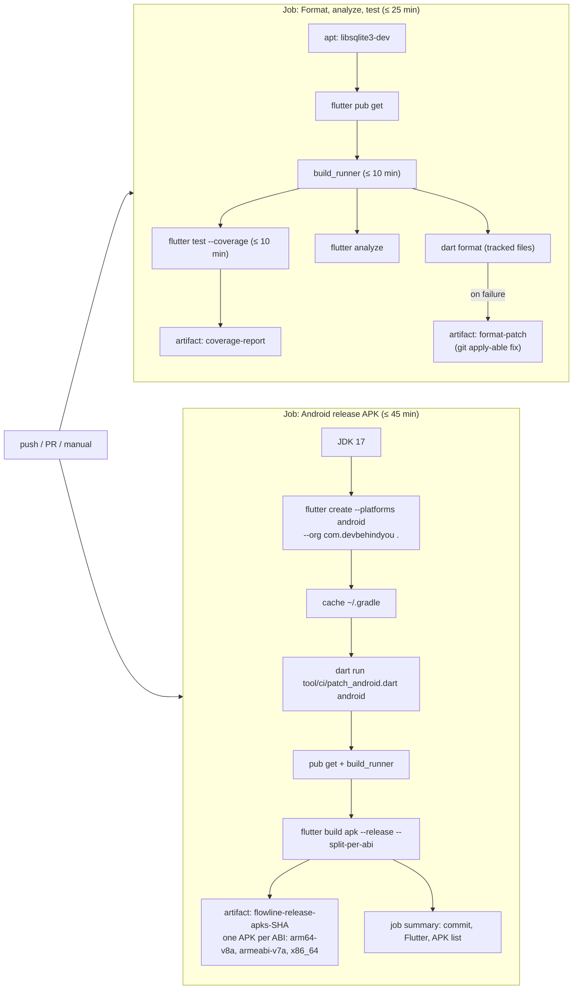
```mermaid
flowchart LR
    Push["push / PR / manual"] --> A & B

    subgraph A["Job: Format, analyze, test (≤ 25 min)"]
        A1["apt: libsqlite3-dev"] --> A2["flutter pub get"] --> A3["build_runner (≤ 10 min)"]
        A3 --> A4["dart format (tracked files)"]
        A3 --> A5["flutter analyze"]
        A3 --> A6["flutter test --coverage (≤ 10 min)"]
        A6 --> A7["artifact: coverage-report"]
        A4 -->|on failure| A8["artifact: format-patch<br/>(git apply-able fix)"]
    end

    subgraph B["Job: Android release APK (≤ 45 min)"]
        B1["JDK 17"] --> B2["flutter create --platforms android<br/>--org com.devbehindyou ."]
        B2 --> B3["cache ~/.gradle"] --> B4["dart run tool/ci/patch_android.dart android"]
        B4 --> B5["pub get + build_runner"] --> B6["flutter build apk --release --split-per-abi"]
        B6 --> B7["artifact: flowline-release-apks-SHA<br/>one APK per ABI: arm64-v8a, armeabi-v7a, x86_64"]
        B6 --> B8["job summary: commit, Flutter, APK list"]
    end
```

Design decisions:
- **Why Flutter 3.35.7, not the latest:** the pinned code generators
  (`riverpod_generator` 2.6 → `analyzer` 7.x) support Dart ≤ 3.9. Flutter
  3.38+ ships Dart 3.10, whose SDK source uses dot shorthands; the analyzer
  crashed on them and `build_runner` then hung for 5.5 hours. Bump Flutter
  only together with the codegen stack.
- Analyze and test still run after a format failure, so one run reports
  everything; the job still fails.
- The format check covers git-tracked files only, so generated code can't
  fail it.
- The two jobs run in parallel for faster feedback.

### 18.3 Android template patches

`android/` is regenerated each run, then patched:

| Patch | Why |
|---|---|
| `INTERNET` permission | `flutter create` adds it only to the debug/profile manifests; without it every AI request fails in a release build. |
| `POST_NOTIFICATIONS` | Session-end alert on Android 13+. |
| `RECEIVE_BOOT_COMPLETED` + `ScheduledNotificationReceiver` + `ScheduledNotificationBootReceiver` | Required by `flutter_local_notifications` ≥ 16 for `zonedSchedule`; without the receiver the scheduled alert never shows. |
| `android:usesCleartextTraffic="true"` | Ollama over plain HTTP on the LAN. |
| `isCoreLibraryDesugaringEnabled = true` + `desugar_jdk_libs:2.1.4` | The notification plugin is built with desugaring; the release build fails without it. |

Signing (B2, fixed): the release build reads `android/key.properties`,
which CI writes from the `ANDROID_KEYSTORE_BASE64` /
`ANDROID_KEYSTORE_PASSWORD` / `ANDROID_KEY_ALIAS` / `ANDROID_KEY_PASSWORD`
secrets, then checks every APK's certificate against
`tool/ci/release_cert_sha256.txt`. Without the secrets it signs with a
throwaway key and says so in the run summary. `versionCode` is the CI run
number (B27). Auto Backup rules keep the database and exclude
flutter_secure_storage's preferences (B3).

---

## 19. Testing

### 19.1 Inventory

| File | Level | Covers |
|---|---|---|
| `test/domain/services/focus_stats_calculator_test.dart` | unit | daily totals, streak rules |
| `test/domain/services/schedule_conflict_checker_test.dart` | unit | exact, touching, nested, partial, multiple, self-exclusion, locked blocks |
| `test/domain/services/export_formatter_test.dart` | unit | CSV header/rows/nulls, JSON round-trip |
| `test/data/remote/ai_clients/ai_error_mapper_test.dart` | unit | every status/timeout mapping, no raw exception leakage |
| `test/data/repositories/data_integrity_test.dart` | repository | FK pragma on, cascade subtasks, unlink sessions, block delete un-schedules tasks, single active session |
| `test/data/repositories/focus_session_repository_impl_test.dart` | repository | natural-end stamping, ended-early, idempotence, extension, self-heal, pause freezes time |
| `test/data/repositories/ai_repository_impl_test.dart` | repository | seeding once, exactly one active provider, conversation defaults, message cascade |
| `test/features/focus_timer/focus_timer_view_model_test.dart` | view model | `completeIfElapsed` cases, racing completions credit once |
| `test/features/schedule/today_screen_test.dart` | widget | empty state (light/dark), unscheduled task, day switching |
| `test/features/focus_timer/focus_screen_test.dart` | widget | idle (light/dark), no idle ticker, plural label, first-frame remaining time, per-second ticking, pause within first second leaves no timer, natural completion at zero |
| `test/features/ai_assistant/assistant_screen_test.dart` | widget | no-provider state (light/dark), no Keystore access |
| `test/features/insights/insights_screen_test.dart` | widget | empty (light/dark), populated, ended-early counted |
| `test/tool/android_patches_test.dart` | unit | manifest + Gradle patches against the 3.35.7 templates, idempotence, loud failure |

**All passing** — 125 tests in CI run `36849191025` (#10); 176 locally after
the first Phase 1 batch (time helpers, repository guards, error view,
busy guards, settings validation, DST and rollover tests, code-rule
tests). See `docs/04-build-and-optimization-plan.md` §6 for what's next.

### 19.2 Harness

- `test/support/test_database.dart` — `AppDatabase.forTesting(DatabaseConnection(NativeDatabase.memory(), closeStreamsSynchronously: true))`.
  The synchronous stream close stops Drift's close timer from failing
  widget tests.
- `test/support/pump_app.dart` — `pumpScreen` (themed `MaterialApp` +
  `ProviderScope` with the DB override, then `pumpAndSettle`),
  `pumpScreenNoSettle` for screens that tick on purpose, and
  `disposeScreen` to cancel their timers.
- No platform-channel mocks are needed: tests avoid the Keystore, and the
  notification service is replaced by a fake where required.

### 19.3 Not yet covered

Emulator/integration tests, Task Detail / settings / sheet widget tests,
AI client request/response shapes against mocked Dio, Drift migration
tests, accessibility (text scale, semantics), golden/screenshot tests,
performance/stress fixtures.

---

## 20. Known issues and gaps

Severity: **P0** critical · **P1** major · **P2** moderate · **P3** minor.
"Suspected" means found by reading the code, not yet reproduced by a test.

| ID | Sev | Area | Issue | Status |
|---|---|---|---|---|
| K1 | P2 | Focus | Ticker leak: pausing/ending within 1 s of (re)start leaked a 1 Hz timer (Riverpod stream provider disposed while loading) | Fixed — widget-owned timer; regression test |
| K2 | P2 | CI | `dart format` fails on the newest files | Fixed — CI #10 format check green |
| K3 | P2 | Schedule intelligence | "Apply suggested time" saves the AI's time without re-checking it for conflicts or the same day | Fixed in `d8fcf62`; tests and prompt fixes (B13, B14, B28) in Phase 0 |
| K4 | P2 | AI settings | `providerHasKeyProvider` isn't refreshed after saving or removing a key, so the card and radio stay stale until you leave the screen | Fixed — key status refreshed after save/remove; test |
| K5 | P2 | AI network | Shared `Dio()` has no connect/receive timeouts and requests can't be cancelled | Fixed — connect/send/receive timeouts on the shared Dio |
| K6 | P2 | AI config | Seeded default models `claude-3-5-sonnet-20241022` and `gemini-1.5-flash` are probably retired, so first use fails until the model is edited | Mitigated (Phase 4.2): **Test connection** lists the vendor's live models, the model field offers them, and warns when the saved model isn't in the list. The seeds themselves are still unverified |
| K7 | P2 | Time | "Today" windows (Focus footer, Insights 30-day range, Today's initial date) are computed when the provider is created, and tabs stay mounted, so they go stale across midnight while the app stays open | Fixed — `currentDayProvider` rolls over at midnight and on resume; tests |
| K8 | P2 | Performance | Whole Focus `Scaffold` rebuilt every second while running | Fixed — `_Countdown` + `RepaintBoundary` |
| K9 | P2 | Error states | Screens show "Something went wrong: $error" with no retry; AI "unexpected error" messages include the raw exception | Fixed — `ErrorView` with Retry; raw exception text never shown; tests |
| K10 | P2 | AI | Full conversation history is sent on every message (unbounded payload) | Confirmed by reading |
| K11 | P3 | Insights | Streak caps at 30 days (query window) | Confirmed by reading |
| K12 | P3 | Insights | Focus footer buckets by `startedAt`, Insights by `completedAt`, so sessions that cross midnight are counted on different days | Fixed — every day window and bucket uses `completedAt` |
| K13 | P3 | Accessibility | Unlabelled icon buttons (see §14.7); no timer semantics; 200% font untested | Fixed — tooltips, timer semantics, 200% text tests on a 360 dp screen (found and fixed overflows on Today, Insights, Focus) |
| K14 | P3 | UX | Remove key and subtask delete have no confirmation | Fixed — shared confirmation dialog |
| K15 | P3 | UX | "Edit times" on the conflict sheet just closes it | Known (README) |
| K16 | P3 | Memory | `TextEditingController` in the "New subtask" dialog is never disposed | Fixed — dialog widget owns and disposes its controller |
| K17 | P3 | Data | Enum index storage: reordering an enum corrupts stored rows | Design risk |
| K18 | P3 | Android | Drift's recommended `sqlite3.tempDirectory` workaround isn't set; large sorts could fail on Android | Fixed — `sqlite3.tempDirectory` set on Android |
| K19 | — | Release | APK signed with the debug key | Fixed (B2) — stable release key from CI secrets |
| K20 | — | Design | Space Grotesk / Inter not bundled | Fixed (Phase 3): bundled under `assets/fonts`, OFL licences on the Licenses page |

New defects found in the full read for the forward plan are tracked as
**B1–B30** in `docs/04-build-and-optimization-plan.md` §3. Fixed so far:
B1 (DST-safe calendar math), B2, B3, B4, B5, B6, B7, B8, B9, B11, B12,
B13, B14, B15, B16, B17, B19, B20, B21, B22, B23, B25, B26, B27,
B28, B29, B30, and B31 (new: error bubbles were sent to the vendor as
history). Schema is now v4 (see §7.3 and `drift_schemas/`).

Fixed during the earlier QA pass (all verified by CI): never-compiled DB
layer and API mismatches; nonexistent `flutter_timezone` version; missing
lint include; FK enforcement off (orphaned subtasks); tasks vanishing on
block delete; missing release `INTERNET` permission; missing notification
receivers; missing desugaring; wrong completion timestamps; double sprint
credit; lost extension minutes; "1 sessions"; 5.5-hour CI hang.

---

## 21. Physical-device verification checklist

CI cannot prove these. Install `flowline-arm64-v8a-release-<sha7>.apk`
from the latest successful run on a phone and check:

1. Fresh install → cold start opens Today without delay.
2. Create, edit and delete a task; add, complete and delete subtasks;
   delete a task that has subtasks.
3. Add a schedule block; add an overlapping one → conflict sheet →
   "Save anyway" → red outline on Today.
4. Start a focus session → the **notification permission prompt** appears.
5. Pause, resume, +5 min, lock the screen, background the app, reopen:
   remaining time is correct.
6. Let a session finish with the app backgrounded: the **notification
   appears**; tap it; Insights shows the session on the right day.
7. Force-stop the app mid-session, wait past the end, reopen: the session
   is recorded as completed at its natural end.
8. Reboot mid-session: the alert still fires (boot receiver).
9. Deny notification permission: the timer still works.
10. AI Providers: add a real key and send a message; try a bad key
    (expect "rejected" message); airplane mode (expect "couldn't reach").
11. Ollama on the LAN via the computer's IP (cleartext HTTP).
12. Export PDF, CSV and JSON through the share sheet.
13. System dark/light switch while on each tab and with a sheet open.
14. Largest system font / display size: Focus ring, stat cards, sheets.
15. TalkBack pass over every screen.

---

## 22. Roadmap

The forward plan is `docs/05-atomic-assist-plan.md` (Phases A–J: the
Atomic design system and UI rebuild, AI contract v3 with tools, the
assistant core with its ledger and Inbox, reminders, people, lists,
voice, proactive suggestions, memory, money, travel). None of it is
built yet. It folds in the open items of `docs/04-build-and-optimization-plan.md`
(Phases 0–7 with exit gates, plus a release track), whose status follows.
Phase 4 is done through 4.3 (AIClient v2, model registry, streaming). Phase 0 is done apart
from the owner-only step (adding the signing secrets) and the device
checklist; Phase 1 is done (237 tests; 92% line coverage of domain + data);
Phase 2 (Flutter 3.47 / Riverpod 3 / Drift 2.35) is done; Phase 3 is in
progress (block editing, task form, settings, Session Summary, onboarding
and splash, fonts and design tokens, l10n scaffolding, adaptive layout, backlog paging and the single-query
timeline, recurring blocks, subtask reorder are done). The list
below is the original scope
roadmap, kept for reference.


Then, per `03-scope…` §10 and the UX spec:
- Schedule block edit/delete UI; due dates; block picker in the task form.
- Session Summary sheet, Skip, custom durations, haptics.
- Assistant streaming, markdown, conversation history, provider switcher,
  Task Breakdown Engine.
- Settings: Appearance (theme mode), Notifications, Data & Privacy.
- Onboarding.
- Google Calendar read-only sync (needs the owner's OAuth client), then
  drift analysis.
- AI Monitoring (voice), per `03-scope…` §6.
- Upgrade the codegen stack (Riverpod 3 / newer Drift) so Flutter can move
  past 3.35.
