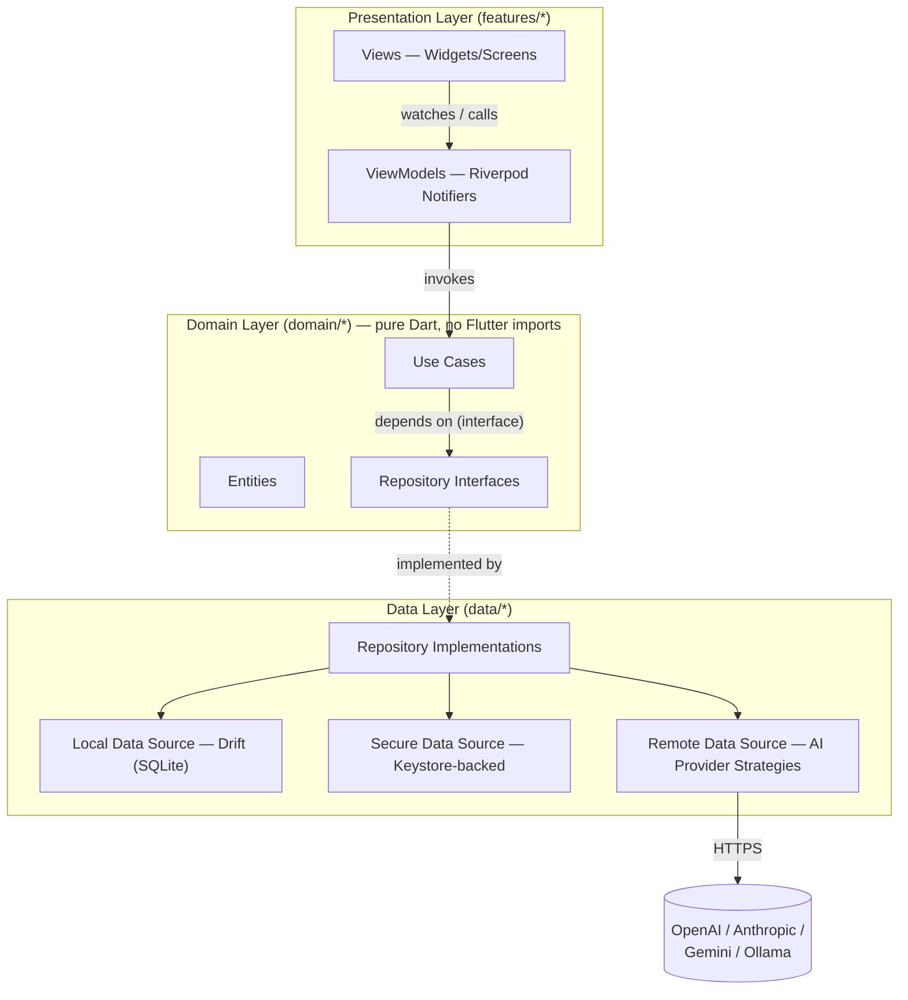
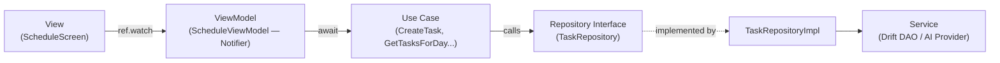
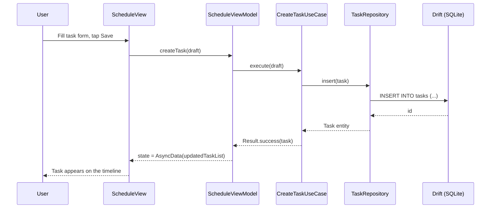
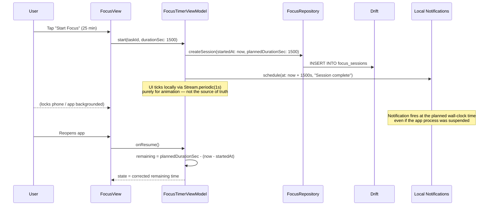
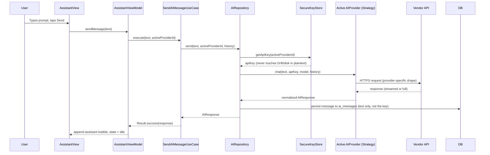

# Workflow + Focus + AI Assistant — Architecture Document
*Flutter (Android-first) · MVVM + Clean Architecture · Riverpod · Drift · Multi-provider AI*

> Working title used below: **Flowline**. Rename freely — it's a placeholder so diagrams and package names have something concrete to refer to.

---

## 1. Overview & Goals

A minimalistic, single-user productivity app that combines:

1. **Schedule/workflow tracking** — time-blocked tasks and daily/weekly planning.
2. **Focus timer** — Pomodoro-style deep work sessions, reliable across app backgrounding.
3. **AI Assistant** — a settings-configurable, multi-provider AI layer (bring-your-own API key for OpenAI, Anthropic, Google Gemini, or a local Ollama endpoint) used for planning help, summarizing the day, and chat.
4. **Insights** — lightweight stats on focus time, streaks, and schedule adherence.

Design constraints driving the architecture below: **local-first** (no backend server required for MVP — AI calls go straight from device to provider APIs), **offline-capable** for everything except AI features, and **swappable AI providers** without touching UI code.

---

## 2. Why These Choices (2026 landscape, briefly)

- **MVVM** is what Flutter's own architecture guide now documents directly (View / ViewModel / Repository / Service), so this doc follows that vocabulary rather than inventing a parallel one. It's layered with **Clean Architecture** (Presentation → Domain → Data, dependencies point inward) for testability as the app grows.
- **State management: Riverpod (3.x, with `@riverpod` codegen)** — it's the default recommendation for new, solo-developer Flutter projects in 2026: compile-safe, no `BuildContext` coupling, strong async support (fits AI streaming and DB queries well). BLoC is the alternative if you ever bring on a larger team and want stricter event/state ceremony — not needed here.
- **Local database: Drift** (SQLite-backed), not Hive/Isar. Both Hive and Isar lost their original maintainers and are now considered legacy for new projects; Drift is SQL-backed, type-safe, actively maintained, and handles the relational bits (tasks ↔ schedule blocks ↔ focus sessions) cleanly.
- **Secure storage: `flutter_secure_storage`** for AI API keys specifically — backed by Android Keystore, never stored in the SQLite DB or `SharedPreferences`.
- **Multi-AI abstraction: Strategy pattern** — one `AIProvider` interface, one implementation per vendor. This is the same shape used by every production-grade multi-provider Flutter AI package on pub.dev right now (unified `chat()` call, per-provider config object, runtime switch).
- **Timer reliability: wall-clock persistence, not a live background `Timer`.** Dart timers stop or drift once Android suspends the app. The reliable pattern is to persist `startedAt` + planned duration, schedule a local notification for the expected end time, and recompute elapsed time from the clock whenever the app resumes.

---

## 3. High-Level Architecture



Dependency rule: **arrows only point inward/downward through interfaces.** The `domain/` layer never imports Flutter or Drift — it only knows about abstract repositories, so it stays unit-testable without a device or database.

---

## 4. Project / Folder Structure

Feature-first, matching Flutter's own MVVM guidance (each feature = View + ViewModel, backed by shared Repositories/Services in `data/` and `domain/`):

```
lib/
├── main.dart
├── app.dart                        # MaterialApp.router, theme, root providers
│
├── core/
│   ├── router/                     # go_router configuration
│   ├── theme/                      # ColorScheme, TextTheme, spacing tokens
│   ├── di/                         # top-level Riverpod provider wiring
│   ├── error/                      # Failure types, exception → Failure mapping
│   ├── utils/                      # Result<T>, date/time helpers, extensions
│   └── network/                    # Dio client + interceptors (AI calls only)
│
├── domain/
│   ├── entities/                   # Task, ScheduleBlock, FocusSession,
│   │                                #   AIProviderConfig, AIMessage, AIConversation
│   ├── repositories/                # abstract TaskRepository, FocusRepository,
│   │                                #   ScheduleRepository, AIRepository
│   └── usecases/                    # one class per action, e.g.:
│                                     #   create_task.dart, start_focus_session.dart,
│                                     #   send_ai_message.dart, get_daily_insights.dart
│
├── data/
│   ├── local/
│   │   ├── drift/                  # AppDatabase, tables, DAOs
│   │   └── secure/                 # SecureKeyStore (flutter_secure_storage wrapper)
│   ├── remote/
│   │   └── ai_providers/           # OpenAIProvider, AnthropicProvider,
│   │                                #   GeminiProvider, OllamaProvider (all implement
│   │                                #   the same AIProvider interface)
│   └── repositories/                # *RepositoryImpl — glue data sources to domain
│
├── features/
│   ├── schedule/
│   │   ├── view/                   # ScheduleScreen, DayTimeline, TaskTile
│   │   ├── viewmodel/              # schedule_view_model.dart (@riverpod)
│   │   └── widgets/
│   ├── focus_timer/
│   │   ├── view/                   # FocusScreen, TimerRing, SessionSummarySheet
│   │   ├── viewmodel/              # focus_timer_view_model.dart
│   │   └── widgets/
│   ├── ai_assistant/
│   │   ├── view/                   # AssistantScreen, ChatBubble, ProviderPicker
│   │   ├── viewmodel/
│   │   └── widgets/
│   ├── insights/
│   │   ├── view/                   # InsightsScreen (streaks, focus-time charts)
│   │   └── viewmodel/
│   └── settings/
│       ├── view/                   # SettingsScreen, AIProvidersScreen,
│       │                            #   ThemeScreen, NotificationsScreen
│       ├── viewmodel/
│       └── widgets/
│
└── shared_widgets/                 # buttons, empty states, cards shared across features
```

---

## 5. MVVM Layer Breakdown (per feature)

Every feature follows the same four-part shape from Flutter's own architecture guide:



- **View** — dumb widget; only reads state and forwards user intents. No business logic, no direct DB/network calls.
- **ViewModel** — a Riverpod `Notifier`/`AsyncNotifier`. Holds UI state, calls use cases, exposes `AsyncValue<T>` so the View can render loading/error/data without extra boilerplate.
- **Use Case** — one class, one verb (`CreateTask`, `StartFocusSession`, `SendAIMessage`). Keeps ViewModels thin and makes business rules independently testable.
- **Repository (interface in `domain/`, implementation in `data/`)** — the single source of truth for a data type; ViewModels/UseCases never talk to Drift or an AI provider directly.
- **Service** — the actual I/O: a Drift DAO, the secure key store, or an AI provider strategy.

---

## 6. Data Flow Diagrams

### 6.1 Create a task / schedule block



### 6.2 Focus session (wall-clock reliable timer)



### 6.3 AI Assistant request (provider-agnostic)



---

## 7. Local Data Model (Drift schema)

```mermaid
erDiagram
    SCHEDULE_BLOCKS ||--o{ TASKS : contains
    TASKS ||--o{ FOCUS_SESSIONS : "tracked_by"
    AI_PROVIDERS ||--o{ AI_CONVERSATIONS : "used_in"
    AI_CONVERSATIONS ||--o{ AI_MESSAGES : has

    SCHEDULE_BLOCKS {
        int id PK
        string title
        datetime startTime
        datetime endTime
        bool isRecurring
        string recurrenceRule "nullable, RRULE-style"
    }
    TASKS {
        int id PK
        int scheduleBlockId FK "nullable"
        string title
        string notes
        string status "todo/in_progress/done"
        int priority
        datetime dueAt "nullable"
        datetime createdAt
    }
    FOCUS_SESSIONS {
        int id PK
        int taskId FK "nullable"
        datetime startedAt
        int plannedDurationSec
        int actualDurationSec "nullable until completed"
        string sessionType "focus/short_break/long_break"
        bool completed
    }
    AI_PROVIDERS {
        string id PK "openai / anthropic / gemini / ollama / ..."
        string displayName
        string defaultModel
        bool isActive
    }
    AI_CONVERSATIONS {
        int id PK
        string providerId FK
        string title
        datetime createdAt
    }
    AI_MESSAGES {
        int id PK
        int conversationId FK
        string role "user/assistant/system"
        string content
        datetime sentAt
    }
```



**Important:** `AI_PROVIDERS` stores only non-secret metadata (which vendor, which default model, which one is active). The **API key itself never enters this table or any Drift table** — it lives only in `flutter_secure_storage`, keyed by `providerId`, and is looked up at request time.

---

## 8. AI Integration Architecture (multi-provider settings)

**Pattern: Strategy + Repository.** One interface, one class per vendor, selected at runtime from Settings.

```dart
// domain/repositories/ai_provider.dart
abstract class AIProvider {
  String get id;                 // 'openai' | 'anthropic' | 'gemini' | 'ollama'
  Future<AIResponse> chat({
    required String prompt,
    required String apiKey,
    required String model,
    List<AIMessage> history = const [],
  });
}

// data/remote/ai_providers/anthropic_provider.dart
class AnthropicProvider implements AIProvider {
  @override
  String get id => 'anthropic';

  @override
  Future<AIResponse> chat({...}) async {
    // vendor-specific request shape, normalized to AIResponse on return
  }
}
```

- `AIRepositoryImpl` holds `Map<String, AIProvider>` and picks one via `activeProviderId` (read from a small settings table or a Riverpod provider fed by Drift).
- **Settings → AI Providers screen** lets the user add/edit/remove a key per vendor, pick a default model, and mark one provider "active." Each save writes only to `SecureKeyStore`; provider metadata (display name, model, active flag) writes to `AI_PROVIDERS`.
- Adding a fifth vendor later = one new class implementing `AIProvider` + one row of settings UI. Nothing in `features/ai_assistant/` changes.
- Recommended starting packages instead of hand-rolling each vendor's HTTP shape: a unified wrapper such as `ai_bridge_core` (+ per-vendor companion packages) or `gen_connect` — both already implement this exact Strategy shape for OpenAI/Anthropic/Gemini/Ollama. Hand-rolling with `dio` is fine too if you want zero third-party AI-SDK dependencies.

---

## 9. State Management (Riverpod)

| Provider | Type | Purpose |
|---|---|---|
| `taskListProvider` | `AsyncNotifier<List<Task>>` | Tasks for the selected day/week |
| `scheduleBlocksProvider` | `AsyncNotifier<List<ScheduleBlock>>` | Time-blocked calendar |
| `focusTimerProvider` | `Notifier<FocusTimerState>` | Running/paused/idle timer, wall-clock corrected |
| `activeAIProviderProvider` | `AsyncNotifier<AIProviderConfig?>` | Which vendor/model is currently active |
| `aiConversationProvider` | `AsyncNotifier<List<AIMessage>>` (family, by conversationId) | Chat thread state |
| `insightsProvider` | `AsyncNotifier<InsightsSummary>` | Aggregated stats for the Insights tab |
| `themeModeProvider` | `Notifier<ThemeMode>` | Light/dark/system toggle |

All repositories are exposed as providers too (`taskRepositoryProvider`, `aiRepositoryProvider`, ...), so ViewModels/UseCases depend on the *interface* provider — swapping the implementation (e.g., a future cloud-sync `TaskRepository`) never touches feature code.

---

## 10. Navigation

**`go_router`** (Flutter-team-endorsed, works cleanly with Riverpod via `ref.watch` redirects). Suggested shell:

```
/                     → ScheduleScreen (Today, default tab)
/focus                → FocusScreen
/assistant            → AssistantScreen
/insights             → InsightsScreen
/settings             → SettingsScreen
/settings/ai          → AIProvidersScreen
/settings/notifications
/task/:id             → TaskDetailScreen (pushed, not a tab)
```

A `StatefulShellRoute` gives the 4 bottom-nav tabs (Today / Focus / Assistant / Insights) persistent state per branch, with Settings reachable from a top-bar icon rather than eating a fifth tab — keeps the nav bar minimal.

---

## 11. Minimalistic UI — a few concrete constraints

Not a full design system, but the guardrails that keep "minimalistic" from becoming vague:

- **One accent color**, neutral gray/near-black-and-white base, Material 3 `ColorScheme.fromSeed`. Optional dynamic color from wallpaper as a toggle, off by default.
- **Default to dark theme** — this is a focus/productivity tool, most used in the same sessions as the timer.
- **4 bottom-nav destinations max** (Today, Focus, Assistant, Insights); Settings lives off the app bar, not the nav bar.
- **No nested cards-on-cards** — one elevation level for content containers, flat backgrounds otherwise.
- Timer screen in particular should be closer to a single focal ring/progress indicator than a dashboard — resist adding controls beyond start/pause/skip.

---

## 12. Notifications & Background Reliability

- **`flutter_local_notifications`** for: focus-session-complete, break-over, and optional schedule-block reminders.
- Timer correctness comes from **wall-clock persistence** (§6.2), not from keeping a Dart isolate alive. This avoids needing a persistent foreground service for the common case.
- If you later want a **live countdown in the notification shade** (not just an end alert), that requires an Android foreground service with `FOREGROUND_SERVICE` + a periodically-updated notification — treat it as a v2 enhancement, not MVP, since it adds real complexity (and a permanently visible notification cuts against "minimalistic").
- `workmanager` is worth adding later only for things that are genuinely deferrable/periodic (e.g., a daily 9pm "plan tomorrow" nudge) — not for the timer itself.

---

## 13. Security Notes

- AI API keys: **`flutter_secure_storage` only** (Android Keystore-backed AES). Never in Drift, never in `SharedPreferences`, never logged.
- No key ever leaves the device except in the Authorization header of the direct HTTPS call to that key's own vendor.
- Local DB (tasks, schedule, chat text) is unencrypted SQLite via Drift by default — acceptable for a single-user local-first app, but note it as a known limitation. If you want it encrypted too, Drift supports swapping the underlying `sqlite3` implementation for `SQLCipher` (`sqlcipher_flutter_libs`) later without touching your table/DAO code.
- Certificate pinning is out of scope for MVP (adds real maintenance overhead per vendor cert rotation) — standard TLS is enough for BYO-key calls to well-known vendor APIs.

---

## 14. Suggested Package List

| Concern | Package(s) |
|---|---|
| State management | `flutter_riverpod`, `riverpod_annotation`, `riverpod_generator` |
| Routing | `go_router` |
| Local database | `drift`, `drift_flutter`, `sqlite3_flutter_libs` |
| Secure storage | `flutter_secure_storage` |
| AI networking | `dio` (or a unified SDK like `ai_bridge_core` / `gen_connect`) |
| Local notifications | `flutter_local_notifications` |
| Deferrable background tasks (v2) | `workmanager` |
| Immutable models / codegen | `freezed`, `json_serializable`, `build_runner` |
| Functional result type | hand-rolled `Result<T>` sealed class, or `fpdart` |
| Charts (Insights tab) | `fl_chart` |
| Testing | `flutter_test`, `mocktail` |

---

## 15. Build Phases

1. **Phase 1 — Core loop:** Schedule + Tasks (Drift, CRUD, MVVM skeleton), minimal theme, navigation shell.
2. **Phase 2 — Focus Timer:** wall-clock session logic, local notifications, session history.
3. **Phase 3 — AI Assistant:** `AIProvider` interface + 2 vendors (start with OpenAI + Anthropic), Settings → AI Providers screen, secure key storage, basic chat UI.
4. **Phase 4 — Insights:** aggregate queries over `focus_sessions`/`tasks`, `fl_chart` visualizations, streaks.
5. **Phase 5 (optional):** additional AI vendors, encrypted DB (SQLCipher), cloud sync/backup, live-countdown foreground service.

---

*This document is a design/architecture reference, not a scaffolded codebase — folder names, provider names, and table names above are meant to be copied directly into the project.*
