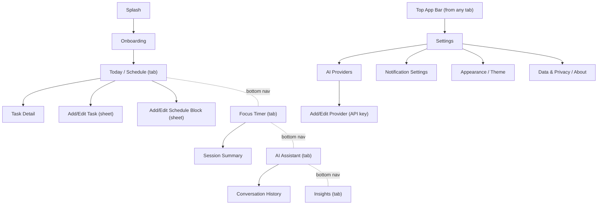
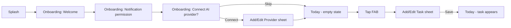
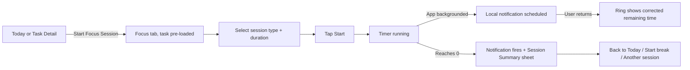
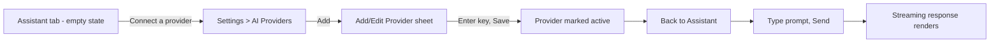

# Flowline — UX/UI Design Specification
*Handoff brief for the design team — Android (Flutter), phone-only v1*

> Companion to `01-architecture.md`. Page names, component names, and folder names below map 1:1 to the `features/` structure in that doc, so anything the design team names here can be dropped straight into the dev naming scheme.

---

## 0. How to Use This Document

This is a **functional/content brief, not visual design** — it defines *what exists, where, and how it behaves*. The design team owns color, type, illustration, and final layout. Section 1 gives the constraints they need to design within; everything after that is the inventory of pages, components, and flows they need to cover.

---

## 1. Design Principles & System Foundations

**Core direction: minimalistic, focus-first, dark-first.** This is a tool people open *to concentrate*, not to browse — every screen should earn its visual weight.

- **Base system:** Material 3. Google's current iteration ("M3 Expressive") adds bolder color, shape-morphing, and a spring-based motion system — use its underlying tokens (type scale, shape scale, motion physics) for consistency with Android, but **apply them conservatively**. This app should sit at the quiet end of M3, not the vibrant end: one accent color, restrained shape variation, motion used only to clarify state changes (timer completing, task moving to done) — never decorative animation.
- **Theme:** Dark mode is the default and primary design target; light mode is a required second theme, not an afterthought. System-follow is the default setting.
- **Color:** One seed/accent color + neutral grayscale base (`ColorScheme.fromSeed`). Reserve color for: the accent (primary actions, active states), and a small semantic set — priority (low/med/high), status (todo/in-progress/done), and session type (focus/short break/long break). No decorative color.
- **Typography:** M3 type scale (display/headline/title/body/label). Numbers that matter at a glance (timer countdown, stat cards) get the boldest/largest treatment on their screen.
- **Spacing:** 8pt grid (4pt for tight/inline spacing). Generous whitespace over dense layouts — this is the primary lever for "minimalistic."
- **Shape:** Pick one corner-radius scale and apply it consistently (e.g., small radius for chips/inputs, larger for cards, full round for the timer ring and FAB). Avoid mixing more than 2–3 radii app-wide.
- **Elevation:** Flat by default. One elevation step for cards/sheets above the background. No stacked/nested elevation.
- **Iconography:** Material Symbols (outlined, consistent weight/optical size across the app).
- **Motion:** Spring-based transitions per M3 motion physics, but sparingly — page transitions, the timer ring, and task-complete are the only places motion should be more than a fade/slide.
- **Accessibility baseline:** WCAG AA contrast minimum in both themes; 48dp minimum touch target; layouts must survive 200% system font scaling without clipping; respect system "reduce motion."

---

## 2. Information Architecture (Sitemap)

---

## 3. Navigation Model

- **Bottom navigation, 4 destinations, persistent across the session:** Today, Focus, Assistant, Insights.
- **Settings is not a 5th tab** — it hangs off a top-bar icon on every tab, keeping the bottom nav minimal.
- **Push (full screen):** Task Detail, Settings and all its sub-screens, Conversation History.
- **Bottom sheet (modal, partial-height):** Add/Edit Task, Add/Edit Schedule Block, Add/Edit AI Provider, Session Summary. Anything short-lived and single-purpose should be a sheet, not a new page — keeps the navigation stack shallow.
- **Dialog (small, blocking):** destructive confirmations only (delete task, remove AI provider/key).

---

## 4. Component Library

Every reusable UI element the app needs. Design as a Figma component with the listed variants/states — component names below should be reused as the Figma component names.

| Component | Purpose | Variants | States | Used on |
|---|---|---|---|---|
| **Primary Button** | Main CTA | filled | default / pressed / disabled / loading | everywhere |
| **Secondary Button** | Secondary action | outlined / text | default / pressed / disabled | forms, dialogs |
| **Icon Button** | Compact action | standard / toggle (e.g. favorite) | default / pressed / selected / disabled | app bars, cards |
| **FAB** | Primary add action | standard, extended (with label) | default / pressed | Today tab |
| **Top App Bar** | Screen header | home (logo + settings icon), detail (back + title + actions), modal (close + title + save) | scrolled/collapsed vs top | all screens |
| **Bottom Navigation Bar** | Tab switching | — | active / inactive per icon, badge (optional, e.g. unread AI reply) | shell |
| **Task Card/Row** | One task | timeline card (on Today), compact list row (in Task list/search) | todo / in-progress / done (visually distinct), overdue | Today, Task Detail parent list |
| **Schedule Block Card** | One time block on the timeline | with tasks nested / empty block | current (highlighted "now" state) / past / future | Today |
| **Day Timeline** | Container for the day's blocks + unscheduled tasks | — | empty day, populated | Today |
| **Timer Ring** | Circular countdown | focus / short break / long break (color-coded) | idle, running, paused, completing (last 10s emphasis), complete | Focus |
| **Session Type Selector** | Choose focus/short/long break | segmented control | selected/unselected, disabled while running | Focus |
| **Session Controls** | Start/Pause/Resume/Skip/Stop | button cluster around ring | contextual — only valid actions shown per timer state | Focus |
| **Chat Bubble** | One message | user (right-aligned) / assistant (left-aligned) | sending, sent, streaming (partial text + cursor), error/retry | Assistant |
| **Chat Input Bar** | Compose + send | — | empty/disabled, has-text/enabled, sending | Assistant |
| **Active Provider Indicator** | Shows which AI is answering | chip/pill in chat header | — | Assistant |
| **Provider Card** | One AI vendor in settings | connected (key saved) / not connected | active (in-use) vs inactive, validating key, invalid key | AI Providers screen |
| **API Key Field** | Enter/edit a key | masked text field with show/hide toggle | empty, filled-masked, validating, valid, invalid/error | Add/Edit Provider |
| **Stat Card** | Single KPI | number + label + optional trend arrow | loading (skeleton), populated, zero-state | Insights |
| **Chart Widget** | Focus-time trend | bar (daily) / line (weekly trend) | loading, populated, empty (no data yet) | Insights |
| **Streak Badge** | Current streak count | — | active streak vs broken/reset | Insights, Today (optional small indicator) |
| **Priority Chip** | Low/Med/High | 3 colors | selected (in forms) / display-only | Task Card, Add/Edit Task |
| **Status Chip** | Todo/In progress/Done | 3 states | — | Task Card, Task Detail |
| **Empty State** | Nothing to show yet | icon/illustration + heading + subtext + optional CTA button | — | Today (no tasks), Assistant (no messages), Insights (no sessions yet), AI Providers (none configured) |
| **Skeleton Loader** | Loading placeholder | shaped per screen (list rows, card, chart) | — | any screen with async data |
| **Inline Error** | Recoverable error within a screen | text + retry button | — | any data-fetch failure |
| **Snackbar** | Transient confirmation/undo | with optional action ("Undo") | — | task complete/delete, settings saved |
| **Confirmation Dialog** | Destructive-action guard | — | — | delete task, remove AI provider |
| **Bottom Sheet Container** | Generic modal form shell | fixed-height / expandable-to-full | — | Add/Edit Task, Add/Edit Block, Add/Edit Provider, Session Summary |
| **Switch** | Boolean setting | — | on/off, disabled | Settings screens |
| **Dropdown / Select** | Pick one of several (e.g. AI model) | — | closed/open, disabled | Add/Edit Provider, Add/Edit Task (schedule block picker) |
| **Date & Time Picker** | Pick a date/time | — | — | Add/Edit Task, Add/Edit Block |
| **Text Field** | Generic form input | single-line / multi-line (notes) | default, focused, error+helper text, disabled | forms throughout |
| **Search Field** | Find a task | — | empty, active-with-results, no-results | optional, Today or a dedicated Task list |
| **Onboarding Step** | One step of first-run flow | illustration + heading + body + primary/skip actions | — | Onboarding |

---

## 5. Page-by-Page Specifications

For each page: **purpose, entry points, sections, components used, key functions, states, edge cases.**

### 5.1 Splash
- **Purpose:** brand moment while the app initializes (DB open, theme load).
- **Entry:** app cold start only.
- **Components:** logo/wordmark only.
- **States:** none user-facing; should be near-instant (local-first, no network dependency).

### 5.2 Onboarding (2–3 steps, skippable)
- **Purpose:** first-run only. Set expectations, optionally connect a first AI provider, request notification permission.
- **Entry:** first launch only; never shown again after completion/skip.
- **Sections:** Step 1 — welcome/value prop. Step 2 — notification permission prompt (with plain-language reason: "for focus session alerts"). Step 3 — optional "Connect an AI provider" (can skip, reachable later from Settings).
- **Components:** Onboarding Step, Primary/Secondary Button.
- **Functions:** request `POST_NOTIFICATIONS` permission; optionally deep-link into Add/Edit Provider.
- **Edge cases:** permission denied → continue anyway, don't block onboarding; app should remain fully usable without notifications.

### 5.3 Today / Schedule (Tab 1, home)
- **Purpose:** the daily command center — time-blocked schedule + unscheduled tasks for today.
- **Entry:** default tab on launch; bottom nav.
- **Sections:** date header (with day-switcher, prev/next + "Today" jump), Day Timeline (Schedule Block Cards containing Task Cards), a separate "Unscheduled" section for tasks with no block, FAB to add a task.
- **Components:** Top App Bar (home variant), Day Timeline, Schedule Block Card, Task Card, Empty State, FAB, Streak Badge (optional small indicator).
- **Functions:** view/switch day, mark task done (tap checkbox or swipe), open Task Detail (tap card), open Add/Edit Task or Add/Edit Block (FAB / "+" per block), start a Focus session directly from a task (secondary action on Task Card → jumps to Focus tab pre-loaded with that task).
- **States:** loading (skeleton timeline), empty (no tasks today → Empty State with "Add your first task" CTA), populated, error (DB read failure — should be rare/local, but design an inline error + retry anyway).
- **Edge cases:** overlapping schedule blocks, a task with no due time, more tasks in a block than fit visually (scroll within block vs. "+N more").

### 5.4 Add/Edit Task (bottom sheet)
- **Purpose:** create or edit a task.
- **Entry:** FAB on Today, "+" on a schedule block, edit action from Task Detail.
- **Sections:** title field, notes field (multi-line), priority chip selector, status (edit mode only), optional due date/time, optional schedule-block assignment.
- **Components:** Bottom Sheet Container, Text Field, Priority Chip (selectable), Date & Time Picker, Dropdown (block picker), Primary/Secondary Button.
- **Functions:** save (validates title required), delete (edit mode, via Confirmation Dialog), cancel/dismiss.
- **States:** empty form (create), pre-filled (edit), saving, validation error (empty title).

### 5.5 Add/Edit Schedule Block (bottom sheet)
- **Purpose:** create/edit a named time block (e.g. "Deep Work 9–11am").
- **Sections:** title, start time, end time, recurrence toggle + simple repeat picker (daily/weekdays/weekly/custom — keep custom minimal for v1, e.g. day-of-week checkboxes).
- **Components:** Bottom Sheet Container, Text Field, Date & Time Picker, Switch, day-of-week selector.
- **Functions:** save, delete (with a choice if recurring: "this occurrence" vs "all future" — flag as a v1 nice-to-have, v2 acceptable to simplify to "all").
- **States:** validation error (end before start).

### 5.6 Task Detail (full screen, pushed)
- **Purpose:** full view of one task, including its focus-session history.
- **Entry:** tap a Task Card anywhere.
- **Sections:** title/notes/priority/status header, linked schedule block (if any), list of past Focus Sessions logged against this task, edit/delete actions.
- **Components:** Top App Bar (detail variant), Status Chip, Priority Chip, Task Card list (session history, reuse a compact variant), Secondary Button ("Start Focus Session").
- **Functions:** edit (opens 5.4), delete (Confirmation Dialog), mark status, start a focus session for this task.
- **States:** no sessions logged yet (Empty State within the sessions section, not full-screen).

### 5.7 Focus Timer (Tab 2)
- **Purpose:** run a focus/break session.
- **Entry:** bottom nav; or from Today/Task Detail pre-loaded with a task.
- **Sections:** optional "linked task" label at top (dismissible — can run untimed/task-less sessions), Session Type Selector, Timer Ring with countdown, Session Controls.
- **Components:** Timer Ring, Session Type Selector, Session Controls, Top App Bar (minimal — maybe just Settings icon).
- **Functions:** start/pause/resume/skip/stop, choose duration preset (25/5/15 default Pomodoro, or a custom-duration option), pick which task the session counts toward.
- **States:** idle (ready to start), running, paused, last-10-seconds (visual emphasis), complete → transitions to Session Summary.
- **Edge cases:** app is reopened mid-session after being backgrounded — ring should show the wall-clock-corrected remaining time immediately, not a stale value; a session interrupted by a phone call/notification should resume correctly.

### 5.8 Session Summary (bottom sheet, appears on completion)
- **Purpose:** close the loop on a finished session — quick dopamine hit + logging.
- **Sections:** "Session complete" state, duration completed, linked task (if any), streak update if applicable, quick actions.
- **Components:** Bottom Sheet Container, Streak Badge, Primary Button ("Start a break" / "Back to Today"), Secondary Button ("Start another focus session").
- **States:** completed-full-duration vs. stopped-early (different tone/copy, still logged honestly with `actualDurationSec`).

### 5.9 AI Assistant (Tab 3)
- **Purpose:** chat with the currently active AI provider; ask about the day, get planning help.
- **Entry:** bottom nav.
- **Sections:** header showing Active Provider Indicator, message list, Chat Input Bar.
- **Components:** Chat Bubble, Active Provider Indicator, Chat Input Bar, Empty State (first-time: "Ask me to help plan your day"), Top App Bar (with "History" and "Settings" icons).
- **Functions:** send message, switch provider mid-conversation (opens a lightweight provider picker, doesn't require leaving the screen), start a new conversation, view history.
- **States:** no provider configured yet (Empty State with a direct CTA into 5.13, not just a dead chat box), sending, streaming response, error (e.g. invalid/expired key — inline error bubble with a "Fix in Settings" link, not a silent failure).
- **Edge cases:** long responses (markdown rendering — code blocks, lists), network failure mid-stream (partial message + retry).

### 5.10 Conversation History (pushed from Assistant)
- **Purpose:** list past conversations, resume or start new.
- **Components:** list of conversation rows (title + date + provider used), Empty State, FAB (new conversation).
- **Functions:** open, rename, delete a conversation.

### 5.11 Insights (Tab 4)
- **Purpose:** at-a-glance view of focus habits.
- **Sections:** top stat row (today's focus time, current streak, sessions completed), weekly/monthly chart, optional schedule-adherence stat (tasks completed vs. planned).
- **Components:** Stat Card, Chart Widget, Streak Badge, Empty State (no sessions yet — points back to Focus tab).
- **States:** loading, populated, empty (new user, zero history).

### 5.12 Settings Home (pushed from top bar)
- **Purpose:** entry point to all app configuration.
- **Sections:** grouped list — AI Providers, Notifications, Appearance, Data & Privacy/About.
- **Components:** Top App Bar (detail), simple settings list rows (icon + label + chevron).

### 5.13 AI Providers (pushed from Settings)
- **Purpose:** manage which AI vendors are connected and which is active.
- **Sections:** list of Provider Cards (one per supported vendor: OpenAI, Anthropic, Google Gemini, Ollama/local — even if not yet connected, show all as "Add" targets), active-provider selection.
- **Components:** Provider Card, Empty State (none connected — CTA to add first), FAB or per-row "Add" action.
- **Functions:** add/edit a key, set active provider + default model, remove a key (Confirmation Dialog — key deletion is destructive and should say plainly that saved conversations for that provider remain but new messages won't work until reconnected).

### 5.14 Add/Edit AI Provider (bottom sheet)
- **Purpose:** enter or update a vendor's API key and default model.
- **Sections:** vendor name (fixed per entry point), API Key Field, model Dropdown (populated per vendor), optional "Test connection" action.
- **Functions:** save (stores key via secure storage only — this screen should never suggest the key is going anywhere but the vendor's own API), validate/test key, cancel.
- **States:** validating, valid, invalid (clear inline error — "Key rejected by \[vendor]", not a generic error).

### 5.15 Notification Settings (pushed from Settings)
- **Purpose:** toggle which notifications fire.
- **Sections:** switches — session-complete alerts, break-over alerts, schedule-block reminders (with lead-time picker, e.g. 5/10/15 min before).
- **Components:** Switch, Dropdown (lead time).

### 5.16 Appearance / Theme (pushed from Settings)
- **Purpose:** theme control.
- **Sections:** theme mode (System/Light/Dark) as a segmented control, dynamic color toggle (on/off).
- **Components:** Segmented Control, Switch.

### 5.17 Data & Privacy / About (pushed from Settings)
- **Purpose:** transparency + housekeeping.
- **Sections:** where data lives (on-device only, explain AI calls go directly to the chosen vendor), export/clear data actions, app version.
- **Components:** simple text sections, Secondary Button (Export), destructive button (Clear all data, behind Confirmation Dialog).

---

## 6. Key User Flows

### 6.1 First-run to first task

### 6.2 Run a focus session

### 6.3 Connect AI provider and send first message

---

## 7. States Matrix

| Screen | Empty | Loading | Error | Success |
|---|---|---|---|---|
| Today | "No tasks yet" + Add CTA | Skeleton timeline | Inline error + retry | Populated timeline |
| Task Detail | "No sessions yet" (sessions section only) | Skeleton header | — (local read, rare) | Full detail |
| Focus | — (always has a ready state) | — | — | Idle/Running/Paused/Complete |
| Assistant | "Ask me anything" / "Connect a provider first" | Streaming dots while responding | Inline error bubble + retry/fix-in-settings | Message thread |
| Insights | "Complete a session to see stats" | Skeleton stat cards + chart | Inline error + retry | Populated stats |
| AI Providers | "No providers connected" + Add CTA | — | Invalid key inline on the card | List of Provider Cards |

---

## 8. Interaction & Micro-interaction Notes

- **Swipe on Task Card:** swipe-right to complete, swipe-left to reveal delete (with Confirmation Dialog for delete, not instant).
- **Long-press on Task Card:** quick actions menu (edit, change priority, delete) as an alternative to swipe, for accessibility.
- **Haptics:** light tap on task-complete; a distinct pattern on timer completion (not just sound/notification — phone may be in a pocket).
- **Notification tap:** deep-links straight into the relevant screen (session-complete → Focus tab with Session Summary open; schedule reminder → Today, scrolled to that block).
- **No pull-to-refresh** — data is local-first and reactive (Riverpod streams from Drift), so there's nothing to "refresh" from a server. Don't design this pattern in.
- **Chat streaming:** assistant bubble should render incrementally as tokens arrive, not pop in all at once.

---

## 9. Accessibility Checklist

- Every icon-only button has a text label for screen readers.
- Color is never the *only* signal for priority/status/session type — pair with shape/label/icon.
- Minimum 48dp touch targets, including swipe-action zones.
- Text and layouts must not clip at 200% OS font scale — test the Timer Ring and Stat Cards specifically, since they combine large numerals with fixed-looking containers.
- Respect system "reduce motion" — spring transitions should degrade to simple fades.
- Dark and light themes both meet WCAG AA contrast for text and icons.

---

## 10. Designer Handoff Notes

- **Figma naming:** mirror the section numbers/names above — pages named `5.x <Page Name>`, components named to match the Component Library table exactly (e.g. `Task Card`, `Timer Ring`) so dev can map Figma → Flutter widget 1:1.
- **Deliverables expected back:**
  1. Figma file with a documented component library (all items from Section 4, both themes).
  2. Full-fidelity screens for every page in Section 5 (dark + light).
  3. Clickable prototype covering the three flows in Section 6.
  4. Redlines/spacing + exported icon set (Material Symbols customized, or confirmation that stock set is used as-is).
- **Explicitly out of scope for v1:** tablet/foldable/adaptive layouts, iOS-specific patterns, onboarding illustrations beyond simple icon/graphic treatments, any server-driven/account-based screens (this is a local-first, single-device app).
