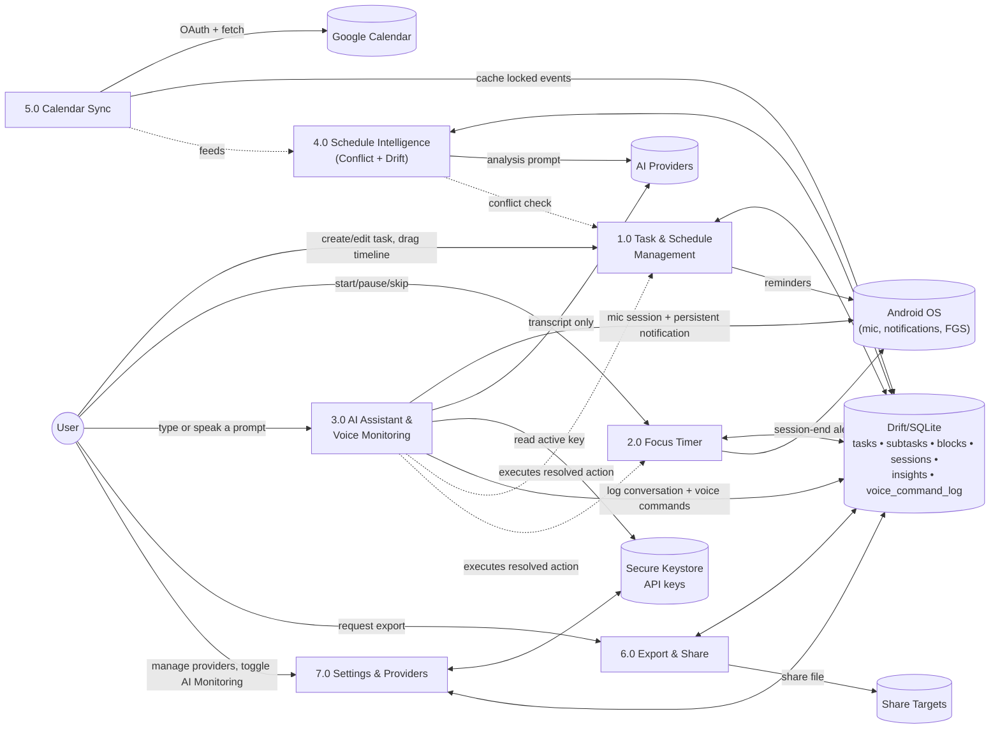
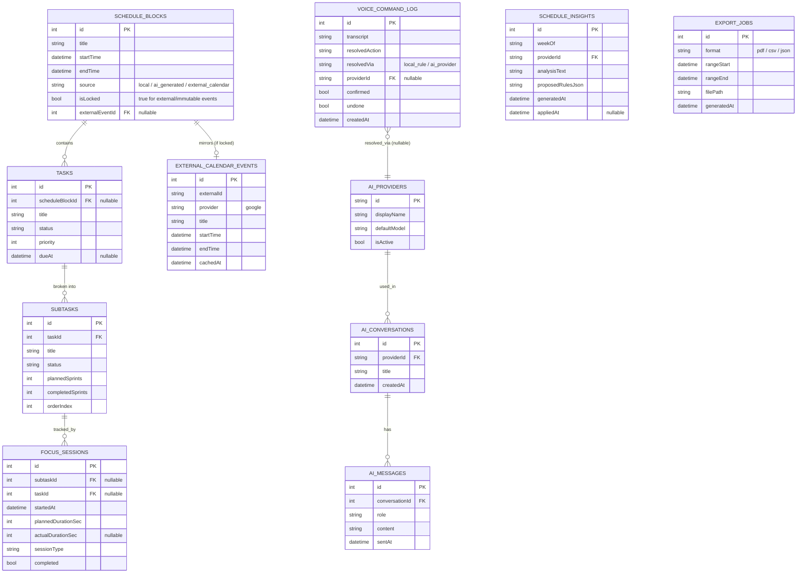
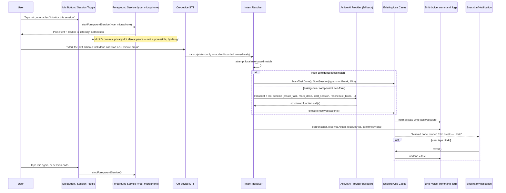

# Flowline — Project Scope, System Architecture & DFD (v2)
*Supersedes and extends `01-architecture.md`, grounded in the delivered UI/UX (`Flowline_app_ui_ux_design.zip`) and adding the voice-driven "AI Monitoring" capability.*

---

## 0. What Changed Since v1

The design team's delivery (dark + light, ~30 screens, full design token system) confirmed the app is called **Flowline** and — deliberately or as productive scope creep — designed several capabilities beyond the original brief. This document treats those as **confirmed scope**, not speculation, since they exist as approved, built screens:

| Area | v1 (my original spec) | Confirmed in delivered UI/UX |
|---|---|---|
| Tasks | flat task list | tasks now have **subtasks**, each with its own sprint (Pomodoro) count and completion tracking |
| Scheduling | manual time blocks only | AI can **bundle subtasks into a schedule block**, detect **conflicts** against external calendar events, and propose/apply fixes |
| AI | chat assistant, single active provider | **multi-model switcher in-chat** (Claude 3.5 Sonnet / GPT-4o mini / Gemini 1.5 / local Ollama), a **Task Breakdown Engine**, and a **weekly "schedule drift" analysis** the AI can auto-apply |
| Calendar | none | **read-only Google Calendar sync** — external events render as "locked/immutable" blocks Flowline must schedule around |
| Insights | basic stats | **calendar-grid adherence view** (streaks, daily focus heatmap) |
| Data | none | **local PDF/CSV/JSON export** + Android system share sheet |
| Voice | none | mic icon present as a **chat dictation** affordance only — no monitoring/ambient feature yet. **This document adds that as new scope.** |

Everything from the v1 architecture doc (MVVM/Clean layering, Riverpod, Drift, folder structure, component library) still holds — this document only adds what's new.

---

## 1. Confirmed Project Scope

**Product:** Flowline — a local-first Android productivity app combining time-blocked scheduling, a Pomodoro focus timer, and a multi-provider AI layer that can plan, break down, and actively adjust the user's schedule, including by voice.

**Modules (confirmed):**
1. **Task & Schedule Management** — tasks, subtasks, time-blocks, drag-and-drop timeline, unscheduled backlog.
2. **Focus Timer** — Pomodoro sessions logged per-subtask, streaks.
3. **AI Assistant** — multi-provider chat, Task Breakdown Engine, Instant Assist Prompts, "Add to Today's Timeline."
4. **Schedule Intelligence** — conflict detection against locked (external) events with AI-recommended and manual resolution; weekly drift analysis with one-tap "Apply Adjustments."
5. **Calendar Sync** — read-only Google Calendar integration to source "immutable" events.
6. **Insights** — streaks, adherence %, calendar-grid heatmap, weekly PDF/CSV/JSON export via system share sheet.
7. **AI Monitoring (Voice)** — **new in this document**: opt-in, foreground-only voice control that transcribes speech on-device and executes the same task/schedule/timer actions available elsewhere in the app.
8. **Settings** — AI Providers (4 vendors), Notifications, Appearance, Data & Privacy, and (new) AI Monitoring.

**Explicit non-goals (unchanged from v1, now reaffirmed by the design's own privacy messaging):** no Flowline-owned backend/account system, no telemetry/analytics collection, no push notifications from a server (all notifications are locally scheduled).

---

## 2. System Context Diagram (Level 0 DFD)

```mermaid
flowchart TB
    User((User))

    subgraph Flowline["Flowline — Flutter Android App"]
    end

    AIProviders[("AI Providers\nAnthropic • OpenAI • Google Gemini • Local Ollama")]
    AndroidOS[("Android OS\nNotifications • Foreground Services •\nMic/Privacy Indicators • Hardware Keystore")]
    GCal[("Google Calendar\n(read-only, OAuth)")]
    ShareTargets[("Share Targets\nGmail • Drive • Slack • Print • Quick Share")]

    User <-->|touch + voice input, on-screen/haptic feedback| Flowline
    Flowline <-->|prompt text in, response out\n(voice-transcribed or typed — audio never leaves device)| AIProviders
    Flowline <-->|schedule/timer/voice-session alerts,\nsecure key read/write| AndroidOS
    Flowline -->|read events for the visible date range\n(OAuth access token)| GCal
    Flowline -->|export files (PDF/CSV/JSON)| ShareTargets
```

No new backend is introduced. Google Calendar is the one genuinely new *class* of external dependency — everything else (AI vendors, OS services, share targets) follows the same "direct device-to-vendor" pattern already established in v1.

---

## 3. Level 1 Data Flow Diagram



---

## 4. Updated Data Model

New/changed entities since v1: `SUBTASKS`, `FOCUS_SESSIONS` now links to a subtask, `SCHEDULE_BLOCKS` gains a lock/source flag, plus four new tables (`EXTERNAL_CALENDAR_EVENTS`, `SCHEDULE_INSIGHTS`, `EXPORT_JOBS`, `VOICE_COMMAND_LOG`).



**Note on `EXTERNAL_CALENDAR_EVENTS`:** this is a read-only local cache, refreshed on sync — Flowline never writes back to Google Calendar. **Note on `VOICE_COMMAND_LOG`:** stores the transcript and the resolved action, not raw audio — audio is discarded immediately after on-device transcription in every case.

---

## 5. Architecture Additions

Three new modules join the `features/` tree from v1:

```
lib/features/
├── schedule_intelligence/   # conflict detection + drift analysis (NEW)
│   ├── view/                # ConflictWarningScreen, TimelineAdjusterScreen, DriftAnalysisScreen
│   └── viewmodel/
├── calendar_sync/           # Google Calendar OAuth + read sync (NEW)
│   └── viewmodel/           # no dedicated screen — surfaces inside Today + conflict screens
├── export/                  # PDF/CSV/JSON generation + share sheet (NEW)
│   ├── view/                # ExportSheet, ExportProgressScreen
│   └── viewmodel/
└── ai_monitoring/           # voice capture + intent resolution (NEW — Section 6)
    ├── view/                # AIMonitoringToggleScreen, listening-state overlay
    └── viewmodel/
```

- **`schedule_intelligence`** depends on `TaskRepository`, `ScheduleRepository`, and `AIRepository` (reuses the existing multi-provider AI layer from v1 — no new AI abstraction needed, just new prompts/tool schemas).
- **`calendar_sync`** introduces one new repository, `CalendarRepository`, backed by `googleapis`/`google_sign_in` — read-only scope only (`calendar.readonly`), token stored via the same secure-storage pattern as AI keys.
- **`export`** is pure local computation over existing Drift tables — no new external dependency beyond a PDF-rendering package.
- **`ai_monitoring`** is the significant new module — see Section 6.

Everything else (Repository/UseCase/ViewModel layering, Riverpod state, `go_router` navigation, Drift as the single local store) is unchanged from v1.

---

## 6. AI Monitoring (Voice) — Deep Dive

### 6.1 What it is, precisely

An **opt-in, foreground-only** mode where Flowline listens to the user's speech, transcribes it on-device, and carries out the same actions available through the UI — create/complete a task, start/pause/stop a focus session, reschedule a block, ask the AI assistant a question — via voice instead of taps. It is a **voice front-end onto the existing Use Cases**, not a new capability surface: nothing it can do isn't already reachable by hand.

### 6.2 The platform constraints that shape the design

This isn't a place for "always listening in the background" marketing — Android's own rules make that impossible to do honestly, and Flowline's whole brand (see the onboarding copy: *"No streaks, guilt alerts... Respects native Focus modes"*) is built on not fighting the OS. The hard constraints, current as of Android 14+:

- **Microphone access requires a typed foreground service** (`foregroundServiceType="microphone"`), declared in the manifest with the `FOREGROUND_SERVICE_MICROPHONE` permission.
- **A foreground service with mic access cannot be *started* while the app is in the background** (while-in-use enforcement) — it can only be started from a foreground user action (tapping the mic, or an in-session toggle), and can continue running briefly after backgrounding, not be initiated from there.
- **A persistent, non-dismissible notification is mandatory** for the entire time the mic session is active — this is the platform's transparency contract, not a Flowline choice.
- **Android's own mic privacy indicator** (status-bar icon → persistent dot) appears automatically whenever the mic is active and **cannot be hidden or replaced** by the app.

Design consequence: **AI Monitoring is session-scoped, not ambient.** The user starts a listening session explicitly (a mic button, or a "Monitor this Focus session" toggle when starting a timer); it runs with a visible notification for as long as it's active; it stops when the user stops it, ends the session, or backgrounds the app.

### 6.3 Pipeline Architecture

Two-tier intent resolution — this is the pattern the broader voice-assistant ecosystem has converged on (the same shape used by Home Assistant's local-first voice pipeline): resolve the common, unambiguous 90% locally and instantly; hand only the ambiguous remainder to an AI provider.



**Why the two-tier split matters here specifically:** it keeps simple, everyday commands ("pause," "mark this done," "start a break") working instantly and **without any AI provider configured at all** — voice control shouldn't be gated behind having an API key saved. The AI-provider path only activates for genuinely ambiguous or compound requests, and reuses the exact function-calling shape already built for the Task Breakdown Engine and Schedule Intelligence — no separate integration.

### 6.4 Guardrails ("does his task *carefully*")

- **Every voice-triggered action surfaces a visible, undo-able confirmation** (the same Snackbar component from the v1 component library) — nothing happens silently.
- **Destructive actions (delete task, clear a schedule block, remove data) are never voice-auto-executed** — they route to the existing Confirmation Dialog, spoken or not.
- **`voice_command_log` is user-visible** (a simple list in the AI Monitoring settings screen: transcript → action taken → undo), so a misheard command is auditable and reversible, not just trusted silently.
- **Local-rule commands never touch an AI provider or the network** — a small, fixed grammar (start/pause/stop/skip session, mark task/subtask done, create a simple task, snooze reminder) covers the actions people actually say most, matching the "zero telemetry by default" brand even when Voice Monitoring is on.

### 6.5 Packages

| Concern | Recommendation | Why |
|---|---|---|
| On-device STT (v1 of this feature) | `speech_to_text` | Official, best-maintained wrapper around Android's native `SpeechRecognizer`; explicitly designed for the commands/short-phrase use case this feature needs first |
| Continuous/streaming STT (later upgrade) | `whisper_kit` (on-device Whisper via whisper.cpp) or Picovoice Cheetah | Needed only if "monitor this entire focus session" ambient listening (not just push-to-talk) is wanted — removes the native recognizer's short-utterance framing, fully offline |
| Typed foreground service | `flutter_foreground_task` | Current, actively maintained; explicit support for Android 14+ `foregroundServiceType` declarations including `microphone`, plus the required persistent notification |
| Permission handling | `permission_handler` | `RECORD_AUDIO` + `POST_NOTIFICATIONS` request/rationale flow |
| Intent parsing (Tier 2) | existing `AIProvider` strategy classes, extended with a tool/function-calling schema | No new abstraction — same interface as v1's chat feature |

### 6.6 Where it lives in the product

- **Settings → AI Monitoring** (new screen, sits next to AI Providers): master on/off toggle (off by default — this is opt-in, matching the onboarding's "Zero Setup Required" tone), the local-command reference list, the voice activity log, and a link to enable/disable the AI-provider fallback tier independently (so a privacy-maximizing user can keep voice control to local commands only, with zero network calls, ever).
- **In-session entry point:** a mic affordance on the Focus Timer screen ("Monitor this session") and a persistent mic button in the AI Assistant input bar (already drawn in the delivered mockups) that now actually activates capture instead of just being decorative.

### 6.7 What this deliberately does *not* attempt (v1 of this feature)

- No wake-word ("Hey Flowline") always-on detection — that requires background audio processing Android doesn't allow for a non-system app without the same foreground-service/notification trade-offs, so it wouldn't actually be "invisible" anyway; push-to-talk/session-scoped is the honest version of this feature.
- No system-level integration yet (Android's **AppFunctions** — a new Jetpack API that lets an app expose its actions as tools to Gemini system-wide, conceptually similar to MCP — is in private preview as of mid-2026, and Google is actively retiring the older Assistant/App Actions path in favor of it). Worth tracking as a Phase-2/3 item once it reaches general availability, since it would let users trigger Flowline actions via the system assistant without opening the app at all — but building against a private-preview API now would be premature.

---

## 7. Confirmed AI Provider & Model Matrix

Taken directly from the delivered AI Providers and Onboarding screens:

| Provider | Default Model | Connection | Notes |
|---|---|---|---|
| Anthropic | Claude 3.5 Sonnet (`claude-3-5-sonnet-20241022`) | Direct `v1/messages` API | Marked "Recommended" in onboarding |
| OpenAI | GPT-4o mini | Direct API | "Ultra Low Latency" positioning |
| Google | Gemini 1.5 Pro & Flash | Direct API | 1M context window called out |
| Ollama | user-configured local model (e.g. Llama 3.2 3B) | `http://localhost:11434` (local network / same-device) | "100% Offline • 0 Cloud Telemetry" |

All four follow the same `AIProvider` strategy interface from v1 — Schedule Intelligence, the Task Breakdown Engine, and AI Monitoring's Tier 2 fallback all call through this one abstraction, keyed off whichever provider is currently active.

---

## 8. Updated Dependency / Package List

Consolidated — v1 packages plus everything new in this document:

| Concern | Package(s) |
|---|---|
| State management | `flutter_riverpod`, `riverpod_annotation`, `riverpod_generator` |
| Routing | `go_router` |
| Local database | `drift`, `drift_flutter`, `sqlite3_flutter_libs` |
| Secure storage | `flutter_secure_storage` (AI keys **and** the Calendar OAuth token) |
| AI networking | `dio` |
| Local notifications | `flutter_local_notifications` |
| **Voice capture (NEW)** | `speech_to_text`, `flutter_foreground_task`, `permission_handler` |
| **Calendar sync (NEW)** | `googleapis`, `google_sign_in` (read-only `calendar.readonly` scope) |
| **Export (NEW)** | `pdf` + `printing` (PDF generation/preview), `csv`, `share_plus` (system share sheet) |
| Deferrable background tasks | `workmanager` (e.g. weekly drift-analysis pre-computation) |
| Immutable models / codegen | `freezed`, `json_serializable`, `build_runner` |
| Charts (Insights, calendar heatmap) | `fl_chart` |
| Testing | `flutter_test`, `mocktail` |

---

## 9. Mobile-Friendliness & Adaptive Layout

The delivered screens are single-column, phone-first — correct as the primary target, but two things are worth building in now rather than retrofitting later:

- **Window Size Classes, not fixed breakpoints.** Use Flutter/Material's window-size-class approach (compact/medium/expanded) rather than hardcoded pixel widths, even though every screen ships compact-only today. This is what lets the same codebase survive a foldable unfolding or a future tablet build without a rewrite — cost almost nothing to do now, expensive to bolt on later.
- **No fixed-width containers in the component library** — every card/sheet/timeline component from Section 4 of the UX spec should size from its parent constraints (`Expanded`/`Flexible`/percentage-based), not literal `width: 360`.
- **Performance on real mid-range Android hardware:** the Day Timeline, Calendar Grid, and Chat message list should all be virtualized (`ListView.builder`/`SliverList`, not `Column` inside a scroll view) given they're the screens most likely to grow long lists over time. The Timer Ring's live countdown should repaint only itself (`RepaintBoundary`), not the whole screen, each second.
- **Battery/thermal consideration specific to this doc's new scope:** AI Monitoring's foreground service should stop itself automatically after a bounded silence window (e.g. 60–90s of no speech) rather than relying solely on the user remembering to tap stop — good for battery, and it also shrinks the window the mic notification is visible, which is good product hygiene for a "calm, minimal" app.

---

## 10. Updated Build Phases

1. **Phase 1 — Core loop** *(unchanged from v1)*: Schedule + Tasks, minimal theme, navigation shell.
2. **Phase 2 — Focus Timer** *(unchanged)*: wall-clock session logic, notifications, session history — now including subtask-linked sprints.
3. **Phase 3 — AI Assistant**: multi-provider chat + Task Breakdown Engine + "Add to Today's Timeline."
4. **Phase 4 — Schedule Intelligence & Calendar Sync**: Google Calendar read sync, conflict detection, manual timeline adjuster, weekly drift analysis + apply.
5. **Phase 5 — Insights & Export**: calendar-grid adherence view, PDF/CSV/JSON export, share sheet.
6. **Phase 6 — AI Monitoring (Voice)**: push-to-talk capture, local-rule intent tier, AI-provider fallback tier, voice activity log, Settings surface.
7. **Phase 7 (optional, tracks Android platform maturity)**: AppFunctions/Gemini system-level integration once out of private preview; ambient/continuous listening via `whisper_kit` if user demand supports the added complexity.

---

*Companion documents: `01-architecture.md` (v1 MVVM/component architecture, unchanged) and `02-ux-ui-spec.md` (original design brief, now realized in `Flowline_app_ui_ux_design.zip`).*
