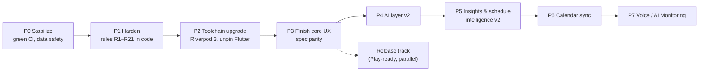

# Flowline — Build & Optimization Plan (v1)

*Written 2026-10-01 against commit `d8fcf62`. This plan says what to build next, in what order, and the rules that keep the work from breaking things that already work.*

> **How this relates to the other docs.** `01-architecture.md`, `02-ux-ui-spec.md` and
> `03-scope-architecture-dfd-v2.md` are the original *plans*. `../PROJECT_OVERVIEW.md` is the
> *as-built* description and holds known issues K1–K20. This document is the *forward plan*.
> It adds a second defect register (B1–B30) for issues found in a full read of the code
> for this plan, and orders everything into phases with exit criteria.
>
> **Sources read in full for this plan:** every file under `lib/`, `test/` (inventory),
> `tool/ci/`, `.github/workflows/ci.yml`, `pubspec.yaml`, `analysis_options.yaml`, all
> files in `docs/`, `README.md`, `PROJECT_OVERVIEW.md`, the full git history (including
> each AI handover commit message), and the CI logs for runs #6–#8.

**Status legend:** **Confirmed** = proven by reading the code, or by CI · **Suspected** = likely from reading, still needs a test to prove · **Verify** = depends on something outside the repo (a vendor API, a Play policy, a package version) that must be checked when the work is done.

---

## Contents

1. [Baseline](#1-baseline)
2. [Rules that keep the code future-proof and bug-proof](#2-rules-that-keep-the-code-future-proof-and-bug-proof)
3. [Defect register (new findings)](#3-defect-register-new-findings)
4. [Phased roadmap](#4-phased-roadmap)
5. [Optimization plan](#5-optimization-plan)
6. [Testing strategy](#6-testing-strategy)
7. [CI/CD and release pipeline](#7-cicd-and-release-pipeline)
8. [AI-assisted development protocol](#8-ai-assisted-development-protocol)
9. [Watchlist for platform, policy and dependency changes](#9-watchlist-for-platform-policy-and-dependency-changes)
10. [Master checklist](#10-master-checklist)

---

## 1. Baseline

| Area | State at `d8fcf62` |
|---|---|
| Build | Release APK builds in CI (Flutter 3.35.7 pinned). No local SDK — **CI is the only build environment.** |
| Quality gates | Analyze ✅ · 90/90 tests ✅ (run #7) · **`dart format` ❌** (1 line in `test/features/focus_timer/focus_screen_test.dart`) |
| Scope built | Tasks/subtasks/blocks, wall-clock focus timer, 4-vendor BYO-key AI chat, conflict detection with AI suggestion, Insights, PDF/CSV/JSON export |
| Scope not built | Block edit/delete UI, Session Summary, onboarding, 3 of 4 Settings screens, streaming/markdown/history in chat, Task Breakdown, Calendar Sync, drift analysis, recurrence, Voice |
| Open known issues | K2, K4–K7, K9–K18 in `PROJECT_OVERVIEW.md` §20; B1–B30 below |
| Tech debt locked in | Riverpod 2.6 + analyzer 7.x codegen stack pins Flutter at 3.35 (Dart 3.9) |

The architecture is sound: layered, with a pure `domain/`, errors returned as values, timer state saved as real clock times, and repository invariants enforced in SQL. Most of the risk is in the **edges**: platform setup, time arithmetic, concurrency between UI and database, and tooling. This plan concentrates there before adding features.

---

## 2. Rules that keep the code future-proof and bug-proof

These rules apply to every phase. Each one names the bug class it prevents. Put them in a
`CLAUDE.md` (see §8) so every AI or human contributor gets them automatically.

### 2.1 Data and persistence

| # | Rule | Prevents |
|---|---|---|
| R1 | **Enums stored by index are append-only.** Never reorder, insert or delete a value. For new enums, store a stable explicit code instead: `textEnum`, or an `int` mapped by a `switch`. | Existing rows silently change meaning (K17) |
| R2 | **Every schema change** bumps `schemaVersion`, adds a step-by-step migration, and **commits a schema snapshot** (`drift_dev make-migrations` or `schema dump`) plus a generated migration test. No schema change merges without a test that upgrades from every older version. | Upgrades that wipe or corrupt user data |
| R3 | **Invariants are enforced in SQL, not only in Dart.** Examples: a partial unique index for "one active session" (B8), `CHECK (end_time > start_time)`, foreign keys left on. | Races that the Dart guard misses |
| R4 | **Read-modify-write is never split across two queries.** Use one `UPDATE … SET x = x + 1`, or a transaction. | Lost updates (B12) |
| R5 | **Order lists by a unique key.** Sort by `(timestamp, id)`, never by a timestamp alone. Drift stores date-times at second precision. | Messages or sessions appearing in a random order (B5) |
| R6 | **Back up the database, never the secrets.** Android Auto Backup rules must include `flowline.sqlite` and exclude flutter_secure_storage's preferences file. | Keys that can't be decrypted after a restore, or a crash on restore (B3) |

### 2.2 Time

| # | Rule | Prevents |
|---|---|---|
| R7 | **Calendar-day arithmetic goes through one helper** (`core/time/day.dart`: `startOfDay`, `addDays(d, n) => DateTime(d.year, d.month, d.day + n)`). **`Duration(days: n)` is banned for calendar math.** A lint check or grep in CI enforces this. | Days that are 23 or 25 hours long at a DST change (B1) |
| R8 | **All "now" goes through `package:clock`.** No `DateTime.now()` in `lib/`. | Code that can't be tested with fake time, and windows that go stale across midnight (K7) |
| R9 | **"Today" is reactive.** A `currentDayProvider` emits at local midnight and on app resume. Every day-window provider watches it. | Screens that keep showing yesterday (K7) |
| R10 | **Times sent to or received from an AI include an explicit offset**, or are parsed as local clock time on purpose. Never call `.toLocal()` on an ambiguous string. | Suggestions shifted by the user's UTC offset (B13) |

### 2.3 State, async and UI

| # | Rule | Prevents |
|---|---|---|
| R11 | **Action notifiers that cross an `await` are `keepAlive`**, or check `ref.mounted` after each `await` (Riverpod 3). Hand-off state such as `pendingFocusLinkProvider` is `keepAlive`. | Lost state and `Ref`-after-dispose errors (B9, B10). Riverpod 3 turns this into a hard failure |
| R12 | **Every user action that writes data has a busy guard and an error path.** Use a shared `runAction()` helper: it disables the trigger, catches errors, shows a snackbar, and always clears the busy flag. | Spinners stuck forever, double inserts (B6, B15, B16) |
| R13 | **Side effects run after the data is correct, and can't undo it.** Persist the sprint credit first, then notifications. Notification failures are caught and logged, never re-thrown. | A lost sprint credit when the notification plugin fails (B4) |
| R14 | **No raw `$error` in the UI.** Map errors to user copy through `core/error/`, with a Retry action. | K9 |
| R15 | **Turn on the `unawaited_futures` and `discarded_futures` lints.** Fire-and-forget calls must be marked with `unawaited()` on purpose. | Silent failures in `onPressed` handlers |
| R16 | **Any output from an AI is untrusted input.** Parse it, validate it against current app state, and re-validate at apply time. Never apply it without a user tap. | Wrong or overlapping blocks (K3, B13–B14), and a future Task Breakdown or Voice inserting junk |

### 2.4 Platform, build and dependencies

| # | Rule | Prevents |
|---|---|---|
| R17 | **Every APK is signed with one stable key** stored as a CI secret. | Each CI run currently signs with a fresh debug key, so updating forces an uninstall, which **deletes all local data** (B2) |
| R18 | **`versionCode` increases every build** (`--build-number=${{ github.run_number }}`). | Can't upgrade, Play rejection |
| R19 | **Upgrade the toolchain as a set.** Flutter, Dart, analyzer, `riverpod_generator`, `drift_dev` and `build_runner` move in one PR, with codegen, analyze, tests and a device smoke test. | The 5.5-hour `build_runner` hang (already happened once) |
| R20 | **Android template patches stay anchor-checked** (already true). Every new manifest or Gradle need goes into `tool/ci/android_patches.dart` with a test. | A Flutter bump silently dropping a permission or receiver |
| R21 | **No hard-coded AI model IDs as the only option.** Seeded defaults are hints. The app lists models from each vendor's models endpoint and validates with a "Test connection" call. | First use failing because a model was retired (K6) |

---

## 3. Defect register (new findings)

Found while reading every file for this plan. These are not in `PROJECT_OVERVIEW.md` §20 yet.
**P0** critical · **P1** major · **P2** moderate · **P3** minor.

| ID | Sev | Status | Where | Defect | Fix | Regression test |
|---|---|---|---|---|---|---|
| **B1** | P1 | Confirmed | `domain/services/focus_stats_calculator.dart:45,68,73`, `features/schedule/viewmodel/today_view_model.dart:18-19`, `data/repositories/schedule_repository_impl.dart:15`, `focus_session_repository_impl.dart:42`, `insights_view_model.dart:17,19`, `export_view_model.dart:21,23` | Calendar math uses `Duration(days: n)`. At a DST change, "midnight minus 24 h" lands on 23:00 or 01:00. Daily-total keys stop matching, so bars read zero, the **streak breaks**, `selectedDate` drifts off midnight, and day windows lose or gain an hour. India has no DST, but any user in a DST zone hits this twice a year. | R7 helper everywhere | Unit tests with `America/New_York` DST dates via the `timezone` test harness or fixed `DateTime` pairs; streak across a DST change |
| **B2** | **P0** | Confirmed | `.github/workflows/ci.yml` (release job) | The release build uses the Flutter template's **debug signing config**. GitHub runners are fresh, so **each run generates a new debug keystore**. An APK from a later run can't install over an earlier one ("package conflicts"). The only way forward is to uninstall, which **wipes the local-first database**. | Generate one release keystore. Store it base64-encoded with its passwords as repo secrets. Add a `signingConfigs.release` patch in `android_patches.dart`. Fail CI on `main` if the secret is missing. | CI step: `apksigner verify --print-certs` and compare the SHA-256 against a committed fingerprint |
| **B3** | P1 | Suspected (Verify) | Android manifest (template default `allowBackup=true`) | Auto Backup copies flutter_secure_storage's encrypted preferences, but **not** the Keystore key that decrypts them. After a restore to a new phone, reading keys can throw or return garbage. | Add `fullBackupContent` / `dataExtractionRules` XML: include the DB, exclude `FlutterSecureStorage`. Catch read errors in `SecureKeyStore` and treat them as "no key". | Unit test of the `SecureKeyStore` error path; device checklist item |
| **B4** | P1 | Confirmed | `features/focus_timer/viewmodel/focus_timer_view_model.dart:111-120` | `complete()` awaits `notificationServiceProvider.future` **before** crediting the subtask sprint. If notification init fails (for example `tz.getLocation` throws on an unknown timezone ID, `notification_service.dart:27`), the session is already marked complete, the credit is skipped, and it can never be retried. | Credit first, then cancel the notification inside `try/catch`. Make `NotificationService.init` fall back to UTC on a lookup failure. | View-model test with a throwing fake `NotificationService` |
| **B5** | P2 | Confirmed | `data/repositories/ai_repository_impl.dart:136,164` | Messages are ordered by `sentAt` only, at second precision. A fast reply (Ollama, or a cached error) shares a second with the prompt, so the order isn't guaranteed. History sent to the vendor can also be out of order. | `orderBy([sentAt asc, id asc])` | Repository test inserting two messages in the same second |
| **B6** | P2 | Confirmed | `features/focus_timer/view/focus_screen.dart:80` | **Start** has no busy guard. A double tap starts two sessions, and the self-heal closes the first as "ended early", leaving a junk row in Insights and exports. | Busy guard (R12), plus the SQL constraint (B8) | Widget test: double tap leaves exactly one session row |
| **B7** | P2 | Confirmed | `focus_session_repository_impl.dart:96,109` | `pauseSession` and `resumeSession` don't check `completedAt IS NULL`. A quick End → Pause/Resume writes `isPaused`/`segmentStartedAt` onto a completed row. | Add `& s.completedAt.isNull()` to the `where` and return a `bool` | Repository test |
| **B8** | P2 | Confirmed | Schema | "At most one active session" is only enforced in Dart. | Migration v4: `CREATE UNIQUE INDEX one_active_session ON focus_sessions ((1)) WHERE completed_at IS NULL` | Repository test: a second insert throws |
| **B9** | P2 | Suspected | `features/focus_timer/viewmodel/focus_timer_view_model.dart:47-60` (`PendingFocusLink`) | It's an auto-dispose provider set from Today or Task Detail. If the Focus tab has never been built, nothing watches it, so it can be disposed before `/focus` builds and the link chip is lost. | `@Riverpod(keepAlive: true)` | Widget test: tap ▶ on a fresh app, then the Focus tab shows the chip |
| **B10** | P2 | Suspected (hard failure in Riverpod 3) | `app.dart:42`, every `ref.read(xxxProvider.notifier)` cached in `build()` (TaskCard, Task Detail, Export, Focus) | Auto-dispose action notifiers are read without being listened to, then used across `await`s. Riverpod 2.6 tolerates this; Riverpod 3 throws `UnmountedRefException`. | R11: make action notifiers `keepAlive`, or read them at call time, and check `ref.mounted` after migration | Covered by the Riverpod 3 migration test suite |
| **B11** | P2 | Confirmed | `domain/entities/task.dart:40-41` (also `ScheduleBlock.copyWith`) | `copyWith(scheduleBlockId: null)` can't **clear** a block or due date (`?? this.x`). It blocks "unschedule task" and "remove due date" in the upcoming task form. | Sentinel or `ValueGetter` pattern, or `freezed` | Entity unit test |
| **B12** | P3 | Confirmed | `task_repository_impl.dart:122` | `incrementSubtaskCompletedSprints` reads and then writes separately (lost update if it races). | `customUpdate('UPDATE subtasks SET completed_sprints = completed_sprints + 1 WHERE id = ?')` | Repository test |
| **B13** | P2 | Confirmed | `domain/services/conflict_resolution_ai.dart:60-63` (from `d8fcf62`) | The prompt sends local times with no offset. If the model answers with a `Z`, `.toLocal()` shifts the slot by the UTC offset (+5:30 in IST). If the shifted slot happens to be free, the wrong time passes validation. | Send times with an explicit offset, or drop any offset and treat the reply as local clock time on purpose (R10) | Parser tests: `Z`, `+05:30`, no offset |
| **B14** | P2 | Confirmed | `buildConflictResolutionPrompt` | The prompt lists only the *conflicting* blocks, but validation checks the *whole day*. The AI suggests slots that clash with blocks it never saw, and the user loops on "Ask again". | Send every block for the day (including locked ones) plus the working-hours window | Prompt snapshot test |
| **B15** | P2 | Confirmed | `export_view_model.dart`, `export_sheet.dart` | Export errors (share sheet cancelled, IO, PDF font) end up as an unhandled future error, with no feedback to the user. | R12 `runAction` + snackbar | Widget test with a throwing fake `ExportService` |
| **B16** | P2 | Confirmed | All form sheets (`add_edit_task_sheet.dart`, `add_edit_schedule_block_sheet.dart`, `add_edit_ai_provider_sheet.dart`) | No `try/catch` around saves. On an error `_saving` stays `true`, so the button spins forever. | R12 | Widget tests with throwing repositories |
| **B17** | P2 | Confirmed | `add_edit_ai_provider_sheet.dart` | No validation: an empty model, or an Ollama URL without `http://`, is saved and then fails with an unclear error. | Validate the fields, and add **Test connection** (R21) | Widget test |
| **B18** | P2 | Confirmed | `anthropic_client.dart:46` | `max_tokens: 1024` is hard-coded, so long answers are silently cut off. `stop_reason` isn't checked. | Move it to `AIRequest.maxOutputTokens`; when it hits the limit, show "Response was cut off" | Client test with a mocked Dio |
| **B19** | P3 | Confirmed | `insights_screen.dart:181` | `DateFormat('E').format(...).substring(0, 1)` can split a character in non-Latin locales. | `DateFormat('EEEEE')` (narrow weekday) | Golden or widget test under `hi_IN` |
| **B20** | P3 | Confirmed | `today_view_model.dart` (`unscheduledTasks`) | The backlog shows **every** unscheduled task ever made, including done ones, on every day. It grows without limit and costs rebuilds. | Hide done tasks older than today, or add a "Show completed" toggle and paginate | Widget test |
| **B21** | P3 | Confirmed | `day_timeline.dart` | One stream provider per block (N+1 queries) inside an eager `ListView(children:)`. | One joined query for the day's blocks and their tasks; `ListView.builder`/slivers | Performance fixture (§5) |
| **B22** | P3 | Confirmed | `assistant_screen.dart` `_send` | The input is cleared before the send. If the send throws, the user's text is lost. | Clear only on success, or restore the text on error | Widget test |
| **B23** | P3 | Confirmed | `ai_repository_impl.dart` `sendMessage` | The user message and assistant reply aren't one unit. If the process dies mid-request, there's an orphan prompt with no reply and no retry. | Add a `pending` status to the message row; on the next launch, mark stale pending rows as an error with **Retry** | Repository test |
| **B24** | P3 | Confirmed | `notification_service.dart` | No notification-tap handler and no payload, so "Tap to see what's next" just opens the app at the last tab. | `onDidReceiveNotificationResponse` → `/focus` with the Session Summary | Integration test |
| **B25** | P3 | Verify | `weekly_pdf_exporter.dart` | The `pdf` package's default Helvetica has limited glyph coverage. Em/en dashes and any future non-Latin text (task titles in Hindi) may render as boxes, or log font warnings. | Bundle a TTF (Inter, which also fixes K20) and pass `pw.ThemeData.withFont` | Golden PDF text extraction test |
| **B26** | P3 | Confirmed | Schema | No indexes on `focus_sessions.started_at`/`completed_at`, `schedule_blocks.start_time`, `tasks.schedule_block_id`, `ai_messages.conversation_id`. | Migration v4 indexes (§5.2) | `EXPLAIN QUERY PLAN` test asserting index use |
| **B27** | P3 | Confirmed | `pubspec.yaml` `version: 0.1.0` | No build number, so every APK has `versionCode 1`. | R18 | CI assertion via `aapt dump badging` |
| **B28** | P3 | Confirmed | `d8fcf62` | `validateConflictSuggestion` and `parseConflictSuggestion` have no tests. | Unit tests: same day, length, overlap, locked block, end ≤ start, block crossing midnight | — |
| **B29** | P3 | Confirmed | `watchBlocksForDay` | Only blocks that *start* that day are returned, so a block crossing midnight from the previous day is missed by the conflict check. | Use the overlap predicate `start < dayEnd AND end > dayStart` | Repository test |
| **B30** | P3 | Confirmed | `focus_session_repository_impl.dart` `watchSessionsInRange` | Windows by `startedAt`, while stats bucket by `completedAt` (also K12). A session that crosses midnight can be dropped from a window. | Use one rule everywhere: bucket and window by `completedAt` (the natural end) | Calculator and repository tests |
| **B31** | P2 | Fixed | `ai_repository_impl.dart` `sendMessage` | Error bubbles were sent back to the vendor as assistant turns in the conversation history. | `buildChatHistory`: only completed exchanges, alternation kept | `chat_history_test`, `ai_send_message_test` |

Carry-overs from `PROJECT_OVERVIEW.md` §20 that are still open and scheduled below: **K2, K4, K5, K6, K7, K9, K10, K11, K12, K13, K14, K15, K16, K18, K20.**

---

## 4. Phased roadmap

Each phase has an **exit gate**, and the next phase doesn't start until it passes. That keeps
new features from being built on top of an unstable base.



### Phase 0 — Stabilize (≈1–2 days)

Goal: `main` is green, and nothing a user does can lose their data.

| # | Work | Fixes |
|---|---|---|
| 0.1 | Apply CI's `format-patch` | K2 |
| 0.2 | Stable release signing key plus CI secret and fingerprint check | **B2** |
| 0.3 | `--build-number=${{ github.run_number }}` | B27 |
| 0.4 | Backup rules: include the DB, exclude secure-storage preferences; harden `SecureKeyStore` reads | B3 |
| 0.5 | Reorder `complete()` (credit first); catch notification errors; UTC fallback in `NotificationService.init` | B4 |
| 0.6 | Follow-ups to `d8fcf62`: tests (B28), explicit offsets in the prompt/parser (B13), whole day in the prompt (B14) | B13, B14, B28 |
| 0.7 | Refresh the status sections of `PROJECT_OVERVIEW.md` (§2, §19, §20, §22) and the README header ("never compiled" is no longer true) | Docs drift |

**Exit gate:** CI is fully green on `main` · two consecutive CI APKs install over each other on a real phone with data kept · the device checklist (`PROJECT_OVERVIEW.md` §21) items 1–9 pass.

### Phase 1 — Harden (≈1 week)

Goal: rules R1–R21 exist as code, so later phases inherit them automatically.

| # | Work | Fixes |
|---|---|---|
| 1.1 | `core/time/`: `clock`-based `Day` helpers + `currentDayProvider` (emits at midnight and on resume). Replace every `DateTime.now()` and `Duration(days:)`. Add a CI grep guard. | B1, K7, R7–R9 |
| 1.2 | `core/error/`: `AppFailure` sealed class, `describe()` user copy, and an `ErrorView(retry:)` widget used by every `.when(error:)` | K9, R14 |
| 1.3 | `core/async/run_action.dart`: busy guard, catch, snackbar. Apply to every write action. | B6, B15, B16, B22, R12 |
| 1.4 | Repository guards: `pause`/`resume` require active · atomic sprint increment · order messages by `(sentAt, id)` · overlap predicate for blocks on a day · single bucketing rule | B5, B7, B12, B29, B30, K12 |
| 1.5 | **Schema v4 migration**: one-active-session unique index; `CHECK(end_time > start_time)`; performance indexes; `tasks.schedule_block_id` becomes a real FK with `ON DELETE SET NULL` (a table rebuild via `TableMigration`); `ai_messages.status` for pending/sent/error. Start committing **schema snapshots** and generated migration tests. | B8, B23, B26, R2, R3 |
| 1.6 | Entities: fix `copyWith` so fields can be cleared (adopting `freezed` here is fine; its codegen stack is compatible) | B11 |
| 1.7 | Networking: `Dio(BaseOptions(connectTimeout: 10s, receiveTimeout: 60s))`; a `CancelToken` per request; a `RetryInterceptor` only for 429/503 with backoff that respects `retry-after` | K5 |
| 1.8 | AI providers: refresh `providerHasKeyProvider` after save/remove; field validation; confirmation dialogs for Remove key and subtask delete; dispose the subtask dialog's controller | K4, K14, K16, B17 |
| 1.9 | Stricter analysis: `strict-casts`, `strict-inference`, `strict-raw-types`; lints `unawaited_futures`, `discarded_futures`, `avoid_dynamic_calls`, `always_declare_return_types`, `prefer_final_locals`, `use_build_context_synchronously` (as an error) | R15 |
| 1.10 | Drift Android setup: set `sqlite3.tempDirectory` at startup | K18 |
| 1.11 | Accessibility: tooltips on every icon button, `Semantics` on the timer ring, text-scale tests at 2.0 | K13 |

**Exit gate:** every B and K item tagged Phase 1 has a regression test · line coverage of `lib/domain` and `lib/data` ≥ 85% · no `DateTime.now()` or `Duration(days:` in `lib/` (CI grep) · the migration test upgrades v1 → v4 cleanly.

### Phase 2 — Toolchain upgrade (≈3–5 days, one PR)

Goal: get off the Flutter 3.35 pin **before** the codebase doubles in size, while the migration is still small.

| # | Work | Notes |
|---|---|---|
| 2.1 | Riverpod 2.6 → 3.x (`flutter_riverpod`, `riverpod_annotation`, `riverpod_generator`) | Things that change behaviour **(Verify against the official migration guide at the time)**: providers retry on error automatically (turn this off for repositories whose errors are terminal), `Ref` used after dispose throws (B10), notifier and `AsyncValue` API changes. Run R11 throughout. |
| 2.2 | `drift`/`drift_dev` → latest that matches the new analyzer; adopt `drift_flutter` (`driftDatabase(name:)`) to replace the hand-rolled `LazyDatabase` | Planned in the docs, simplifies Android setup |
| 2.3 | `build_runner` latest; consider `riverpod_lint` via `custom_lint` | Lints catch R11 violations statically |
| 2.4 | Unpin Flutter to the current stable; regenerate and re-test the Android template patches (R20) | The patches fail loudly if anchors moved |
| 2.5 | Other packages: `flutter_local_notifications` (newer majors change `zonedSchedule`), `share_plus` 11+ (`SharePlus.instance.share`), `flutter_secure_storage` 10 (moves off the deprecated Jetpack Security; **check that existing keys migrate**), `go_router` latest, `fl_chart`, `pdf`/`printing` | One package per commit inside the PR, with CI between each |

**Exit gate:** CI green on the new Flutter stable · device checklist re-run · an upgrade install over a Phase 1 APK keeps the data **and the API keys**.

### Phase 3 — Finish core UX (spec parity, ≈2–3 weeks)

Goal: every page in `02-ux-ui-spec.md` §5 exists and handles all four states (empty, loading, error, success).

| Area | Work | Spec ref |
|---|---|---|
| Schedule | Block **edit/delete** UI (long-press or tap a block, which opens the existing sheet in edit mode); "Edit times" from the conflict sheet reopens the form pre-filled (K15); current/past/future styling; "now" line | §5.5, D4 |
| Recurrence | `recurrence_rule` (RRULE subset: daily, weekdays, weekly by weekday). Expand occurrences in a pure domain service; store exceptions. "This occurrence / all future" on delete. | §5.5, 01 §7 |
| Tasks | Form gains status (edit), due date/time, block picker, delete; overdue state; long-press menu; snackbar **Undo** on complete/delete (soft-delete with `deleted_at`, purged after 7 days) | §5.4, §8 |
| Task Detail | Focus-session history for the task (`watchSessionsForTask` already exists); subtask reorder (`orderIndex`) | §5.6 |
| Focus | **Session Summary** sheet; Skip; custom durations; auto-suggest a long break after N focus sessions; last-10-seconds emphasis; haptics; notification tap deep link (B24) | §5.7–5.8 |
| Settings | **Appearance** (System/Light/Dark, dynamic colour switch, stored in a `settings` key-value table); **Notifications** (session/break/block reminders with lead time); **Data & Privacy** (what is stored where, export all, **clear all data** with confirmation, version) | §5.15–5.17 |
| Onboarding | 3 skippable steps (value, notification permission with rationale, connect AI); `onboarding_completed` setting; Android 12+ splash via `flutter_native_splash` | §5.1–5.2 |
| Design system | Bundle Space Grotesk + Inter (OFL) under `assets/fonts`; map the full token set (apply the `surface-container-*` tokens); **decide the canonical dark primary** (`#C0C1FF` token vs `#6366F1` in code) and record the decision in `docs/design-tokens/` | D8, K20 |
| Settings icon | On every tab's app bar | D5 |
| l10n scaffolding | `flutter_localizations` + `gen-l10n` ARB files; move all strings now, while there are only about 150 | Future-proofing |
| Adaptive | Window size classes (compact/medium/expanded); remove the fixed 240 px timer ring (scale to constraints) | 03 §9 |

**Exit gate:** the spec's states matrix (§7) is satisfied on every screen · golden tests for every screen in light and dark at text scale 1.0 and 2.0 · the emulator integration job (§7) is green.

### Phase 4 — AI layer v2 (≈2–3 weeks)

Goal: make the AI contract stable enough that Task Breakdown, drift analysis and Voice all reuse it without changing the interface again.

**4.1 Interface redesign (do this first; everything else depends on it):**

```dart
// domain/repositories/ai_client.dart (v2) — sketch
abstract interface class AIClient {
  AIProviderId get id;
  Stream<AIEvent> send(AIRequest request, {AICancelToken? cancel});
  Future<List<AIModelInfo>> listModels(AIProviderConfig config, String apiKey);
}

final class AIRequest {
  final AIProviderConfig config;
  final String apiKey;
  final String? system;              // per-feature system prompt
  final List<AIMessage> history;     // already windowed by the repository
  final String prompt;
  final int maxOutputTokens;
  final AIResponseFormat format;     // text | json(schema)
  final List<AIToolSpec> tools;      // for Task Breakdown / Voice tier 2
}

sealed class AIEvent {}              // TextDelta, ToolCall, Done(stopReason, usage), Failure
```

Why this shape lasts: streaming, structured output, tools, cancellation and usage are all optional fields or events. A fifth vendor, or a vendor API change, stays inside one client class. Non-streaming vendors emit a single `TextDelta` followed by `Done`.

| # | Work | Fixes |
|---|---|---|
| 4.2 | **Model registry**: `listModels` per vendor (Anthropic, OpenAI and Gemini models endpoints; Ollama `/api/tags`). Model picker dropdown, **Test connection** button, cached list; seeded defaults only pre-select | K6, R21 |
| 4.3 | **Streaming** (SSE for the hosted vendors, NDJSON for Ollama) into a `pending` message row that is updated in place; **Stop** button cancels | Spec §5.9 |
| 4.4 | **Context windowing**: send the last N messages, or up to a token budget, plus an optional rolling summary | K10 |
| 4.5 | Markdown rendering (`flutter_markdown_plus` or the current maintained fork — Verify), copy, retry on error bubbles, "Fix in Settings" link | §5.9 |
| 4.6 | Conversation history screen (list, rename, delete, new); in-chat provider switcher | §5.10 |
| 4.7 | **Task Breakdown Engine**: JSON-schema structured output → a preview list of subtasks with sprint estimates → the user edits and accepts (R16) | 03 §1 |
| 4.8 | **Add to Today's Timeline**: AI proposes a block for the day's free slots (reuses the B14 context and `validateConflictSuggestion`) | 03 §1 |
| 4.9 | Cost and privacy UX: show what will be sent before the first send per provider; optional per-provider monthly token counter from `usage` | Brand promise |

**Exit gate:** contract tests for every client against recorded fixtures (mocked Dio: success, 401, 429, 5xx, timeout, cancel, cut-off, malformed JSON) · streaming verified on a device for every vendor whose key the owner has.

### Phase 5 — Insights and schedule intelligence v2 (≈2 weeks)

| Work | Notes |
|---|---|
| Monthly view + calendar heatmap; adherence % (tasks done vs planned per block) | 02 §5.11, 03 §1 |
| Streak without the 30-day cap: compute from a lightweight `daily_focus_totals` table maintained on completion (or a SQL `GROUP BY` over the index) | K11 |
| Weekly **drift analysis**: a pure domain service computes planned-vs-actual deltas; AI only phrases the summary and proposes rule changes in a fixed JSON format; preview → **Apply adjustments** with undo; stored in `schedule_insights` | 03 §4 |
| Manual timeline adjuster: drag-to-resize/move blocks with live conflict preview (reuse `ScheduleConflictChecker`) | 03 §1 |
| Export v2: date-range picker; include task titles (now free text, so switch to a real CSV encoder with RFC 4180 quoting) | Formatter note in code |

### Phase 6 — Calendar sync (blocked on owner credentials)

Prerequisites that only the owner can do: a Google Cloud project, an OAuth client, the **release-key SHA-1** (which only exists after B2 is fixed), and the consent screen.

Build: `CalendarRepository` (read-only `calendar.readonly`), an `external_calendar_events` cache table, sync on open/resume plus pull-to-sync in Settings, and locked blocks rendered from the cache. This is the first real cross-repository orchestration, so introduce the **Use Case layer here** (`SyncCalendarUseCase`, `DetectConflictsUseCase`), as the README always planned.

### Phase 7 — AI Monitoring (Voice)

Follow `03-scope-architecture-dfd-v2.md` §6 exactly: push-to-talk, a `microphone`-type foreground service, the tier-1 local grammar, tier-2 AI tool calls through the Phase 4 `AIClient` v2, a confirmation snackbar with undo, a visible `voice_command_log`, and an auto-stop after silence. Re-check Android foreground-service and microphone policy at that time (Verify).

### Release track (in parallel from the end of Phase 3)

| Item | Notes |
|---|---|
| App Bundle (`flutter build appbundle`) + Play App Signing | Upload key = the B2 key |
| `targetSdk` at Play's current requirement | Play raises it every year (Verify each release) |
| 16 KB memory page support | Required for new apps and updates targeting recent Android versions. `sqlite3_flutter_libs` and other native libraries must be 16 KB-aligned. Check in CI with `zipalign -c -P 16` or `check_elf_alignment` (Verify) |
| Edge-to-edge and predictive back | Enforced on newer targets; test the app bars and bottom sheets |
| Data safety form + privacy policy page | User prompts go to the AI vendor the user chose; no data goes to Flowline |
| Restrict `usesCleartextTraffic` | Keep the blanket allow (needed for Ollama on the LAN), but document it in Data & Privacy. Reassess if Play review flags it |
| R8/obfuscation + `--split-debug-info` symbols uploaded as an artifact | Crash triage without telemetry |
| Optional, opt-in local crash log | Write to a file the user can export; never sent automatically (keeps the "no telemetry" promise) |

---

## 5. Optimization plan

Budgets are measured on a mid-range reference device (the owner's phone) with a seeded
**stress fixture**: 2 years of data — 3,000 tasks, 9,000 subtasks, 2,000 blocks, 15,000 sessions, 50 conversations × 200 messages.

### 5.1 Budgets

| Metric | Budget | How it's measured |
|---|---|---|
| Cold start to the first Today frame | ≤ 800 ms (profile mode) | `integration_test` + `traceAction`, `flutter run --profile` timeline |
| Today rebuild on a task toggle | ≤ 8 ms build, no jank frames | DevTools frame chart on the stress fixture |
| Focus screen while running | Only the `RepaintBoundary` repaints each second (already true) | Repaint rainbow / test |
| Insights load (30–365 days) | ≤ 150 ms query | Repository benchmark test |
| Release APK (arm64) | Track it; alert on +10% per release | CI job summary diff |
| Battery | No wakelocks; 0 periodic work while idle; one inexact alarm per running session | `adb shell dumpsys alarm` / batterystats on the device checklist |

### 5.2 Database

- **Indexes (v4):** `focus_sessions(completed_at)`, `focus_sessions(started_at)`, `schedule_blocks(start_time)`, `tasks(schedule_block_id)`, `subtasks(task_id, order_index)`, `ai_messages(conversation_id, sent_at, id)`.
- **Narrow watch queries:** Drift re-runs a `watch()` whenever a table it reads changes. Join the day's blocks and tasks in one query (B21). Have Insights read aggregated rows, not raw sessions.
- **Aggregates in SQL:** daily totals via `GROUP BY date(completed_at, 'unixepoch', 'localtime')` instead of loading 30+ days of rows into Dart.
- **Pagination:** chat messages (`limit`/`offset` by id, load older on scroll); the unscheduled backlog (B20).
- **Housekeeping:** purge soft-deleted rows after 7 days; `PRAGMA optimize` on close; WAL mode (default with `drift_flutter`).

### 5.3 UI

- Use `ListView.builder` or slivers for the timeline, subtasks, chat and history (B21; D16).
- `select()` narrow fields in `ref.watch` where a widget only needs one property.
- `const` constructors are already linted; keep `RepaintBoundary` on the ring; avoid `MediaQuery.of(context)` in list items (use `MediaQuery.sizeOf`).
- Shader warm-up isn't needed on Impeller (the Android default on current Flutter); re-check after Phase 2.

### 5.4 Network and AI

- Timeouts, cancellation and limited retry (Phase 1.7). Use HTTP keep-alive through one shared `Dio`.
- Windowed history (K10) cuts both latency and cost.
- Stream responses (Phase 4) so the first token arrives sooner.
- Cache the model list per provider for 24 h.

### 5.5 Size

- `--split-per-abi` (done), App Bundle for Play, R8 (default in release), `--tree-shake-icons` (default).
- Subset bundled fonts to the Latin and Devanagari ranges actually needed (Verify font licence terms for subsetting; OFL allows it).

---

## 6. Testing strategy

### 6.1 Test pyramid targets

| Layer | Tools | Target |
|---|---|---|
| Pure domain (services, parsers, time helpers) | `test` + property-based cases | 95% lines; every defect gets a test |
| Repositories (Drift in memory) | existing `test/support/test_database.dart` | 90%; one test per invariant (R3) |
| Migrations | Drift `SchemaVerifier` + committed snapshots | Every `from → to` pair |
| AI clients | Mocked Dio fixtures (recorded real payloads, keys removed) | All status codes, cut-off responses, malformed bodies, streaming chunks |
| View models | `ProviderContainer` with fakes; `fakeAsync` + `clock` | Every action's success and failure path |
| Widgets | existing `pumpScreen` harness | Every screen × {empty, loading, error, data} × {light, dark} |
| Goldens | `alchemist` or Flutter goldens on CI's Linux renderer | Every screen; text scale 1.0 and 2.0 |
| Integration | `integration_test` on an Android emulator in CI | Launch, task CRUD, block + conflict, full focus session with fake time, export |
| Device | `PROJECT_OVERVIEW.md` §21 checklist | Before every release; items added as features land |

### 6.2 Tests the bug classes need

- **Time:** run the calculator and repository suites twice, under `TZ=Asia/Kolkata` and `TZ=America/New_York`, with fixtures on both DST change dates and at 23:59:59 / 00:00:00.
- **Concurrency:** double tap, racing completion (exists), End → Pause sequences, two sends.
- **Round-trips:** export JSON → parse → equal; RRULE expand → collapse.
- **Fuzzing:** `parseConflictSuggestion` and the future structured-output parsers against random and adversarial model output (must never throw, must never return an invalid range).

### 6.3 CI gates (blocking)

`format` · `analyze` (with the strict settings) · `test` · coverage floor (no drop of more than 1% from `main`) · goldens · migration tests · the `DateTime.now()`/`Duration(days:` grep guard · APK signature fingerprint (B2) · versionCode increases · 16 KB alignment check (release track).

---

## 7. CI/CD and release pipeline

| Change | Why |
|---|---|
| **Format-fix workflow** (`workflow_dispatch` or `/format` on a PR comment) that runs `dart format` and pushes a commit to the PR branch | No local SDK; today this is manual patch-applying (K2 has recurred twice) |
| **Emulator job** (`reactivecircus/android-emulator-runner`, API 34/35 x86_64, with KVM) running `integration_test` | Catches platform-channel and lifecycle bugs unit tests can't |
| **Golden job** with the reference images committed; failures upload the diffs | Visual regressions in a design-token-driven UI |
| **Release workflow** on tag `v*`: signed AAB + APKs, `--split-debug-info` symbols, generated changelog, GitHub Release | Repeatable, traceable releases |
| **Dependabot** for `pub` and `github-actions` (weekly; group the codegen stack per R19) | Steady, small upgrades instead of a big jump later |
| Cache the pub cache and Gradle (Gradle exists); cache `.dart_tool/build` keyed on the lockfile | Faster runs |
| Commit `pubspec.lock` (it's an app, not a package; it isn't in the repo today) | Reproducible builds: CI currently resolves fresh versions within the caret ranges on every run |
| Job summary: APK sizes, coverage %, test counts, signature SHA-256 | Visible at a glance in the CI run page |

---

## 8. AI-assisted development protocol

This project is built through AI sessions with CI as the only compiler. The git history shows
both sides of that: excellent root-cause commits (`1f5d597`, `3fc2115`) and a context-free one
(`d8fcf62` "Fiexe"). A written protocol makes every session start from the same place.

**Add `CLAUDE.md` at the repo root** containing:

1. The environment facts: no local SDK; CI is the compiler; Flutter pinned (and why); how to fetch the format patch.
2. Rules R1–R21 (link to §2 of this document).
3. **Definition of done** for any change: tests for the change · `dart format`-clean · `PROJECT_OVERVIEW.md` updated if behaviour, schema or status changed · defect IDs (K/B) referenced in the commit · no new `DateTime.now()`/`Duration(days:`.
4. Commit conventions: `type(scope): summary` (`fix(focus):`, `feat(schedule):`, `docs:`), a body explaining *why*, and the defect IDs closed.
5. A handover section in every session's final message: what changed, what was verified (CI run link), what is **unverified**, and the next step. This is the same VERIFIED/UNVERIFIED discipline `PROJECT_OVERVIEW.md` already uses.
6. Source-of-truth order: code + CI > `PROJECT_OVERVIEW.md` > this plan > `03` > `01`/`02`.

**Documentation upkeep:** `PROJECT_OVERVIEW.md` §2/§19/§20 are refreshed in the same PR that changes them. This plan's §10 checklist is ticked in the PR that closes each item. `README.md` becomes a short entry point (what Flowline is, how to get an APK, links), and the historical phase log moves to `docs/history.md`.

---

## 9. Watchlist for platform, policy and dependency changes

Events that will force work later, with what triggers them and what to do. Review at the start of every phase.

| Watch | Trigger | Action |
|---|---|---|
| Play target-API requirement | Yearly (usually August) | Bump `targetSdk` through the template; run the edge-to-edge, predictive back, notification and alarm checks |
| 16 KB page size | Already enforced for recent targets (Verify) | CI alignment check; keep native dependencies current |
| Exact alarms / foreground-service types | Each Android major | Stay on inexact alarms (current design). Declare the FGS type only in Phase 7 |
| `flutter_secure_storage` v10 storage migration | Phase 2 upgrade | Migration test for existing keys before release |
| Riverpod major versions | Phase 2, then each major | R11 keeps the code mostly compliant; `riverpod_lint` catches the rest |
| Drift / SQLite | Each release of `drift`, `sqlite3_flutter_libs` | Snapshots + migration tests (R2) |
| AI vendor APIs | Model retirements, API version headers (`anthropic-version`), Gemini `v1beta` → stable, OpenAI endpoint changes | Model registry (R21); client contract fixtures; one client class per vendor keeps the impact local |
| Android AppFunctions (03 §6.7) | General availability | Re-evaluate for Phase 7+ |
| Flutter `share_plus` / `printing` / `pdf` majors | Phase 2 and Dependabot | One package per commit, with CI between |
| Fonts | Licence changes are unlikely (OFL) | Bundle the TTFs; no runtime font fetching |

---

## 10. Master checklist

Tick these in the PR that closes each item.

**Phase 0 — Stabilize** — done in code and CI (run #10); still needs the owner to add the `ANDROID_*` signing secrets, then the device checks in the exit gate.
- [x] 0.1 Apply the format patch (K2)
- [x] 0.2 Stable signing key + fingerprint check (B2)
- [x] 0.3 Increasing versionCode (B27)
- [x] 0.4 Backup rules + hardened key reads (B3)
- [x] 0.5 `complete()` ordering + notification fallback (B4)
- [x] 0.6 Conflict-suggestion tests, explicit offsets, whole-day prompt (B28, B13, B14)
- [x] 0.7 Refresh the status sections of PROJECT_OVERVIEW and README

**Phase 1 — Harden** — done. Exit gate: 237 tests; domain + data line coverage 92% (table declarations excluded); code-rule tests enforce R7/R8; v3 → v4 migration tested with data (v1/v2 never shipped, so there are no snapshots for them). Cancellation and retry from 1.7 move to Phase 4 with the AIClient v2 interface. Found and fixed along the way: **B31** (error bubbles sent to the vendor as history), a 200 response with a non-object body reported as "couldn't reach", 200%-text overflows on Today/Insights/Focus, and **B25** confirmed (em/en dashes drawn as boxes in the PDF; now Latin-1 only).
- [x] 1.1 Time helpers + `currentDayProvider` + grep guard (B1, K7)
- [x] 1.2 Error model + `ErrorView` with retry (K9)
- [x] 1.3 `runAction` busy/error guard everywhere (B6, B15, B16, B22)
- [x] 1.4 Repository guards and ordering (B5, B7, B12, B29, B30, K12)
- [x] 1.5 Schema v4 + snapshots + migration tests (B8, B23, B26)
- [x] 1.6 `copyWith` that can clear fields (B11)
- [x] 1.7 Dio timeouts, cancellation, limited retry (K5)
- [x] 1.8 AI provider settings fixes (K4, K14, K16, B17)
- [x] 1.9 Strict analysis + async lints
- [x] 1.10 `sqlite3.tempDirectory` (K18)
- [x] 1.11 Accessibility labels + timer semantics (K13)

**Phase 2 — Toolchain** — done in code and CI (Flutter 3.47.5). Device checks in the exit gate (upgrade install keeps data **and** API keys) are still the owner's. Deviations: `drift_flutter` not adopted (the hand-written opener is three lines and already sets `sqlite3.tempDirectory`); `riverpod_lint` not added (it depends on `custom_lint`, whose analyzer range lags the SDK — the keepAlive rule R11 is enforced by review instead); `flutter_secure_storage` deliberately held at 10.x (it migrates 9.x data; 11.x can't read it).
- [x] 2.1 Riverpod 3 (B9, B10)
- [x] 2.2 Drift latest (2.35, `sqlite3` 3 via build hooks)
- [x] 2.3 `build_runner` 2.16
- [x] 2.4 Unpin Flutter; template patches re-verified (3.47.5: AGP 9.1, Gradle 9.3, Kotlin 2.4)
- [x] 2.5 Remaining package majors (verified one at a time locally)

**Phase 3 — Core UX**
- [x] Block edit/delete + "Edit times" hand-off (D4, K15)
- [ ] Recurrence
- [x] Full task form, overdue state, undo (B11 required)
- [ ] Task Detail session history (done) + subtask reorder
- [x] Session Summary, Skip, custom durations, haptics, notification deep link (B24)
- [x] Appearance, Notifications, Data & Privacy settings
- [x] Onboarding + splash
- [x] Fonts + full token mapping + dark-primary decision (D8, K20, B25)
- [x] l10n scaffolding; narrow weekday labels (B19). Follow-ups: AI error bubbles are stored as English text (typed errors with AIClient v2, Phase 4); the PDF export stays English; Devanagari needs a Noto fallback font
- [x] Adaptive layout; scalable timer ring
- [ ] Backlog filtering and pagination (B20); single-query timeline (B21)

**Phase 4 — AI v2**
- [ ] `AIClient` v2 interface
- [ ] Model registry + Test connection (K6)
- [ ] Streaming + Stop
- [ ] Context windowing (K10)
- [ ] Markdown, retry, "Fix in Settings"
- [ ] Conversation history + in-chat switcher
- [ ] Task Breakdown Engine
- [ ] Add to Today's Timeline
- [ ] Configurable output tokens, cut-off detection (B18)

**Phase 5 — Insights & intelligence v2**
- [ ] Monthly view + heatmap + adherence
- [ ] Uncapped streak (K11)
- [ ] Drift analysis + apply with undo
- [ ] Manual timeline adjuster
- [ ] Export v2 with a real CSV encoder

**Phase 6 — Calendar sync** (blocked on owner OAuth setup + B2 key)
- [ ] Use Case layer introduced
- [ ] `CalendarRepository` + cache table + locked blocks

**Phase 7 — Voice**
- [ ] Per `03-scope-architecture-dfd-v2.md` §6

**Release track**
- [ ] AAB + Play App Signing
- [ ] Current `targetSdk`; edge-to-edge; predictive back
- [ ] 16 KB alignment check
- [ ] Data safety + privacy policy
- [ ] Symbols artifact; optional local crash log

**Process**
- [x] `CLAUDE.md` with rules and definition of done
- [ ] Format-fix workflow
- [ ] Emulator integration job
- [ ] Golden job
- [ ] Dependabot
- [ ] Tagged release workflow
